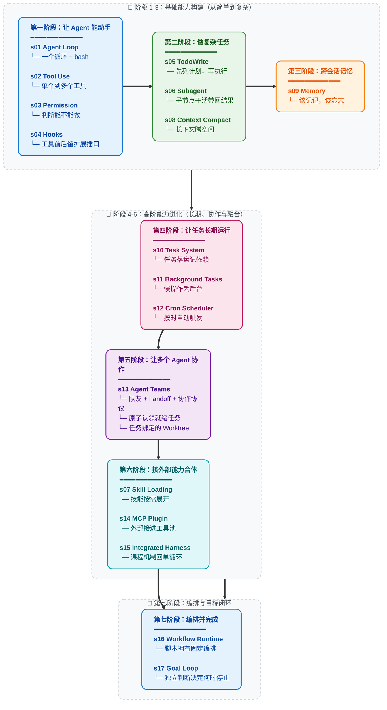

# Learn Claude Code — LangChain Agent Harness 版

> **命名说明**：仓库目录名与 `.env.example` 里的 `langchain4j` 是历史遗留（`LangChain4j` 是 Java 库，与本项目无关）。
> 本项目是**纯 Python** 实现（LangChain 1.x + LangGraph + OpenAI-compatible ChatModel），仓库内没有任何 Java 文件。

框架选对了，代码量最多可以少一半。这个仓库基于 [LangChain](https://github.com/langchain-ai/langchain) 和 [LangGraph](https://github.com/langchain-ai/langgraph)，深入拆解 Claude Code 这类 coding agent 的 Harness。

本项目已对齐 [shareAI-lab/learn-claude-code](https://github.com/shareAI-lab/learn-claude-code) 的 17 章源码结构（功能同步基线：`08263f49b3d5c895ea61d56a3737d8eebe624f20`；本次结构核对：main `0dcafa2ae053a1ddd6a72f265431104b08a5aa13`）。章节中的 Agent Loop、工具协议、Hook、Context、Task、Team、Workflow 与 Goal 实现保留上游结构；s01 使用 LangChain `create_agent` 展示框架提供的最小 Agent，s02 沿用同一 Agent Loop 增加结构化工具，后续章节再逐步展开 Harness 机制。

> Agency 来自模型，Agent 产品 = 模型 + Harness。

模型负责理解、推理和决策；Harness 负责工具执行、权限、生命周期、上下文、记忆、委派与恢复。本项目的目标不是重新发明模型，而是用逐章可运行的 LangChain 代码理解 Claude Code 一类 coding agent 的工程机制。

## 核心模式

第一章用 LangChain `create_agent` 对齐参考实现的“一个 Bash 工具 + 一个 Agent Loop”，并通过 `stream` 实时输出模型 token：

```python
@tool
def bash(command: str) -> str:
    """Run a shell command in the current working directory."""
    result = subprocess.run(command, shell=True, capture_output=True, text=True)
    return (result.stdout + result.stderr).strip() or "(no output)"


agent = create_agent(model=model, tools=[bash], system_prompt=SYSTEM)

for chunk in agent.stream(
    {"messages": messages},
    stream_mode=["messages", "values"],
    version="v2",
):
    if chunk["type"] == "messages":
        token, metadata = chunk["data"]
        if metadata.get("langgraph_node") == "model" and token.text:
            print(token.text, end="", flush=True)
```

`create_agent` 在 LangGraph 上自动完成“模型 → 工具 → 模型”的循环；`messages` stream 输出 token，`values` stream 提供最终状态并用于保留多轮会话历史。完整讲解和代码片段见 [s01 Agent Loop](s01_agent_loop/)。

### Agency 从哪来

Agent 的核心是一个神经网络 -- Transformer、RNN、一个被训练出来的函数 -- 经过数十亿次梯度更新，在行动序列数据上学会了感知环境、推理目标、采取行动。Agency 这个东西从来不是外面那层代码赋予的，而是模型在训练中学到的。

人类就是最好的例子。一个由数百万年进化训练出来的生物神经网络，通过感官感知世界，通过大脑推理，通过身体行动。当 DeepMind、OpenAI 或 Anthropic 说 "agent" 时，他们说的核心都是同一件事：**一个通过训练学会了行动的模型，加上让它能在特定环境中工作的基础设施。**

历史已经写好了铁证：

- **2013 -- DeepMind DQN 玩 Atari。** 一个神经网络，只接收原始像素和游戏分数，学会了 7 款 Atari 2600 游戏 -- 超越所有先前算法，在其中 3 款上击败人类专家。到 2015 年，同一架构扩展到 [49 款游戏，达到职业人类测试员水平](https://www.nature.com/articles/nature14236)，论文发表在 *Nature*。没有游戏专属规则。没有决策树。一个模型，从经验中学习。那个模型就是 agent。

- **2019 -- OpenAI Five 征服 Dota 2。** 五个神经网络，在 10 个月内与自己对战了 [45,000 年的 Dota 2](https://openai.com/index/openai-five-defeats-dota-2-world-champions/)，在旧金山直播赛上 2-0 击败了 **OG** -- TI8 世界冠军。随后的公开竞技场中，AI 在 42,729 场比赛中胜率 99.4%。没有脚本化的策略。没有元编程的团队协调逻辑。模型完全通过自我对弈学会了团队协作、战术和实时适应。

- **2019 -- DeepMind AlphaStar 制霸星际争霸 II。** AlphaStar 在闭门赛中 [10-1 击败职业选手](https://deepmind.google/blog/alphastar-mastering-the-real-time-strategy-game-starcraft-ii/)，随后在欧洲服务器上达到[宗师段位](https://www.nature.com/articles/d41586-019-03298-6) -- 90,000 名玩家中的前 0.15%。一个信息不完全、实时决策、组合动作空间远超国际象棋和围棋的游戏。Agent 是什么？是模型。训练出来的。不是编出来的。

- **2019 -- 腾讯绝悟统治王者荣耀。** 腾讯 AI Lab 的 "绝悟" 于 2019 年 8 月 2 日世冠杯半决赛上[以 5v5 击败 KPL 职业选手](https://www.jiemian.com/article/3371171.html)。在 1v1 模式下，职业选手 [15 场只赢 1 场，最多坚持不到 8 分钟](https://developer.aliyun.com/article/851058)。训练强度：一天等于人类 440 年。到 2021 年，绝悟在全英雄池 BO5 上全面超越 KPL 职业选手水准。没有手工编写的英雄克制表。没有脚本化的阵容编排。一个从零开始通过自我对弈学习整个游戏的模型。

- **2024-2025 -- LLM Agent 重塑软件工程。** Claude、GPT、Gemini -- 在人类全部代码和推理上训练的大语言模型 -- 被部署为编程 agent。它们阅读代码库，编写实现，调试故障，团队协作。架构与之前每一个 agent 完全相同：一个训练好的模型，放入一个环境，给予感知和行动的工具。唯一的不同是它们学到的东西的规模和解决任务的通用性。

每一个里程碑都指向同一个事实：**Agency -- 那个感知、推理、行动的能力 -- 是训练出来的，不是编出来的。** 但每一个 agent 同时也需要一个环境才能工作：Atari 模拟器、Dota 2 客户端、星际争霸 II 引擎、IDE 和终端。模型提供智能，环境提供行动空间。两者合在一起才是一个完整的 agent。

### Agent 不是什么

"Agent" 这个词已经被一整个提示词水管工产业劫持了。

拖拽式工作流构建器。无代码 "AI Agent" 平台。提示词链编排库。它们共享同一个幻觉：把 LLM API 调用用 if-else 分支、节点图、硬编码路由逻辑串在一起就算是 "构建 Agent" 了。

不是的。它们做出来的东西是鲁布·戈德堡机械 -- 一个过度工程化的、脆弱的过程式规则流水线，LLM 被楔在里面当一个美化了的文本补全节点。那不是 Agent。那是一个有着宏大妄想的 shell 脚本。

**提示词水管工式 "Agent" 是不做模型的程序员的意淫。** 他们试图通过堆叠过程式逻辑来暴力模拟智能 -- 庞大的规则树、节点图、链式提示词瀑布流 -- 然后祈祷足够多的胶水代码能涌现出自主行为。不会的。你不可能通过工程手段编码出 agency。Agency 是学出来的，不是编出来的。

那些系统从诞生之日起就已经死了：脆弱、不可扩展、根本不具备泛化能力。它们是 GOFAI（Good Old-Fashioned AI，经典符号 AI）的现代还魂 -- 几十年前就被学界抛弃的符号规则系统，现在喷了一层 LLM 的漆又登场了。换了个包装，同一条死路。

### 心智转换：从 "开发 Agent" 到开发 Harness

当一个人说 "我在开发 Agent" 时，他只可能是两个意思之一：

**1. 训练模型。** 通过强化学习、微调、RLHF 或其他基于梯度的方法调整权重。收集任务过程数据 -- 真实领域中感知、推理、行动的实际序列 -- 用它们来塑造模型的行为。这是 DeepMind、OpenAI、腾讯 AI Lab、Anthropic 在做的事。这是最本义的 Agent 开发。

**2. 构建 Harness。** 编写代码，为模型提供一个可操作的环境。这是我们大多数人在做的事，也是本仓库的核心。

Harness 是 agent 在特定领域工作所需要的一切：

```
Harness = Tools + Knowledge + Observation + Action Interfaces + Permissions

    Tools:          文件读写、Shell、网络、数据库、浏览器
    Knowledge:      产品文档、领域资料、API 规范、风格指南
    Observation:    git diff、错误日志、浏览器状态、传感器数据
    Action:         CLI 命令、API 调用、UI 交互
    Permissions:    沙箱隔离、审批流程、信任边界
```

模型做决策。Harness 执行。模型做推理。Harness 提供上下文。模型是驾驶者。Harness 是载具。

**编程 agent 的 harness 是它的 IDE、终端和文件系统。** 农业 agent 的 harness 是传感器阵列、灌溉控制和气象数据。酒店 agent 的 harness 是预订系统、客户沟通渠道和设施管理 API。Agent -- 那个智能、那个决策者 -- 永远是模型。Harness 因领域而变。Agent 跨领域泛化。

这个仓库教你造载具。编程用的载具。但设计模式可以泛化到任何领域：庄园管理、农田运营、酒店运作、工厂制造、物流调度、医疗保健、教育培训、科学研究。只要有一个任务需要被感知、推理和执行 -- agent 就需要一个 harness。

### Harness 工程师到底在做什么

如果你在读这个仓库，你很可能是一名 harness 工程师 -- 这是一个强大的身份。以下是你真正的工作：

- **实现工具。** 给 agent 一双手。文件读写、Shell 执行、API 调用、浏览器控制、数据库查询。每个工具都是 agent 在环境中可以采取的一个行动。设计它们时要原子化、可组合、描述清晰。

- **策划知识。** 给 agent 领域专长。产品文档、架构决策记录、风格指南、合规要求。按需加载（s07），不要前置塞入。Agent 应该知道有什么可用，然后自己拉取所需。

- **管理上下文。** 给 agent 干净的记忆。子 agent 隔离（s06）防止噪声泄露。上下文压缩（s08）防止历史淹没。任务系统（s10）让目标持久化到单次对话之外。

- **控制权限。** 给 agent 边界。沙箱化文件访问。对破坏性操作要求审批。在 agent 和外部系统之间实施信任边界。这是安全工程与 harness 工程的交汇点。

- **收集任务过程数据。** Agent 在你的 harness 中执行的每一条行动序列都是训练信号。真实部署中的感知-推理-行动轨迹是微调下一代 agent 模型的原材料。你的 harness 不仅服务于 agent -- 它还可以帮助进化 agent。

你不是在编写智能。你是在构建智能栖居的世界。这个世界的质量 -- agent 能看得多清楚、行动得多精准、可用知识有多丰富 -- 直接决定了智能能多有效地表达自己。

**造好 Harness。Agent 会完成剩下的。**

### 为什么是 Claude Code -- Harness 工程的大师课

为什么这个仓库专门拆解 Claude Code？

因为 Claude Code 是我们所见过的最优雅、最完整的 agent harness 实现。不是因为某个巧妙的技巧，而是因为它 *没做* 的事：它没有试图成为 agent 本身。它没有强加僵化的工作流。它没有用精心设计的决策树去替模型做判断。它给模型提供了工具、知识、上下文管理和权限边界 -- 然后让开了。

把 Claude Code 剥到本质来看：

```
Claude Code = 一个 agent loop
            + 工具 (bash, read, write, edit, glob, grep, browser...)
            + 按需 skill 加载
            + 上下文压缩
            + 子 agent 派生
            + 带依赖图的任务系统
            + 异步邮箱的团队协调
            + worktree 隔离的并行执行
            + 权限治理
            + Hook 扩展系统
            + 长期记忆
            + MCP 外部能力路由
```

就这些。这就是全部架构。每一个组件都是 harness 机制 -- 为 agent 构建的栖居世界的一部分。Agent 本身呢？是 Claude。一个模型。由 Anthropic 在人类推理和代码的全部广度上训练而成。Harness 没有让 Claude 变聪明。Claude 本来就聪明。Harness 给了 Claude 双手、双眼和一个工作空间。

这就是 Claude Code 作为教学标本的意义：**它展示了当你信任模型、把工程精力集中在 harness 上时会发生什么。** 本仓库的课程（s01-s17）逐步拆解并重组 Claude Code 架构中的 harness 机制。学完之后，你理解的不只是 Claude Code 怎么工作，而是适用于任何领域、任何 agent 的 harness 工程通用原则。

启示不是 "复制 Claude Code"。启示是：**最好的 agent 产品，出自那些明白自己的工作是 harness 而非 intelligence 的工程师之手。**

---

## 愿景：用真正的 Agent 铺满宇宙

这不只关乎编程 agent。

每一个人类从事复杂、多步骤、需要判断力的工作的领域，都是 agent 可以运作的领域 -- 只要有对的 harness。本仓库中的模式是通用的：

```
庄园管理 agent  = 模型 + 物业传感器 + 维护工具 + 租户通信
农业 agent      = 模型 + 土壤/气象数据 + 灌溉控制 + 作物知识
酒店运营 agent  = 模型 + 预订系统 + 客户渠道 + 设施 API
医学研究 agent  = 模型 + 文献检索 + 实验仪器 + 协议文档
制造业 agent    = 模型 + 产线传感器 + 质量控制 + 物流系统
教育 agent      = 模型 + 课程知识 + 学生进度 + 评估工具
```

循环永远不变。工具在变。知识在变。权限在变。Agent = 模型(LLM) + 泛化的操作环境(Harness)。

每一个读这个仓库的 harness 工程师都在学习远超软件工程的模式。你在学习为一个智能的、自动化的未来构建基础设施。每一个部署在真实领域的好 harness，都是 agent 能够感知、推理、行动的又一个阵地。

先铺满工作室。然后是农田、医院、工厂。然后是城市。然后是星球。

**Bash is all you need. Real agents are all the universe needs.**

---

```
                    THE AGENT PATTERN
                    =================

    User --> messages[] --> LLM --> response
                                      |
                            包含 tool_use 内容块？
                           /                          \
                         yes                           no
                          |                             |
                    execute tools                    return text
                    append results
                    loop back -----------------> messages[]


    这是最小循环。每个 AI Agent 都需要这个循环。
    模型决定何时调用工具、何时停止。
    代码只是执行模型的要求。
    本仓库教你构建围绕这个循环的一切 --
    让 agent 在特定领域高效工作的 harness。
```

**17 个递进式课程, 从简单循环到完整 Harness。**
**每个课程添加一个 harness 机制。每个机制有一句格言。**

> **s01** &nbsp; *"One loop & Bash is all you need"* &mdash; 一个工具 + 一个循环 = 一个 Agent
>
> **s02** &nbsp; *"工具自己描述自己"* &mdash; 循环不用动，新增一个 `@tool` 函数并加入 `TOOLS` 即可
>
> **s03** &nbsp; *"先划边界, 再给自由"* &mdash; 先判断操作能不能做，要不要问用户
>
> **s04** &nbsp; *"挂在循环上, 不写进循环里"* &mdash; 在工具前后留插口，不改主循环也能扩展
>
> **s05** &nbsp; *"没有计划的 agent 走哪算哪"* &mdash; 先列步骤再动手, 完成率翻倍
>
> **s06** &nbsp; *"大任务拆小, 每个小任务干净的上下文"* &mdash; 子 Agent 自己干活，只把结果带回来
>
> **s07** &nbsp; *"用到时再加载, 别全塞 prompt 里"* &mdash; 技能先列目录，用到时再展开
>
> **s08** &nbsp; *"上下文总会满, 要有办法腾地方"* &mdash; 四层压缩策略, 便宜的先跑贵的后跑
>
> **s09** &nbsp; *"记住该记的, 忘掉该忘的"* &mdash; 三个子系统: 筛选、提取、整理
>
> **s10** &nbsp; *"大目标拆成小任务, 排好序, 持久化"* &mdash; 文件持久化的任务图, 多 agent 协作的基础
>
> **s11** &nbsp; *"慢操作丢后台, agent 继续思考"* &mdash; 后台线程跑命令, 完成后注入通知
>
> **s12** &nbsp; *"定时触发, 不需要人推"* &mdash; 按时间自动触发任务
>
> **s13** &nbsp; *"一个搞不定, 组队来"* &mdash; 持久队友 + 异步邮箱 + 协作协议 + worktree 隔离（原 s15-s18 合并）
>
> **s14** &nbsp; *"能力不够? 插上 MCP"* &mdash; 把外部工具接进同一个工具池
>
> **s15** &nbsp; *"机制很多，循环一个"* &mdash; 前面所有机制回到一个完整 harness
>
> **s16** &nbsp; *"编排形状固定时，就把它写进代码"* &mdash; 保存好的 workflow 用 journal 续跑
>
> **s17** &nbsp; *"目标决定循环什么时候真正结束"* &mdash; 独立判断器审查，目标不可能/失败/超限时交还用户

---


## 范围说明 (重要)

本仓库是一个 0->1 的 harness 工程学习项目 -- 构建围绕 agent 模型的工作环境。
为保证学习路径清晰，仓库有意简化或省略了部分生产机制：

- Hook 只展开课程需要的 UserPromptSubmit、PreToolUse、PostToolUse、Stop 等关键事件，不覆盖生产产品的完整事件总线。
- Permission 演示 deny、规则匹配和用户确认；它不是沙箱，也不等价于完整的组织策略与信任治理。
- s13 实现任务绑定 Worktree、持久队友、邮箱和计划/关机协议，但仍是教学运行时，不是对任何产品内部实现的声明。
- MCP 聚焦工具发现、命名空间、宿主权限和动态工具池，省略真实 transport、OAuth、资源/提示订阅与重连细节。
- s16 Workflow 与 s17 Goal 是机制示例：前者扩展 s15 宿主，后者从 s04 基础内核独立演示停止门控；它们不是声称 Claude Code 存在同名内置工具。

仓库中的团队 JSONL 邮箱协议是教学实现，不是对任何特定生产内部实现的声明。

## 上游对齐与章节继承关系

课程的阅读顺序是 s01 → s17。下表的“代码基线”表示教学机制的演进关系，**不是 Python 的类继承或跨章 import**。s01 用 `create_agent` 建立最小智能体，s02 保持这个实现并扩展工具；s03 起为了展示权限、Hook 等底层控制点，在各章单文件中展开消息适配和调用循环。s17 也独立实现。与上游 main 一致，s15 通过文件加载复用 s09 的 Memory，s16 通过文件加载复用 s15 宿主，s15 不反向依赖 s16。

| 章节 | 代码基线 | 本章加入或组合的机制 |
|---|---|---|
| s01 | 最小内核 | `create_agent` + Bash + stream |
| s02 | s01 | 四个新 `@tool` + `TOOLS` 注册，Agent Loop 不变 |
| s03 | s02 的五工具能力 | 展开底层循环并加入三段式权限检查 |
| s04 | s03 | 把权限与扩展逻辑移入 Hook |
| s05 | s04 | TodoWrite |
| s06 | s04 基础内核 | 一次性、隔离上下文的 Subagent |
| s07 | s04 基础内核 | Skill 目录与按需加载 |
| s08 | s04 基础内核 | 上下文预算、裁剪、微压缩与摘要 |
| s09 | s04 基础内核 | 跨会话 Memory 的选择、提取与整理 |
| s10 | s04 基础内核 | 持久 Task 图、依赖、认领与完成 |
| s11 | s04 基础内核 | Background Task 与完成通知；不继承 s10 |
| s12 | s04 基础内核 | Cron、持久化与至少一次交付；不继承 s11 |
| s13 | s10 | Task + 持久队友 + 邮箱协议 + Worktree；不带入 s11/s12 |
| s14 | s04 基础内核 | MCP 工具发现、命名空间和动态工具池 |
| s15 | 集成章 | Skills、Context、Memory、Task、Background、Cron、Teams、Worktree、MCP 回到一个循环 |
| s16 | s15 宿主 | 追加 `Workflow` 工具、journal、resume 与结构化校验 |
| s17 | s04 基础内核 | 独立 Goal evaluator 控制真正停止，与 s16 形成“如何做/是否完成”的概念衔接 |

`code.py` 是带注释主实现；`code_uncommented.py` 由 [`scripts/build_uncommented.py`](scripts/build_uncommented.py) 从同一源码生成。模型适配和平台兼容代码直接展开，阅读章节无需跳转到公共 `harness` 包。文件工具、路径检查和环境读取继续在各章按其教学范围实现。

### “深入 CC 源码”原文来源

源码研读区取自 [fix/s08-s20-sync-frontmatter-parser](https://github.com/shareAI-lab/learn-claude-code/tree/67a9126c6435a8654ba7a6f68c0fd2130f00a462)，保留完整折叠块、嵌套内容、表格、源码行号和原章节编号。来源与逐块 SHA-256 记录在 [`upstream.lock.json`](upstream.lock.json)。原文中的“教学版”和章号指该旧版本，主线代码关系以上表为准。

| 本地章节 | 原文所在旧章节 |
|---|---|
| s01–s09 | 同名章节 |
| s10 Task / s11 Background / s12 Cron | s12 / s13 / s14 |
| s13 Agent Teams | s15 Teams、s16 Protocols、s17 Autonomous、s18 Worktree |
| s14 MCP | s19 MCP |
| s15 Integrated Harness | s20 没有源码研读块，留空 |
| s16 Workflow / s17 Goal | 指定版本没有这两章，留空 |
| legacy 中的旧章节 | 各自同名旧章节 |

同步原文使用 `python scripts/sync_cc_source_readmes.py <指定提交的上游目录>`。[`scripts/merge_chapter_readmes.py`](scripts/merge_chapter_readmes.py) 更新正文时会保留该原文区，包括没有原文的空区。


## 学习路径

主线：能动手 → 能做复杂任务 → 能记住和恢复 → 能长期运行 → 能协作 → 能扩展并合体 → 编排并完成




## 学完之后 -- 从理解到落地

17 个课程走完, 你已经从内到外理解了 harness 工程的运作原理。两种方式把知识变成产品:

### Kode Agent CLI -- 开源 Coding Agent CLI

> `npm i -g @shareai-lab/kode`

支持 Skill & LSP, 适配 Windows, 可接 GLM / MiniMax / DeepSeek 等开放模型。装完即用。

GitHub: **[shareAI-lab/Kode-CLI](https://github.com/shareAI-lab/Kode-CLI)**

### Kode Agent SDK -- 把 Agent 能力嵌入你的应用

官方 Claude Code Agent SDK 底层与完整 CLI 进程通信 -- 每个并发用户 = 一个终端进程。Kode SDK 是独立库, 无 per-user 进程开销, 可嵌入后端、浏览器插件、嵌入式设备等任意运行时。

GitHub: **[shareAI-lab/kode-agent-sdk](https://github.com/shareAI-lab/kode-agent-sdk)**

---

## 姊妹教程: 从*被动临时会话*到*主动常驻助手*

本仓库教的 harness 属于 **用完即走** 型 -- 开终端、给 agent 任务、做完关掉, 下次重开是全新会话。Claude Code 就是这种模式。

但 [OpenClaw](https://github.com/openclaw/openclaw) 证明了另一种可能: 在同样的 agent core 之上, 加两个 harness 机制就能让 agent 从 "踹一下动一下" 变成 "自己隔 30 秒醒一次找活干":

- **心跳 (Heartbeat)** -- 每 30 秒 harness 给 agent 发一条消息, 让它检查有没有事可做。没事就继续睡, 有事立刻行动。
- **定时任务 (Cron)** -- agent 可以给自己安排未来要做的事, 到点自动执行。

再加上 IM 多通道路由 (WhatsApp/Telegram/Slack/Discord 等 13+ 平台)、不清空的上下文记忆、Soul 人格系统, agent 就从一个临时工具变成了始终在线的个人 AI 助手。

**[claw0](https://github.com/shareAI-lab/claw0)** 是我们的姊妹教学仓库, 从零拆解这些 harness 机制:

```
claw agent = agent core + heartbeat + cron + IM chat + memory + soul
```

```
learn-claude-code                   claw0
(agent harness 内核:                 (主动式常驻 harness:
 循环、工具、规划、                    心跳、定时任务、IM 通道、
 团队、worktree 隔离)                  记忆、Soul 人格)
```


## 快速开始

> 环境要求：**Python >= 3.11**（代码用到 `X | Y` 联合类型与 `typing.NotRequired`）。

Windows PowerShell：

```powershell
python -m venv venv
.\venv\Scripts\Activate.ps1
pip install -r requirements.txt
Copy-Item .env.example .env
# 编辑 .env 后运行任一已实现章节
python -m s01_agent_loop.code
```

`.env` 至少需要：

```dotenv
MODEL_ID=your-model-id
OPENAI_API_KEY=your-api-key
BASE_URL=https://your-openai-compatible-endpoint/v1
```

如果使用备用模型，再设置 `FALLBACK_MODEL_ID`。不要提交真实 `.env`。

### 安全边界

`run_bash` 的 `shell=True` 仅为教学演示：它把模型输出直接交给 shell，**黑名单 / 路径检查不等于安全边界**。为保持与上游逐章源码的对应关系，每章在本章文件内保留相应权限和路径逻辑；[`harness/security.py`](harness/security.py) 与 [`harness/paths.py`](harness/paths.py) 则供本仓库公共工具和独立测试使用。生产环境请改用默认拒绝的权限中间件 + 沙箱 / 容器。

### 测试与 CI

```bash
pip install -r requirements-dev.txt  # pytest + ruff
pytest -q                            # 17 章机制、集成边界与 harness 完整回归
ruff check harness tests             # 只 lint 公共内核与测试
```

CI（[.github/workflows/ci.yml](.github/workflows/ci.yml)）在 Python 3.11 / 3.13 执行同样两步：用 `py_compile` 机器验证“逐章无语法错误”，章节运行时仍需真实 API key 手动验证。

## 全部章节

| # | 章节 | 机制 | 状态 |
|---:|---|---|---|
| 01 | [s01: Agent Loop](s01_agent_loop/) | 最小 Agent 闭环 | ✅ 已实现 |
| 02 | [s02: Tool Use](s02_tool_use/) | 结构化文件与命令工具 | ✅ 已实现 |
| 03 | [s03: Permission](s03_permission/) | deny、规则与用户确认 | ✅ 已实现 |
| 04 | [s04: Hooks](s04_hooks/) | 生命周期扩展点 | ✅ 已实现 |
| 05 | [s05: TodoWrite](s05_todo_write/) | 任务内计划与流式进度 | ✅ 已实现 |
| 06 | [s06: Subagent](s06_subagent/) | 隔离上下文的委派 | ✅ 已实现 |
| 07 | [s07: Skill Loading](s07_skill_loading/) | Skills 渐进加载 | ✅ 已实现 |
| 08 | [s08: Context Compact](s08_context_compact/) | 多层上下文压缩 | ✅ 已实现 |
| 09 | [s09: Memory](s09_memory/) | Markdown 长期记忆 | ✅ 已实现 |
| 10 | [s10: Task System](s10_task_system/) | 持久任务、依赖与认领/完成状态 | ✅ 已实现 |
| 11 | [s11: Background Tasks](s11_background_tasks/) | 后台命令、生命周期与完成通知 | ✅ 已实现 |
| 12 | [s12: Cron Scheduler](s12_cron_scheduler/) | 五段式 Cron、持久化、到期队列与自动交付 | ✅ 已实现 |
| 13 | [s13: Agent Teams](s13_agent_teams/) | Lead/Teammate 子图、共享状态与双向 handoff | ✅ 已实现 |
| 14 | [s14: MCP & Plugin](s14_mcp_plugin/) | 动态工具池 + MCP 主机策略 | ✅ 已实现 |
| 15 | [s15: Integrated Harness](s15_integrated_harness/) | 多机制合一 + 通知注入 | ✅ 已实现 |
| 16 | [s16: Workflow Runtime](s16_workflow_runtime/) | 固定编排 + journal 续跑 | ✅ 已实现 |
| 17 | [s17: Goal Loop](s17_goal_loop/) | 独立评估器决定停止 | ✅ 已实现 |

> 旧 20 章中不再单独成章的 s10 System Prompt、s11 Error Recovery，以及并入 s13 的 s16-s18 团队章节，已原样归档到 [legacy/](legacy/)。

## 目录约定

```text
learn_claude_code/
├── s01_agent_loop/
│   ├── code.py              # 带注释教学版（可直接运行）
│   ├── code_uncommented.py  # 无注释速读版
│   ├── images/
│   └── README.md
├── s03_permission/
│   ├── code.py              # 权限规则 + LangChain middleware
│   ├── code_uncommented.py
│   ├── images/
│   └── README.md
├── s05_todo_write/
│   ├── code.py
│   ├── code_streaming.py    # s05.5 流式版（归档）
│   ├── code_uncommented.py
│   ├── images/
│   └── README.md
├── ...
├── s10_task_system/ ... s13_agent_teams/
│   ├── code.py
│   ├── code_uncommented.py
│   ├── images/
│   └── README.md
├── s14_mcp_plugin/ ... s17_goal_loop/
│   ├── code.py              # 带注释教学版（可直接运行）
│   ├── code_uncommented.py  # 无注释速读版
│   ├── images/
│   └── README.md
├── legacy/                  # 20 章旧编排中移除/合并的章节（存档）
├── skills/                  # s07 可扫描的示例 Skills
├── harness/                 # 历史公共工具与兼容测试；章节代码不依赖此包
├── tests/                   # harness 单测 + 全库 py_compile 冒烟
├── pyproject.toml           # min Python 3.11 + ruff + pytest 配置
├── requirements-dev.txt     # pytest + ruff
├── .github/workflows/ci.yml
├── .env.example
└── requirements.txt
```

已实现章节统一为两份文件：`code.py` 是带注释的教学版（`python -m sXX.code` 直接运行），`code_uncommented.py` 是去掉教学注释的速读版。原来的 s03.5 middleware 实现已合并进 s03 主代码；s05.5 仍以 `code_streaming.py` 归档。

## 说明与致谢

章节命名、教学脉络、主实现与插图来自或改编自 [shareAI-lab/learn-claude-code](https://github.com/shareAI-lab/learn-claude-code)，原项目采用 MIT License。当前 17 章主实现对齐上游同步基线；模型供应商边界由本仓库的 LangChain 适配层替换，章节 README 末尾继续保留本仓库原有的 Claude Code 源码研读补充。教学实现不等于 Claude Code 产品源码，具体简化边界以各章说明为准。
