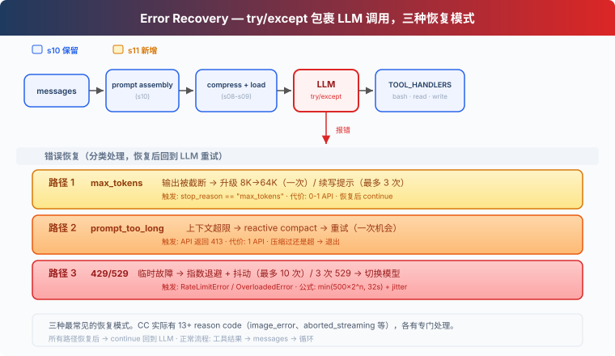
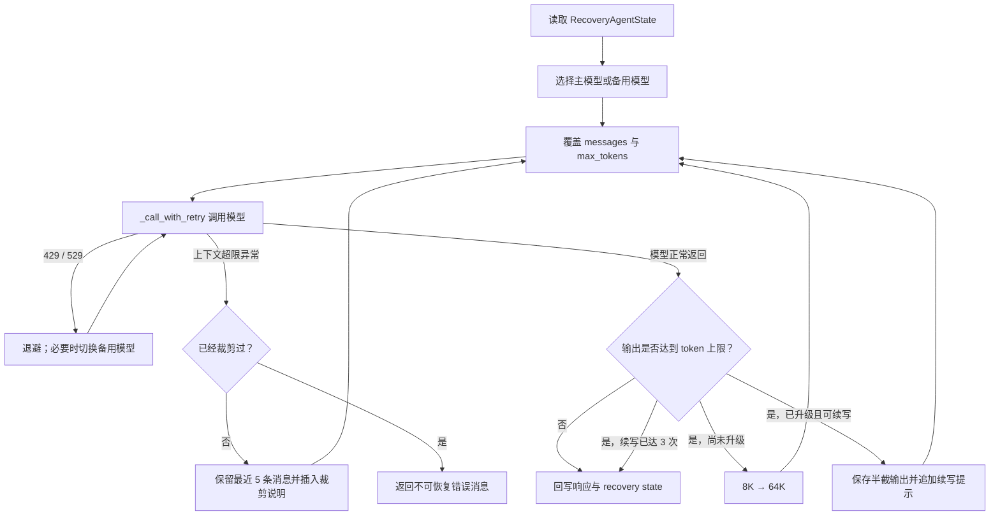

# s11: Error Recovery — 出错了，自己恢复

> LangChain 教学改编版。章节结构与“深入 CC 源码”部分主要参考 [shareAI-lab/learn-claude-code](https://github.com/shareAI-lab/learn-claude-code)。
>
> **Harness 层**：韧性 — 分类错误、退避重试、降级模型与上下文恢复。

[s10](../s10_system_prompt/) → **s11** → [s12](../s12_task_system/)

---

## 问题

真实模型 API 会限流、过载、超时、截断输出或拒绝过长上下文。直接异常退出会丢掉整个 Agent 回合。

---

## 解决方案



当前 LangChain 实现已完成三条恢复路径及 `AgentMiddleware` 接线：输出截断时执行 8K→64K 升级与最多 3 次续写，上下文超限时响应式裁剪并重试一次，遇到 429/529 时按 `Retry-After` 或指数退避重试，并在连续 3 次 529 后切换备用模型。`create_agent` 继续负责标准工具循环。

---

## 工作原理：LangChain 版本

```python
PRIMARY_MODEL = ChatOpenAI(
    model=MODEL_ID, api_key=API_KEY, base_url=BASE_URL,
    max_retries=0, timeout=120,
)
FALLBACK_MODEL = (
    build_model(FALLBACK_MODEL_ID) if FALLBACK_MODEL_ID else None
)

def retry_delay(attempt: int, retry_after: float | None = None) -> float:
    if retry_after is not None:
        return retry_after
    base = min(BASE_DELAY_SECONDS * (2 ** attempt), MAX_DELAY_SECONDS)
    return base + random.uniform(0, base * 0.25)

class RecoveryAgentState(AgentState):
    recovery: NotRequired[dict[str, Any]]
```

这里关闭 SDK 自带重试，避免它与教学恢复层重复重试。恢复状态会在一次用户请求的模型/工具循环中持续保留，并在下一条用户请求开始前自动重置。未配置 `FALLBACK_MODEL_ID` 时不会创建备用客户端，连续 529 将继续使用主模型退避重试。

---

## LangChain 与 LangGraph 的自主错误重试

这里的“自主”不是指框架能够凭空判断并修复所有异常，而是指：开发者先声明**哪些错误可重试、最多重试几次、如何退避、失败后是否降级**，运行时再自动拦截异常并执行恢复策略，无需业务代码在每个调用点重复写 `try/except`。如果最终错误被转换成消息重新交给模型，Agent 还可以根据错误内容修改参数、改用其他工具或换一条路径，这属于更高一层的**语义自纠**。

### 1. 分层理解：一次错误可能由谁处理

| 层级 | 典型能力 | 适合处理 | 是否会让模型重新思考 |
|---|---|---|---|
| 模型供应商 SDK | `max_retries`、连接超时 | 网络抖动、连接失败、部分 429/5xx | 否，只是原样重发 HTTP 请求 |
| LangChain Runnable | `with_retry(...)` | 任意单独的 Runnable/Chain 调用 | 通常否 |
| LangChain Agent Middleware | `ModelRetryMiddleware`、`ToolRetryMiddleware`、`ModelFallbackMiddleware` | 模型调用、工具调用、模型降级 | 工具错误转成 `ToolMessage` 后可以 |
| LangGraph 节点运行时 | `RetryPolicy` | 图中任意节点或 `@task` 的瞬时异常 | 否，默认以相同节点输入重新执行 |
| Agent 控制循环 | 错误消息 → 再次调用模型 | 参数错误、工具不可用、需要换方案 | 是，模型可以生成新的行动 |
| LangGraph 持久化 | Checkpointer、durable execution | 进程退出、任务中断后从检查点恢复 | 取决于恢复后进入的节点 |

因此，“重试同一个操作”和“让 Agent 自己纠错”要严格区分：

- **机械重试**：输入和操作不变，适合超时、限流、服务暂时不可用等瞬时错误。
- **语义重试**：把失败原因写回消息历史，让模型修改工具参数、选择备用工具或重写答案，适合数据校验失败和可解释的业务错误。
- **恢复执行**：从最近检查点继续图运行，解决进程崩溃或长任务中断；它不是一次普通 API 重试。

### 2. LangChain：模型调用自动重试

`ModelRetryMiddleware` 会包裹每次 Agent 模型调用。默认配置是“首次调用 + 最多 2 次重试”，支持同步和异步执行，并提供以下参数：

- `retry_on`：异常类型元组，或 `Exception -> bool` 判断函数。
- `initial_delay`：第一次重试前的等待时间。
- `backoff_factor`：指数退避倍数；设为 `0.0` 时使用固定等待时间。
- `max_delay`：单次等待上限。
- `jitter`：默认加入 ±25% 随机抖动，避免大量实例同时重试。
- `on_failure="error"`：耗尽后重新抛出异常并终止当前运行。
- `on_failure="continue"`：耗尽后返回包含错误信息的 `AIMessage`。
- `on_failure=callable`：用自定义函数生成最终错误消息。

```python
from langchain.agents import create_agent
from langchain.agents.middleware import ModelRetryMiddleware


def is_transient_model_error(exc: Exception) -> bool:
    status = getattr(exc, "status_code", None)
    return status in {408, 429, 500, 502, 503, 504, 529}


agent = create_agent(
    model=model,
    tools=tools,
    middleware=[
        ModelRetryMiddleware(
            max_retries=3,          # 不含首次调用，总尝试次数最多为 4
            retry_on=is_transient_model_error,
            initial_delay=1.0,
            backoff_factor=2.0,
            max_delay=30.0,
            jitter=True,
            on_failure="error",
        )
    ],
)
```

不要在生产环境中无条件重试所有异常。认证失败、参数非法、模型名错误和超出上下文窗口通常不会因为等待而自行消失；对这些错误重试只会增加延迟和费用。本章自定义中间件进一步读取 `Retry-After`，并对 429、529、上下文超限和输出截断采用不同策略，这是通用 `ModelRetryMiddleware` 不会自动完成的业务化判断。

### 3. LangChain：工具重试与 Agent 自纠

`ToolRetryMiddleware` 包裹工具调用，配置项与模型重试相似，并可通过 `tools=[...]` 只对指定工具生效。重试耗尽时，默认的 `on_failure="continue"` 不会直接杀死 Agent，而是生成 `status="error"` 的 `ToolMessage`，保留原 `tool_call_id` 并送回模型。下一轮模型因此能够看到失败原因并自主决定：

1. 修正参数后再次调用同一工具；
2. 换用另一个工具；
3. 使用已经获得的信息给出降级答案；
4. 明确告知用户当前无法完成。

```python
from langchain.agents.middleware import ToolRetryMiddleware

tool_retry = ToolRetryMiddleware(
    max_retries=2,
    tools=["web_search", "query_database"],
    retry_on=(TimeoutError, ConnectionError),
    initial_delay=0.5,
    backoff_factor=2.0,
    on_failure=lambda exc: (
        f"工具暂时不可用：{type(exc).__name__}: {exc}。"
        "请检查参数，或选择其他工具继续。"
    ),
)
```

这形成了两段式恢复：中间件先对瞬时错误做低成本的机械重试，仍失败后才让 LLM 进行语义自纠。对于写数据库、发邮件、付款、创建工单等有副作用的工具，自动重试前必须使用幂等键、去重表或“查询是否已成功”的补偿逻辑，否则第一次调用其实已经成功但响应丢失时，重试可能造成重复写入。

### 4. LangChain：模型降级

`ModelFallbackMiddleware` 会在主模型抛出异常时，按照声明顺序尝试备用模型：

```python
from langchain.agents.middleware import ModelFallbackMiddleware

fallback = ModelFallbackMiddleware(
    fallback_model_1,
    fallback_model_2,
)

agent = create_agent(
    model=primary_model,
    tools=tools,
    middleware=[fallback],
)
```

内置降级中间件适合“主模型失败就依次换模型”的通用场景。本章实现更细：只有连续 3 次 529 才切换备用模型，并把当前选择写入 `RecoveryAgentState`，后续模型/工具循环继续使用该模型。模型切换还要关注能力差异，例如工具调用、结构化输出、上下文长度和多模态支持是否兼容。

### 5. LangGraph：节点级 `RetryPolicy`

LangChain 的 `create_agent` 底层由 LangGraph 执行。对于自己构建的 `StateGraph`，可以在节点上声明 `RetryPolicy`，让模型节点、HTTP 节点、数据库节点或子图节点独立重试：

```python
from langgraph.graph import StateGraph
from langgraph.types import RetryPolicy


def is_transient(exc: Exception) -> bool:
    status = getattr(exc, "status_code", None)
    return isinstance(exc, (TimeoutError, ConnectionError)) or status in {
        429, 500, 502, 503, 504, 529
    }


api_retry = RetryPolicy(
    initial_interval=0.5,
    backoff_factor=2.0,
    max_interval=20.0,
    max_attempts=4,       # 包含首次执行：1 次首次 + 最多 3 次重试
    jitter=True,
    retry_on=is_transient,
)

builder = StateGraph(State)
builder.add_node("call_api", call_api, retry_policy=api_retry)
```

在本项目锁定的 `langgraph==1.2.7` 中，`RetryPolicy` 默认值为：

| 参数 | 默认值 | 含义 |
|---|---:|---|
| `initial_interval` | `0.5` 秒 | 首次失败后的基础等待 |
| `backoff_factor` | `2.0` | 每次失败后的指数增长倍数 |
| `max_interval` | `128.0` 秒 | 基础等待的上限 |
| `max_attempts` | `3` | 总执行次数，**包含第一次** |
| `jitter` | `True` | 在等待时间上增加随机抖动 |
| `retry_on` | `default_retry_on` | 判断哪些异常允许重试 |

默认 `retry_on` 会重试连接错误、`httpx`/`requests` 的 5xx 等较可能恢复的错误，并跳过 `ValueError`、`TypeError`、`SyntaxError`、`RuntimeError`、`OSError` 等通常表示代码或输入有问题的异常。对于 429、供应商特有异常以及业务异常，建议显式提供判断函数，不要依赖默认分类。

还可以传入多条策略，LangGraph 会采用**第一条匹配当前异常的策略**；或通过 `builder.set_node_defaults(retry_policy=...)` 设置图内默认值，再由单个节点覆盖。没有配置节点策略或图默认策略时，LangGraph 不会自动重试普通节点异常。

### 6. LangGraph 重试时的状态语义

节点失败后，LangGraph 会清除该节点上一次失败尝试产生的待提交 state writes，再以相同节点输入重新执行。因此图状态不会因为一次失败尝试而简单累加两遍。不过，这个保证只覆盖 **LangGraph 管理的状态写入**，不会自动回滚节点内部已经发生的外部副作用：

- 已发出的 HTTP POST、邮件或支付请求不会被撤销；
- 已提交的数据库事务不会自动回滚；
- 已写入的文件、对象存储和第三方系统记录仍然存在；
- 流式输出可能已经被调用方看见。

所以可重试节点应尽量保持纯函数，或把副作用封装成幂等操作。常见方法是使用 `thread_id + node_name + operation_id` 生成幂等键，并在外部系统中保存执行结果；重试时先查询旧结果，而不是盲目再执行一次。

### 7. Checkpointer 与进程级恢复

给编译后的图配置 Checkpointer，并在调用时提供稳定的 `thread_id`，LangGraph 可以保存每一步的状态。进程崩溃、人工中断或服务重启后，可以从最近检查点恢复，而不必从头重跑整个 Agent。

需要注意：

- Checkpointer 提供的是**持久化与恢复基础设施**，不等于自动吞掉异常。
- 节点内的瞬时异常仍应使用 `RetryPolicy` 或 LangChain 中间件处理。
- 如果重启后可能重新进入含副作用的节点，仍然需要幂等设计。
- 内存型 Checkpointer 只适合开发测试；跨进程恢复要使用持久化存储。

### 8. 本章自定义恢复中间件如何组合这些能力

本章没有直接堆叠所有内置重试器，而是用一个 `ErrorRecoveryMiddleware` 统一编排模型恢复：

| 故障/信号 | 本章自动动作 | 是否改变下一次请求 |
|---|---|---|
| 429 | 优先遵守 `Retry-After`，否则指数退避 + 抖动 | 不改变模型和消息 |
| 529 | 退避重试；连续 3 次后可切换备用模型 | 可能改变模型 |
| 上下文超限 | 保留最近消息并插入裁剪说明，只重试一次 | 改变消息历史 |
| 输出达到 token 上限 | 先把 8K 提升到 64K | 改变 `max_tokens` |
| 再次输出截断 | 保存已生成内容，追加 continuation prompt，最多 3 次 | 扩展消息历史 |
| 不可恢复异常 | 转成错误 `AIMessage`，让调用方获得完整 Agent 状态 | 结束当前恢复循环 |

`before_agent` 在新用户请求开始时初始化恢复计数；`wrap_model_call` 在同一个 Agent 工具循环中拦截每次模型调用；`ExtendedModelResponse + Command(update=...)` 把模型选择、续写次数和裁剪标记写回 LangGraph state。这说明 LangChain Middleware 负责“在哪个调用边界拦截”，LangGraph state 负责“恢复决策如何跨节点持续”，两者组合后才形成完整的自主恢复闭环。

#### 8.1 为什么本章选择手动实现

直接使用 `ModelRetryMiddleware` 可以完成通用的“捕获异常 → 等待 → 重试”，但本章需要根据不同故障改变下一次请求，仅靠统一重试参数不够：

- 429 要优先读取服务端的 `Retry-After`；
- 529 不仅要重试，还要累计连续次数并切换备用模型；
- 上下文超限不能原样重试，必须先修改消息历史；
- 输出截断通常不是异常，而是一次“成功返回但未完成”的响应；
- 截断后的下一次调用要提高 token 上限，或把半截结果写回上下文后请求续写；
- 每次恢复都会改变模型、消息或参数，因此需要在 LangGraph state 中保存决策。

所以代码继承 `AgentMiddleware`，手动实现 `wrap_model_call`，在模型真正执行前后检查请求、异常和响应。这样既复用了 `create_agent` 的标准模型/工具循环，又可以插入本章需要的恢复状态机。

#### 8.2 第一步：关闭底层 SDK 的隐藏重试

```python
def build_model(model_id: str) -> ChatOpenAI:
    return ChatOpenAI(
        model=model_id,
        api_key=API_KEY,
        base_url=BASE_URL,
        temperature=0,
        max_retries=0,
        timeout=120,
    )
```

`max_retries=0` 很重要。如果 SDK 在内部已经重试多次，外层中间件既看不到每一次 429/529，也无法准确维护 `consecutive_529`；同时还会出现“SDK 重试次数 × 中间件重试次数”的放大效应。本章把重试权统一交给 `ErrorRecoveryMiddleware`。

#### 8.3 第二步：定义可跨模型/工具循环保存的恢复状态

```python
class RecoveryData(TypedDict):
    has_escalated: bool
    max_tokens: int
    recovery_count: int
    consecutive_529: int
    has_attempted_reactive_compact: bool
    current_model: Literal["primary", "fallback"]


class RecoveryAgentState(AgentState[Any]):
    recovery: NotRequired[RecoveryData]
```

各字段不是普通的局部计数器，而是一次 Agent 运行中的恢复记忆：

| 字段 | 作用 | 防止的问题 |
|---|---|---|
| `has_escalated` | 是否已从 8K 提升到 64K | 每次截断都重复做无意义升级 |
| `max_tokens` | 下一次模型调用使用的输出上限 | 恢复调用又退回默认 8K |
| `recovery_count` | 已经续写了多少次 | 模型不断截断时无限续写 |
| `consecutive_529` | 连续过载次数 | 单次 529 就过早切换模型 |
| `has_attempted_reactive_compact` | 是否已经裁剪过上下文 | 上下文仍超限时无限裁剪重试 |
| `current_model` | 当前使用主模型还是备用模型 | 后续工具循环又切回故障模型 |

`before_agent()` 在每次新的 `agent.invoke()`/`agent.stream()` 开始时返回 `initial_recovery_state()`。因此恢复状态在当前 Agent 运行的多轮“模型 → 工具 → 模型”循环中保留，但不会污染下一条独立用户请求。

```python
def before_agent(self, state, runtime):
    return {"recovery": initial_recovery_state()}
```

#### 8.4 第三步：把供应商异常归一化

不同 OpenAI 兼容服务抛出的异常类并不完全相同：有的把状态码放在 `exc.status_code`，有的放在 `exc.response.status_code`，还有的只在异常文本、`code` 或 `body` 中提供线索。因此代码没有强依赖某一个 SDK 异常类，而是用以下函数做兼容分类：

```python
exception_status_code(exc)       # 提取 HTTP 状态码
exception_text(exc)              # 合并类型名、消息、code、body
is_rate_limit_error(exc)         # 识别 429 / rate limit
is_overloaded_error(exc)         # 识别 529 / overloaded
is_prompt_too_long_error(exc)    # 识别上下文窗口超限
```

只有 429 和 529 会进入“原样机械重试”。上下文超限会交给外层先裁剪消息；其他未知异常立即上抛给外层转换成最终错误响应。这样可以避免把认证失败、无效参数和程序错误当成瞬时错误反复执行。

#### 8.5 第四步：实现 `Retry-After`、指数退避和抖动

`retry_after_seconds()` 同时支持两种标准 `Retry-After` 格式：

- 秒数，例如 `Retry-After: 5`；
- HTTP 日期，例如 `Retry-After: Wed, 21 Oct 2026 07:28:00 GMT`。

如果响应没有可用的 `Retry-After`，再使用本地退避公式：

```python
def retry_delay(attempt: int, retry_after: float | None = None) -> float:
    if retry_after is not None:
        return retry_after
    base = min(BASE_DELAY_SECONDS * (2**attempt), MAX_DELAY_SECONDS)
    return base + random.uniform(0, base * 0.25)
```

本章参数是基础延迟 `0.5s`、上限 `32s`，并增加 `0%~25%` 的正向抖动。`attempt` 从 0 开始，所以基础等待依次约为 `0.5s、1s、2s、4s……32s`。

#### 8.6 第五步：内层循环负责“请求不变”的机械重试

`_call_with_retry()` 对应通用 `ModelRetryMiddleware` 的核心职责。`handler(current_request)` 才是真正把当前请求交给下一个中间件或模型的调用：

```python
for retry_number in range(MAX_RETRIES + 1):
    try:
        response = handler(current_request)
        recovery["consecutive_529"] = 0
        return response
    except Exception as exc:
        if not is_rate_limit_error(exc) and not is_overloaded_error(exc):
            raise

        # 更新 529 计数，达到阈值时 override(model=备用模型)
        # 未耗尽重试时计算 delay 并 time.sleep(delay)

raise RuntimeError(f"Max retries ({MAX_RETRIES}) exceeded")
```

这里的 `MAX_RETRIES=10` 表示首次请求之外最多再重试 10 次。成功后立即把连续 529 计数清零；429 也会中断“连续 529”序列。

529 的模型降级也是在内层完成的：

1. 捕获 529 后增加 `consecutive_529`；
2. 达到 `MAX_CONSECUTIVE_529=3` 时检查是否配置备用模型；
3. 把 `current_model` 改为 `"fallback"`；
4. 使用 `current_request.override(model=self.fallback_model)` 替换本轮请求模型；
5. 等待退避时间后，由下一次循环调用备用模型；
6. 如果没有配置备用模型，则输出提示并继续使用主模型重试。

这相当于手动实现了一个带触发条件的 `ModelFallbackMiddleware`：内置版本遇到主模型异常就立即尝试备用模型，而本章只在连续 3 次 529 后降级。

#### 8.7 第六步：外层状态机负责“修改请求后再试”

`wrap_model_call()` 是整个恢复逻辑的入口。内层 `_call_with_retry()` 只处理请求不变的 429/529，外层 `while True` 则可以修改模型、消息和 `max_tokens` 后重新构造 `ModelRequest`：



每轮都会通过 `request.override(...)` 创建新请求，而不是直接修改原对象：

```python
settings = {
    **request.model_settings,
    "max_tokens": int(recovery["max_tokens"]),
}
call_request = request.override(
    model=self._selected_model(recovery),
    messages=working_messages,
    model_settings=settings,
)
```

这种做法保留了 LangChain 请求对象的不可变语义，也确保下一次 `handler()` 收到的是本轮恢复策略计算出的模型、消息和参数。

#### 8.8 上下文超限是如何恢复的

上下文超限时，原样重试一定还会失败，所以外层调用 `reactive_compact()`：

1. 仅保留消息历史最后 5 条；
2. 如果裁剪后的第一条是孤立的 `ToolMessage`，继续移除，避免缺少对应的 AI tool call；
3. 在最前面插入一条 `HumanMessage`，说明更早的对话因上下文超限被裁剪；
4. 设置 `has_attempted_reactive_compact=True` 和 `history_replaced=True`；
5. 回到 `while True`，使用新消息列表再调用一次模型。

如果裁剪后仍然超限，则不再重复裁剪，而是返回 `[Error] Context is still too large after reactive compact.`。这是一种有上限的响应式恢复，避免无限循环。

需要注意，这个教学实现是“保留尾部”的简单裁剪，不会总结被删除内容。生产系统通常会结合 token 计数、消息配对校验和摘要节点，尽量保留任务目标、关键决策及未完成工作。

#### 8.9 输出截断是如何续写的

输出截断通常不会抛异常，所以代码在模型成功返回后调用 `response_hit_output_limit()`，从最后一条 `AIMessage` 的以下位置寻找结束原因：

- `response_metadata.finish_reason`；
- `response_metadata.stop_reason`；
- `additional_kwargs.finish_reason`；
- `additional_kwargs.stop_reason`；
- `incomplete_details`。

检测到 `length`、`max_tokens` 或 `max_output_tokens` 等标记后分两阶段恢复：

**第一阶段：提高输出预算**

```python
if not recovery["has_escalated"]:
    recovery["has_escalated"] = True
    recovery["max_tokens"] = ESCALATED_MAX_TOKENS
    continue
```

第一次截断不立即追加续写提示，而是把上限从 8K 提高到 64K，使用相同消息重新生成。这适合模型只是因为初始预算过小而被截断的情况。

**第二阶段：保存半截结果并要求继续**

```python
working_messages.extend(response.result)
working_messages.append(HumanMessage(content=CONTINUATION_PROMPT))
recovery["recovery_count"] += 1
continue
```

如果 64K 仍被截断，就先把本次 `AIMessage` 放入 `working_messages`，再追加“直接续写、不要道歉或回顾”的 `HumanMessage`。模型下一次能看到自己已经生成的部分，从断点继续。最多续写 3 次，达到上限后返回当前已有结果，防止无限消耗 token。

#### 8.10 恢复后的消息和状态如何写回 LangGraph

恢复过程中使用的是局部 `working_messages`，最终必须把新增消息和恢复状态正确提交给图。`_finalize()` 分两种情况：

```python
if history_replaced:
    result = [
        RemoveMessage(id=REMOVE_ALL_MESSAGES),
        *working_messages,
        *response.result,
    ]
else:
    result = [
        *working_messages[original_message_count:],
        *response.result,
    ]
```

- **没有裁剪历史**：只返回原始消息数量之后新增的续写消息和最终响应，避免把旧消息重复追加到 state。
- **已经裁剪历史**：先发送 `RemoveMessage(id=REMOVE_ALL_MESSAGES)` 清空图中的旧消息，再写入裁剪后的完整历史和最终响应。

随后使用扩展响应同时提交模型结果与恢复状态：

```python
return ExtendedModelResponse(
    model_response=normalized,
    command=Command(update={"recovery": dict(recovery)}),
)
```

这里的 `Command(update=...)` 就是手动实现与 LangGraph 的连接点。若只返回普通 `ModelResponse`，模型文本虽然能够进入消息历史，但 `current_model`、续写次数等恢复字段不会可靠地进入图状态。

#### 8.11 最后接入 `create_agent`

```python
recovery_middleware = ErrorRecoveryMiddleware(PRIMARY_MODEL, FALLBACK_MODEL)
agent = create_agent(
    model=PRIMARY_MODEL,
    tools=TOOLS,
    middleware=[runtime_system_prompt, recovery_middleware],
    state_schema=RecoveryAgentState,
    name="error_recovery",
)
```

接线包含三个关键点：

- 把自定义中间件放入 `middleware`，使所有 Agent 模型调用经过 `wrap_model_call`；
- 把 `RecoveryAgentState` 传给 `state_schema`，让 LangGraph 接受 `recovery` 字段；
- 仍由 `create_agent` 管理标准的“模型生成 tool call → 执行工具 → 把 ToolMessage 交回模型”循环。

外层 `agent_loop()` 使用 `agent.stream(..., stream_mode="values")` 获取每次状态快照，并在结束后用 `final_state` 更新 `session_state`。`recursion_limit=128` 限制的是整个图的最大步数，是最后一道循环保护；它与单次模型调用的 `MAX_RETRIES`、截断续写的 `MAX_RECOVERY_RETRIES` 是三套不同的上限。

#### 8.12 与框架内置能力的对应关系

| 框架能力 | 本章手动实现位置 | 覆盖程度 |
|---|---|---|
| `ModelRetryMiddleware` | `_call_with_retry()`、`retry_delay()` | 已实现，并增加 `Retry-After` 和错误分类 |
| `ModelFallbackMiddleware` | `_selected_model()`、连续 529 分支 | 已实现为“达到阈值后才降级” |
| `RetryPolicy` | `wrap_model_call()` 内部循环 | 思路相似，但只包裹模型调用，不是通用节点级策略 |
| 上下文恢复 | `reactive_compact()` | 已实现一次简单尾部裁剪 |
| 输出截断恢复 | `response_hit_output_limit()`、continuation 分支 | 已实现 8K→64K 和最多 3 次续写 |
| `ToolRetryMiddleware` | 无 | **尚未实现**，工具异常没有本章专用重试策略 |
| Checkpointer/durable execution | 无 | **尚未实现**，进程退出后不能靠本章状态自动恢复 |
| 异步重试 | 无 `awrap_model_call()` | **尚未实现**，当前使用同步 `time.sleep()` |

因此，本章代码是一个专注于**模型调用链**的教学实现，而不是 LangChain/LangGraph 全部容错能力的替代品。如果继续扩展，优先级通常是：为只读工具加入 `ToolRetryMiddleware`、为副作用工具加入幂等键、为图配置持久化 Checkpointer，并补充异步 `awrap_model_call()`。

### 9. 避免重试风暴

同一次请求可能同时经过供应商 SDK、LangChain Middleware、LangGraph 节点和外层任务队列。如果每层都重试 3 次，最坏情况不是 3 次，而可能接近各层尝试次数的乘积。建议：

1. 明确唯一的主要重试层；本章因此设置 `ChatOpenAI(max_retries=0)`。
2. 只重试瞬时错误，并限制总尝试次数、总耗时和费用。
3. 尊重 `Retry-After`，使用指数退避和抖动。
4. 对非幂等工具默认不做机械重试，除非已有幂等保护。
5. 记录 `attempt`、错误类型、等待时间、模型名和是否降级，便于观测。
6. 重试耗尽后返回清晰错误或进入人工处理，不要无限循环。

---

## 本章文件

- `code.py`：带注释教学版（可直接运行）。
- `code_uncommented.py`：便于直接阅读完整控制流的精简版本。

---

## 试一下

先在仓库根目录准备环境，然后从根目录按模块运行：

```powershell
python -m venv venv
.\venv\Scripts\Activate.ps1
pip install -r requirements.txt
Copy-Item .env.example .env
python -m s11_error_recovery.code
```

也可以直接运行无注释版：

```powershell
python -m s11_error_recovery.code_uncommented
```

> 这些教学 Agent 可以执行命令和修改文件。建议先在测试目录中试用，并认真阅读每次权限提示。

---

## 接下来

Agent 现在能在错误中自动恢复了。但它处理的任务仍然是"一次性"的——你给它一个任务，它做完，结束。

能不能让 Agent 管理一个**任务列表**——有依赖关系、持久化到磁盘、跨会话能恢复？TODO 列表不是任务系统。

s12 Task System → 任务是有依赖、有状态、持久化的图。这是多 Agent 协作的基础。

<details>
<summary>深入 CC 源码</summary>

> 以下基于 CC 源码 `query.ts`（1729 行）、`services/api/withRetry.ts`（822 行）、`query/tokenBudget.ts`（93 行）、`utils/tokenBudget.ts`（73 行）的分析。

### 一、十几种 reason/transition（不只是 3 条）

教学版讲了 3 种最常见的恢复模式。CC 实际有十几种 reason/transition，每轮 LLM 调用后都会判断：

| reason/transition | 教学版对应 | CC 行为 |
|---|---|---|
| `completed` | 正常完成 | 返回结果 |
| `next_turn` | 正常工具调用 | 继续下一轮工具执行 |
| `max_output_tokens_escalate` | 路径 1 | 8K→64K 升级 |
| `max_output_tokens_recovery` | 路径 1 续写 | 续写提示（最多 3 次） |
| `reactive_compact_retry` | 路径 2 | reactive compact → 重试 |
| `prompt_too_long` | 路径 2 | 同上 |
| `collapse_drain_retry` | 未展开 | context collapse 先提交暂存 |
| `model_error` | 未展开 | 重试 |
| `image_error` | 未展开 | `ImageSizeError` / `ImageResizeError` 专门处理 |
| `aborted_streaming` | 未展开 | 流式中止恢复 |
| `aborted_tools` | 未展开 | 工具中止 |
| `stop_hook_blocking` | 未展开 | 注入 blocking error → 模型自纠 |
| `stop_hook_prevented` | 未展开 | hooks 阻止 |
| `hook_stopped` | 未展开 | hook 停止执行 |
| `token_budget_continuation` | 未展开 | token 用量 < 90% 时继续 |
| `blocking_limit` | 未展开 | 阻塞限制 |
| `max_turns` | 未展开 | 达到最大轮次 |

教学版只展开了前 5 种（最常见的），其余各有专门处理逻辑。

### 二、指数退避的精确公式

CC 的退避延迟（`withRetry.ts:530-548`）：

```
delay = min(500 × 2^(attempt-1), 32000) + random(0~25%)
```

| 尝试 | 基础延迟 | + 抖动 |
|------|---------|--------|
| 1 | 500ms | 0-125ms |
| 2 | 1000ms | 0-250ms |
| 4 | 4000ms | 0-1000ms |
| 7+ | 32000ms（上限） | 0-8000ms |

如果服务器返回 `Retry-After` header，优先用那个值。

### 三、CONTINUATION 提示原文

CC 的续写提示（`query.ts:1225-1227`）：

```
Output token limit hit. Resume directly — no apology, no recap of what
you were doing. Pick up mid-thought if that is where the cut happened.
Break remaining work into smaller pieces.
```

Token budget 的 nudge 提示（`tokenBudget.ts:72`）：

```
Stopped at {pct}% of token target. Keep working — do not summarize.
```

### 四、流式错误处理

CC 的流式路径中，可恢复的错误（413、max_tokens、media error）在 streaming 期间**被暂扣不展示**（`query.ts:788-822`）——SDK 消费者看不到，只有恢复逻辑能看到。等 streaming 结束后才判断是否需要恢复。

### 五、529 → Fallback Model 切换

连续 3 次 529 过载错误后（`MAX_529_RETRIES = 3`），CC 自动切换到 fallback model（如 Opus → Sonnet）。切换时清除所有 pending 消息和 tool 结果，给用户展示 "Switched to {model} due to high demand"。

### 六、Diminishing Returns 检测

Token budget 的"继续"不是无限的。当连续 3 次 continuation 且 token 增量 < 500 时，系统判断"继续也没有实质性产出"，停止 continuation（`tokenBudget.ts:60-62`）。

</details>

