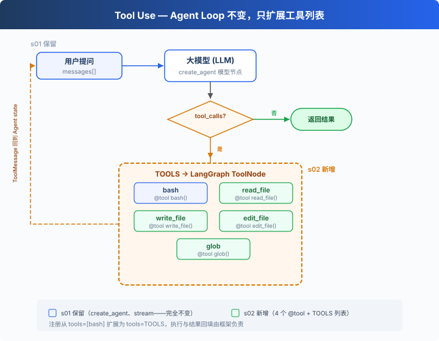

# s02: Tool Use — Agent 的手和脚

> LangChain 教学改编版。章节结构与“深入 CC 源码”部分主要参考 [shareAI-lab/learn-claude-code](https://github.com/shareAI-lab/learn-claude-code)。
>
> **Harness 层**：工具系统 — 结构化调用、路径边界与结果回传。

[s01](../s01_agent_loop/) → **s02** → [s03](../s03_permission/)

---

## 问题

只有 Bash 时，读取、写入和精确编辑都依赖 shell 字符串，模型容易遇到转义、跨平台和误覆盖问题。

---

## 解决方案



用 LangChain 的 `@tool` 把 Python 函数变成带名称、描述和参数 schema 的工具，同时可以把所有文件路径限制在工作区内。

---

## 工作原理：LangChain 版本

```python
@tool
def run_read(path: str, limit: int | None = None) -> str:
    """读取工作区内的文本文件。"""
    lines = safe_path(path).read_text().splitlines()
    if limit and limit < len(lines):
        lines = lines[:limit] + [f"...({len(lines) - limit} more lines)"]
    return "\n".join(lines)

TOOLS = [run_bash, run_edit, run_glob, run_write, run_read]
agent = create_agent(model=MODEL, tools=TOOLS, system_prompt=SYSTEM)
```

`safe_path()` 使用 `Path.resolve()` 与 `is_relative_to()` 拦截逃逸工作区的路径。工具抛出的可预期错误会转成字符串交还模型，使 Agent 能据此修正下一步。

---

## 本章文件

`code.py` 是带注释的教学主版本（可直接运行）；`code_uncommented.py` 是去掉教学注释的精简版。

---

## 试一下

先在仓库根目录准备环境，然后从根目录按模块运行：

```powershell
python -m venv venv
.\venv\Scripts\Activate.ps1
pip install -r requirements.txt
Copy-Item .env.example .env
python -m s02_tool_use.code
```

> 这些教学 Agent 可以执行命令和修改文件。建议先在测试目录中试用，并认真阅读每次权限提示。

---

## 接下来

现在 Agent 有 5 个专用工具。file tools 受 `safe_path` 保护，但 bash 不受限制，`rm -rf /` 还是能跑。

s03 Permission → 在工具执行之前加一道门：这个操作安全吗？需要用户批准吗？

<details>
<summary>深入 CC 源码</summary>

> 以下基于 CC 源码 `Tool.ts`、`tools.ts`、`toolOrchestration.ts`、`toolExecution.ts`、`StreamingToolExecutor.ts` 的核查。

### 一、工具定义方式

**教学版**：`TOOLS` 数组 + `TOOL_HANDLERS` 字典。定义和实现分开。
**CC**：每个工具是 `buildTool()` 创建的独立对象，包含 schema、验证、权限、执行。`getAllBaseTools()` 汇总所有工具。

教学版的分离方式对教学更清晰——读者一眼看到"加一个工具 = 两条定义"。

### 二、并发安全判断：isConcurrencySafe()


教学版按原始顺序逐个执行，不做并发。CC 用 `isConcurrencySafe(input)` 判断能否并发——注意这不是简单的"只读 vs 写"，而是按具体输入判断：

| | isReadOnly | isConcurrencySafe |
|---|---|---|
| FileRead | true | true |
| Glob | true | true |
| Bash `ls` | true | **true** ← 关键差异 |
| Bash `rm` | false | false |
| TaskCreate | false | **true** ← 改状态但可并发（TaskCreate 在 s12 介绍） |

CC 的 Bash tool 的 `isConcurrencySafe` 等于 `isReadOnly`——只读命令可并发，写命令不可。TaskCreate 虽然改了任务文件，但每次都写不同的文件，所以可以并发。

### 三、分区算法

CC 的 `partitionToolCalls()`（`toolOrchestration.ts:91-115`）不是分两组，而是把工具调用**按连续块分批**：

```
[read A, read B, glob *.py, bash "rm x", read C]
  → batch1(并发): [read A, read B, glob *.py]
  → batch2(串行): [bash "rm x"]
  → batch3(并发): [read C]
```

并发安全的连续块编入同一个 batch，batch 内真正并发执行（`toolOrchestration.ts:152-176`，有并发上限）。遇到非并发安全的就开新 batch 串行执行。batch 之间严格顺序。

### 四、验证管线

CC 的每个工具调用经过严格的 5 步验证（`toolExecution.ts`）：

1. **Zod schema 验证**（`614-680`，教学版用 JSON Schema 替代）：参数类型/结构检查
2. **工具级 validateInput()**（`682-733`）：参数值验证（如路径是否在工作区内）
3. **PreToolUse hooks**（`800-862`，s04 详细介绍）：钩子可以返回消息、修改输入、阻止执行
4. **权限检查**（`921-931`，s03 的核心内容）：canUseTool + checkPermissions → allow/deny/ask
5. **执行 tool.call()**（`1207-1222`）

教学版省略了 Zod（用 JSON Schema）、省略了 validateInput（用安全函数）、保留了权限检查和钩子概念。

### 五、流式工具执行

CC 的 `StreamingToolExecutor`（`StreamingToolExecutor.ts`）让工具在模型还在生成时就启动——不等模型说完。`read_file` 可能在模型还在输出"我来分析"的时候就跑完了。教学版不实现这个，目标和 s01 一致——概念清晰，不追求性能极致。

### 六、工具结果持久化

每个工具有一个 `maxResultSizeChars` 字段。结果超过这个值就落盘，模型看到的是预览 + 文件路径。FileRead 特殊——设为 `Infinity`，防止读文件的输出又被当成文件落盘。具体来说，如果 FileRead 的结果超过阈值被落盘，模型下次读那个落盘文件时又会触发落盘 → 无限循环（读文件 → 落盘 → 再读 → 再落盘 → ...）。

</details>

