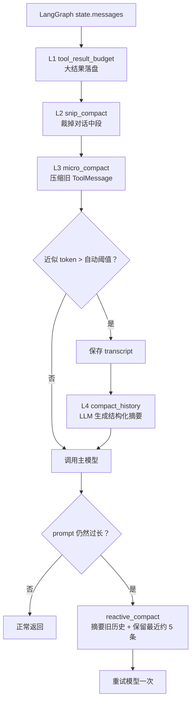

# s08: Context Compact — 上下文永远装得下

> LangChain 教学改编版。章节结构与“深入 CC 源码”部分主要参考 [shareAI-lab/learn-claude-code](https://github.com/shareAI-lab/learn-claude-code)。
>
> **Harness 层**：上下文工程——裁剪、持久化、摘要与响应式恢复。

[s07](../s07_skill_loading/) → **s08** → [s09](../s09_memory/)

---

## 本章要解决什么

Agent 的上下文不是只有用户提问，还包括系统提示词、模型回复、工具调用参数、工具返回值、Todo 状态，以及前面每轮留下的消息。会话越长，模型每次请求携带的内容就越多，最终会出现三个问题：

1. **成本和延迟持续上升**：同一批旧消息会在后续每次模型调用中反复发送。
2. **重要信息被噪声淹没**：大段文件内容、命令输出和已经完成的中间过程占据窗口。
3. **请求直接失败**：服务端返回 `413`、`prompt_too_long` 或 `context_length_exceeded`。

简单地删除旧消息并不安全。编码 Agent 还必须保留当前目标、关键决定、已经修改的文件、验证结果、失败尝试和用户约束；同时，`AIMessage.tool_calls` 与对应的 `ToolMessage` 不能被裁成不完整的消息组。

因此，本章的目标不是“删除得越多越好”，而是：

> 先用确定、便宜的规则回收空间；仍然过大时再调用模型生成摘要；无论哪种压缩路径，都尽量保留可追溯的原始记录。

---

## 整体方案


`ContentCompactionMiddleware` 在每次请求模型之前依次执行四层处理：

| 层级 | 函数 | 触发条件 | 处理方式 | 是否调用 LLM |
|------|------|----------|----------|--------------|
| L1 工具结果预算 | `tool_result_budget` | 末尾连续 `ToolMessage` 的 UTF-8 总字节数超过 200,000 | 优先把大于 30,000 字节的结果落盘，上下文只留路径和前 2,000 字符预览 | 否 |
| L2 中段裁剪 | `snip_compact` | 消息数超过 50 | 以保留开头 3 条和最近 47 条为目标，中间替换为一条裁剪标记 | 否 |
| L3 微压缩 | `micro_compact` | 存在较旧且超过 120 字符的工具结果 | 保留最近 3 条工具结果，较旧结果替换成短占位符 | 否 |
| L4 自动摘要 | `compact_history` | 近似 token 数超过自动压缩阈值 | 保存完整 transcript，再让摘要模型把活动上下文收敛成一条摘要 | 是 |

这四层之外还有两个兜底入口：

- **响应式压缩**：如果模型服务仍然报告 prompt 过长，保留最近消息、摘要更早的历史，然后重试一次。
- **手动压缩工具**：模型可以单独调用 `compact`，并通过 `focus` 指定摘要时需要重点保留的信息。

所以，“四层”指的是 `before_model` 中的常规流水线，不包含响应式兜底和手动工具。



---

## 为什么执行顺序不能交换

代码明确固定为：

```text
tool_result_budget → snip_compact → micro_compact → token 统计 → compact_history
```

关键原因是 **L1 必须先于 L3**。`micro_compact` 会把旧工具结果替换成占位符；如果先运行它，大输出的原文已经不在活动消息中，`tool_result_budget` 就没有机会把原始内容保存到磁盘。

另外，前三层都是本地、确定性的转换，成本远低于调用摘要模型。它们先释放一部分空间，可以减少不必要的摘要调用，也能缩短真正送给摘要模型的历史。

---

## 四层压缩逐层拆解

### L1：工具结果预算与落盘

`tool_result_budget()` 只检查消息列表末尾那一组连续的 `ToolMessage`。这正对应 Agent 一轮并行或连续工具调用刚执行完、准备再次请求模型的常见状态。

处理流程如下：

1. 计算末尾所有工具结果的 UTF-8 字节总数。
2. 总量不超过 `200_000` 字节时原样返回。
3. 超过预算时，按单条结果从大到小排序。
4. 只处理超过 `30_000` 字节的结果，并持续落盘，直到总量回到预算以内或没有满足条件的结果。
5. 文件写入 `.task_outputs/tool-results/<tool_call_id>.txt`。
6. 原 `ToolMessage.content` 被替换为 `<persisted-output>` 标记、相对路径和前 2,000 字符预览。

这一步不是把所有工具结果都写文件，而是在一轮工具结果过大时，优先迁移最大的几条。文件名中的非法字符会被替换为 `_`。

示意结果：

```xml
<persisted-output>
Full output: .task_outputs/tool-results/call_abc123.txt
Preview:
这里是原始工具结果的前 2000 个字符……
</persisted-output>
```

### L2：中段裁剪

`snip_compact()` 在消息数超过 50 时工作。它尽量保留：

- 最开始的 3 条消息，用于保留会话起点；
- 最近约 47 条消息，用于保留当前工作现场；
- 一条 `[snipped N messages from conversation middle]`，明确告诉模型中间发生过裁剪。

“约 47 条”而不是严格 47 条，是因为代码会调整边界，避免把工具调用消息组从中间切开。因此插入裁剪标记后，结果数量也不保证严格等于 50。

这层速度很快，但被裁掉的中段不会被总结，所以它适合先移除大量旧的过程性消息，而不负责长期保真。

### L3：旧工具结果微压缩

`micro_compact()` 搜索整个消息列表中的 `ToolMessage`：

- 最近 3 条工具结果完整保留；
- 更早的工具结果如果不超过 120 字符，也完整保留；
- 更早且较长的结果替换为：

```text
[Earlier tool result compacted. Re-run the tool if needed.]
```

替换后的消息会清空 `artifact`，并在 `response_metadata` 中写入 `context_compacted=True`。工具调用与工具结果的消息结构仍然存在，只是大段内容被缩短了；如果后续还需要具体内容，Agent 可以重新调用工具。

### L4：达到阈值后生成摘要

代码使用 LangChain 的 `count_tokens_approximately()` 估算：

```text
父 Agent 系统提示词 + 当前 messages
```

自动压缩阈值按下面的公式计算：

```text
AUTO_COMPACT_TOKENS
= CONTEXT_WINDOW_TOKENS
- MAX_OUTPUT_TOKENS
- AUTOCOMPACT_BUFFER_TOKENS
```

默认配置是：

```text
128,000 - 8,000 - 13,000 = 107,000 tokens
```

这里预留了 8,000 token 给模型输出，再保留 13,000 token 的安全缓冲。`CONTEXT_WINDOW_TOKENS` 必须与实际模型窗口匹配，否则阈值会过早触发，或者根本来不及触发。

超过阈值后，`compact_history()` 会：

1. 先把当前消息逐条序列化成 JSONL transcript；
2. 使用 XML 形式拼接历史，交给同一个 `ChatOpenAI` 模型总结；
3. 要求摘要保留目标、发现和决定、文件变更、已完成工作与验证、剩余工作、错误尝试、用户约束七类信息；
4. 用一条带 `[Auto compact]` 标记的 `HumanMessage` 替换活动消息历史；
5. 把 transcript 路径放入消息的 `additional_kwargs`。

摘要模型被明确要求只返回文本、不能调用工具。

---

## 工具消息为什么要成对保留

大多数支持工具调用的模型都要求以下协议保持完整：

```text
AIMessage(tool_calls=[call_1, call_2])
├── ToolMessage(tool_call_id=call_1)
└── ToolMessage(tool_call_id=call_2)
```

如果只保留后面的 `ToolMessage`，却删除发起调用的 `AIMessage`，模型服务可能直接拒绝请求。`_safe_tail_start()` 会在裁剪边界落入工具结果组时向前寻找对应的 `AIMessage`；`snip_compact()` 也会避免只保留头部工具调用而丢掉紧随其后的结果。

手动 `compact` 更特殊：工具执行时，最后一条 `AIMessage` 正是尚未完成的 `compact` 调用。代码先用 `messages[:-1]` 生成摘要，再重建一组最小而合法的：

```text
AIMessage(tool_calls=[compact_call])
ToolMessage(tool_call_id=当前调用 ID)
```

这样既能替换历史，又不会破坏当前工具调用协议。

---

## LangChain middleware 如何修改状态

核心状态在 `CompactState` 中扩展：

```python
class CompactState(AgentState):
    compact_failures: NotRequired[int]
```

`before_model()` 每次调用主模型前运行前三层规则，并决定是否自动摘要。LangGraph 的消息字段默认采用“追加/按 ID 合并”的 reducer，因此不能只返回一个新的短列表来表示“覆盖全部历史”。本章使用：

```python
{
    "messages": [
        RemoveMessage(id=REMOVE_ALL_MESSAGES),
        *compacted_messages,
    ]
}
```

先发出删除全部消息的指令，再追加新的压缩结果。

自动摘要如果失败，会增加 `compact_failures`。连续失败达到 3 次后，主动摘要暂时熔断，避免每次模型调用前都重复执行同一个失败操作；压缩成功或 token 回到阈值以下时计数归零。

中间件在父 Agent 中的顺序是：

```text
user_prompt_submit
→ ContentCompactionMiddleware
→ TodoListMiddleware
→ tool_hook
→ stop_hook
```

压缩只挂在父 Agent 上。子 Agent 使用独立上下文，只返回最终结论，中间消息不会合并回父 Agent 历史。

---

## 三种摘要入口的区别

| 路径 | 何时触发 | 历史如何处理 | 是否重试模型 | 状态如何提交 |
|------|----------|--------------|--------------|--------------|
| 自动压缩 | `before_model` 估算值超过阈值 | 全部当前历史总结成一条消息 | 不涉及重试，随后正常调用 | `RemoveMessage(REMOVE_ALL_MESSAGES)` 后写入摘要 |
| 响应式压缩 | 模型请求抛出已识别的 prompt-too-long 错误 | 总结较旧消息，保留最近约 5 条；边界会避开工具结果组 | 是，只重试一次 | `ExtendedModelResponse` 携带 `Command`，写入压缩历史和本次模型结果 |
| 手动 `compact` | 模型判断有必要并单独调用工具 | 总结调用前的全部历史，可传入 `focus` | 工具返回后继续正常 Agent 循环 | 工具直接返回 `Command` 重写消息并清零失败计数 |

### 响应式压缩

`wrap_model_call()` 捕获模型异常，但只处理以下明确的上下文过长信号：

- HTTP 状态码 `413`；
- `prompt_too_long`；
- `context_length_exceeded`；
- `too many tokens`；
- `maximum context length`。

其他异常继续向外抛出，不会被误当成压缩问题。响应式路径保存完整 transcript，以最近 5 条消息为初始保留目标，把更旧消息总结成 `[Reactive] compact`，然后通过 `request.override(messages=...)` 重试一次。重试成功后，`ExtendedModelResponse + Command` 同时把压缩后的请求历史和新的模型回复写回图状态，防止内存状态仍保留旧的大上下文。

### 手动 `compact`

`compact` 是一个 LangChain 工具，不是 CLI 内置斜杠命令。系统提示词要求它必须单独调用，不能和别的工具并行。可选参数 `focus` 用来告诉摘要模型重点保留什么，例如：

```text
请单独调用 compact，重点保留已经修改的文件、测试结果和剩余 TODO。
```

手动压缩同样先保存 transcript，并在新的摘要消息中明确写出完整记录的路径。

---

## 两类持久化文件

| 目录 | 写入时机 | 格式 | 用途 |
|------|----------|------|------|
| `.task_outputs/tool-results/` | 一轮工具结果超过预算，且存在大于 30,000 字节的单条结果 | 原始文本 `.txt` | 把大输出移出模型活动上下文，同时保留路径和预览 |
| `.transcripts/` | 自动、响应式或手动摘要前 | 每行一条消息的 `.jsonl` | 审计、排查和人工恢复完整会话 |

两个目录都相对于 `Path.cwd()` 创建，所以推荐始终从仓库根目录运行本章。

需要注意：教学版没有 transcript 检索工具。文件仍在磁盘上，不代表模型会自动读回其中的细节。自动摘要后，模型的活动上下文主要依赖摘要；如果遗漏了某个文件内容，需要再次读取文件或由用户提供信息。

---

## 与前面章节的关系

本章不是一个只会聊天的最小示例，而是在前面能力上继续叠加：

- s03/s04 的权限检查与 hooks；
- s05 的 Todo 管理；
- s06 的父子 Agent；
- s07 的渐进式 Skill 加载；
- s08 新增的上下文压缩与 transcript 持久化。

父 Agent 的 `session_state` 会在同一个 CLI 进程内保存完整图状态，包括 `messages`、`todos` 和 `compact_failures`。代码没有配置持久化 checkpointer，因此退出进程后活动状态不会自动恢复；已经写入磁盘的 transcript 和工具结果文件仍然存在。

---

## 本章文件

- `code.py`：带注释教学版（可直接运行）。
- `code_uncommented.py`：逻辑相同、去掉教学注释的精简版，便于通读完整结构。
- `images/`：本章的压缩流程图。

---

## 运行

先在仓库根目录准备环境，然后从根目录按模块运行：

```powershell
python -m venv venv
.\venv\Scripts\Activate.ps1
pip install -r requirements.txt
Copy-Item .env.example .env
python -m s08_context_compact.code
```

`.env` 至少需要配置：

```dotenv
OPENAI_API_KEY=your-api-key
MODEL_ID=your-model-id
BASE_URL=https://your-openai-compatible-endpoint/v1
CONTEXT_WINDOW_TOKENS=128000
```

如果使用 OpenAI 官方地址，可按 `.env.example` 的说明处理 `BASE_URL`。`CONTEXT_WINDOW_TOKENS` 应填写当前 `MODEL_ID` 的真实上下文窗口。

> 这些教学 Agent 可以执行命令和修改文件。建议先在测试目录中试用，并认真阅读每次权限提示。

---

## 如何观察压缩是否生效

### 1. 降低阈值测试自动摘要

为了不必真的构造十几万 token，可以临时把上下文窗口调小。因为代码固定预留 `8,000 + 13,000` token，所以测试值必须大于 21,000：

```powershell
$env:CONTEXT_WINDOW_TOKENS = "30000"
python -m s08_context_compact.code
```

此时自动压缩阈值为 9,000 token。连续进行多轮文件分析后，可以观察终端是否出现：

```text
[auto compact: ... tokens]
[Transcript saved: ...]
```

### 2. 测试工具结果落盘

让 Agent 在同一轮读取或产生多个大输出，使末尾工具结果总和超过 200,000 字节。随后检查：

```powershell
Get-ChildItem .task_outputs\tool-results
```

### 3. 测试手动压缩

明确要求模型单独调用 `compact`，并指定 `focus`。压缩后检查：

```powershell
Get-ChildItem .transcripts
Get-Content .transcripts\<某个 transcript 文件>.jsonl -TotalCount 3
```

### 4. 调试时重点看这些状态

- 当前 `messages` 数量是否明显减少；
- 摘要中是否保留当前任务、文件路径、验证结果和剩余工作；
- `compact_failures` 是否在失败后增加、成功后归零；
- 工具调用 `AIMessage` 与 `ToolMessage` 是否仍然配对；
- 响应式重试后，图状态中是否写入了压缩后的历史，而不只是本次临时请求被缩短。

---

## 教学版的边界

- token 数是近似估算，不是服务端 tokenizer 的精确结果。
- 中段裁剪发生在完整摘要之前，被裁掉的过程细节不会自动进入摘要。
- 自动摘要依赖 LLM，仍可能遗漏低频但重要的信息。
- transcript 只负责保存，没有自动检索和恢复机制。
- 工具结果预算只处理消息末尾连续的 `ToolMessage`，不是全局扫描所有历史结果。
- 响应式压缩只重试一次；第二次仍失败时异常会继续抛出。
- 没有实现 Claude Code 的 `contextCollapse`、压缩后文件恢复和更细的分级重试。
- 没有 checkpointer，进程退出后不能仅靠 `session_state` 恢复会话。

这些限制是有意保留的：本章集中展示上下文压缩的核心机制，而不把生产级缓存、恢复和持久化系统一次性全部引入。

---

## 接下来

上下文压缩让 Agent 能跑很久不会崩。但每次压缩后，用户之前告诉它的偏好、约束也跟着丢了。能不能让 Agent 有选择地记住重要的事？

s09 Memory → 三个子系统：选择记什么、提取关键信息、整理巩固。跨压缩、跨会话。

<details>
<summary>深入 CC 源码</summary>

> 以下基于 CC 源码 `compact.ts`、`autoCompact.ts`、`microCompact.ts`、`query.ts` 的分析。

### 执行顺序对照

教学版为了讲解方便按 L1/L2/L3/L4 编号，但实际执行顺序和编号不完全对应：

| 维度 | 教学版 | Claude Code |
|------|--------|-------------|
| 执行顺序 | budget → snip → micro → auto | budget → snip → micro → collapse → auto（`query.ts:379-468`） |
| snip_compact | 保留头 3 + 尾 47 | CC 仅主线程启用；实现不在开源仓库中（`HISTORY_SNIP` feature gate），但接口可见：`snipCompactIfNeeded(messages)` → `{ messages, tokensFreed, boundaryMessage? }`，还暴露了 `SnipTool` 工具让模型主动调用。教学版的 3/47 是简化参数 |
| micro_compact | 文本占位符替换 | 两条路径：time-based 直接清内容，cached 走 API `cache_edits`（legacy path 已移除） |
| micro_compact 白名单 | 按位置（最近 3 条） | time-based 按时间阈值触发；cached 按计数触发（`microCompact.ts`） |
| tool_result_budget | 200KB 字符 | 200,000 字符（`toolLimits.ts:49`） |
| compact_history 阈值 | 字符数估算 | 精确 token：`contextWindow - maxOutputTokens - 13_000` |
| 摘要要求 | 5 类信息 | 9 个部分 + `<analysis>`/`<summary>` 双标签 |
| 压缩 prompt | 简单 prompt | 首尾双重防呆禁止调工具 |
| PTL retry | 有（简化） | `truncateHeadForPTLRetry()` 按消息组回退（`compact.ts:243-290`） |
| 后压缩恢复 | 无（教学版只保留摘要） | 自动重新读取最近文件、计划、agent/skill/tool 等 |
| 熔断器 | 3 次 | 3 次（`autoCompact.ts:70`） |
| reactive 重试 | 1 次 | CC 有更精细的分级重试 |

### 执行顺序详解

CC 源码 `query.ts` 中的真实顺序：

1. `applyToolResultBudget`（L379）：先处理大结果，确保完整内容落盘
2. `snipCompact`（L403）：裁中间消息
3. `microcompact`（L414）：旧结果占位
4. `contextCollapse`（L441）：独立的上下文管理系统（教学版无）
5. `autoCompact`（L454）：LLM 全量摘要

教学版的 budget → snip → micro 顺序与此一致。教学版没有 contextCollapse 机制。

### read_file 的取舍

教学版的 `micro_compact` 会把旧 `tool_result` 统一替换成占位符，包括 `read_file`。这通常不影响功能正确性：如果后续还需要文件内容，模型可以重新读一次。代价是可能多一次工具调用，也可能降低 prompt cache 命中率。

Claude Code 没有用教学版这种简单规则解决这个问题。它把 `Read` 也放进可 microcompact 的工具集合，但同时维护 `readFileState`：重复读取未变化文件时返回 `FILE_UNCHANGED_STUB`，compact 后再按预算恢复最近读过的文件内容（例如最多 5 个文件、每个 5K token、总预算 50K token）。这是生产级实现里的缓存和恢复机制，教学版不展开，保留“压缩旧结果，必要时重新读取”的简单 trade-off。

### 完整常量参考

| 常量 | 值 | 源文件 |
|------|-----|--------|
| `AUTOCOMPACT_BUFFER_TOKENS` | 13,000 | `autoCompact.ts:62` |
| `MAX_CONSECUTIVE_AUTOCOMPACT_FAILURES` | 3 | `autoCompact.ts:70` |
| `MAX_OUTPUT_TOKENS_FOR_SUMMARY` | 20,000 | `autoCompact.ts:30` |
| `POST_COMPACT_TOKEN_BUDGET` | 50,000 | `compact.ts:123` |
| `POST_COMPACT_MAX_FILES_TO_RESTORE` | 5 | `compact.ts:122` |
| `POST_COMPACT_MAX_TOKENS_PER_FILE` | 5,000 | `compact.ts:124` |
| 时间 micro_compact 间隔 | 60 分钟 | `timeBasedMCConfig.ts` |
| `MAX_COMPACT_STREAMING_RETRIES` | 2 | `compact.ts:131` |

### contextCollapse 和 sessionMemoryCompact

CC 源码中还有两个机制本教学版没有展开：

- **contextCollapse**：独立的上下文管理系统，启用时抑制 proactive autocompact（`autoCompact.ts:215-222`），由 collapse 的 commit/blocking 流程接管上下文管理。但 manual `/compact` 和 reactive fallback 仍是独立路径，不受 contextCollapse 影响。
- **sessionMemoryCompact**：compact_history 之前，CC 会先尝试用已有的 session memory（s09 会讲到）做轻量摘要，不调 LLM。这个机制等学完 s09 之后回头看会更清楚。

### 压缩 prompt 长什么样？

CC 的压缩 prompt 有两个硬性要求：

1. **绝对禁止调用工具**：开头就是 `CRITICAL: Respond with TEXT ONLY. Do NOT call any tools.`，末尾还会再 REMINDER 一次
2. **先分析再总结**：模型需要先在 `<analysis>` 标签里理清思路，然后在 `<summary>` 标签里输出正式摘要。analysis 在格式化时被剥离

### 教学版的简化是刻意的

- micro_compact 用文本占位 → 我们没有 API 层的 `cache_edits` 权限
- read_file 不特殊处理 → 教学版接受必要时重新读取，避免引入 readFileState 和后压缩恢复机制
- token 用字符数估算 → 精确 tokenizer 不在教学范围内
- 后压缩恢复省略 → 教学版只保留摘要，不自动重新附加文件
- 两个辅助机制不展开 → 属于 10% 的细节

核心设计思想，便宜的先跑贵的后跑，完整保留。

</details>

