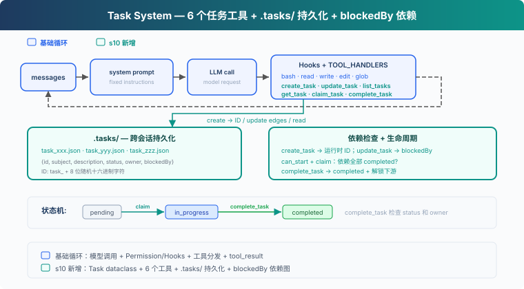
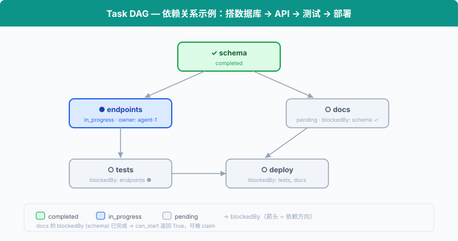
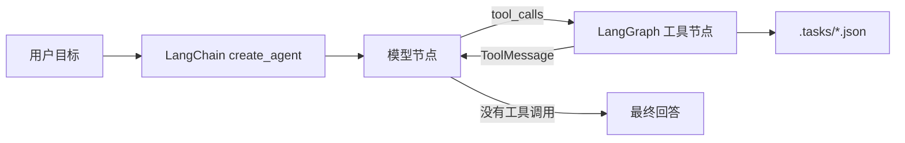

# s10: Task System — 从执行清单到可协调的任务状态

s01 → ... → s08 → s09 → `s10` → [s11](../s11_background_tasks/) → s12 → ... → s16 → s17

> *"大目标拆成小任务, 排好序, 持久化"* — 文件持久化的任务图, 多 agent 协作的基础。
>
> **Harness 层**: 任务 — 持久化的目标, 可恢复的进度。

---

## 问题

s05 的 TodoWrite 让 Agent 记录当前任务的执行步骤。清单中的每一项只有内容和状态，用来提醒 Agent 接下来还要做什么。

当项目被拆成创建数据库表、编写 API 和添加测试三个任务时，Harness 还需要知道它们之间的关系：数据库表完成后才能编写 API，API 接口确定后才能添加测试。每个任务还要记录由谁负责。

TodoWrite 没有记录这些依赖和分工。它可以显示“编写 API”仍未完成，但 Harness 无法据此判断这个任务是否可以开始。

本章加入 Task System。每个任务都有独立的 ID 和状态，`blockedBy` 记录前置任务，`owner` 记录负责执行的 Agent。

---

## 解决方案



代码保留 S04 的五个基础工具、Permission、Hooks 和统一 `execute_tool`，再加入 6 个任务工具、`.tasks/` 目录持久化和 `blockedBy` 依赖检查。

TodoWrite vs Task System：

| | TodoWrite (s05) | Task System (s10) |
|---|---|---|
| 定位 | 当前任务的执行清单 | 可恢复的任务系统 |
| 存储 | 进程内 / 会话状态 | `.tasks/{id}.json` |
| 依赖 | 无 | `blockedBy` 依赖图 |
| 生命周期 | 当前会话 / 当前任务 | 跨会话保留 |
| 分工 | 不负责任务认领 | `owner` / claim |
| 状态 | pending / in_progress / completed | pending / in_progress / completed |
| 粒度 | Agent 自己的步骤 | 可被认领、追踪、解锁的任务 |
| 更新契约 | 整表替换 | 对单条记录执行创建、读取、更新、列举 |

---

## 工作原理



### Task: 数据结构

每个任务是一个 JSON 文件，存于 `.tasks/` 目录：

```python
@dataclass
class Task:
    id: str
    subject: str
    description: str
    status: str          # pending | in_progress | completed
    owner: str | None    # 负责当前任务的 Agent
    blockedBy: list[str] # 依赖的任务 ID 列表
```

ID 使用 `task_` 加 8 位随机十六进制字符生成。创建文件时使用排他写入；如果 ID 已存在，就重新生成。

`TaskStore` 负责校验任务 ID 和读写 JSON 文件，`TASKS = TaskStore(TASKS_DIR)` 是本章使用的任务存储。

### create_task: 创建任务

```python
def create_task(subject: str, description: str = "") -> Task:
    return TASKS.create(subject, description)
```

`TaskStore.create` 检查 subject，分配随机 ID，再把任务写入 `.tasks/{id}.json`。新任务的 `blockedBy` 固定为空，工具结果会把运行时生成的 ID 返回给模型。

### update_task: 使用返回的 ID 添加依赖

```python
def update_task(task_id: str, addBlockedBy: list[str]) -> Task:
    return TASKS.update_dependencies(task_id, addBlockedBy)
```

任务图采用两阶段构建：先创建所有节点，再使用 `create_task` 返回的 ID 调用 `update_task` 添加边。模型可能在一条回复里同时发出多个工具调用，而这些同级调用在任何工具结果产生前就已经确定，因此某个 `create_task` 无法直接使用另一个调用刚生成的 ID。

`update_task` 会先校验整次修改，再统一保存。目标任务和依赖必须存在，目标必须仍为 pending 且无人认领，并且不能形成自依赖或环。重复添加已有依赖是安全的，不会产生重复边。

### can_start: 依赖检查

一个任务只能在它的 `blockedBy` **全部 completed** 之后才能开始：

```python
def can_start(task_id: str) -> bool:
    return not incomplete_dependencies(load_task(task_id))
```

`incomplete_dependencies` 读取每个前置任务。只要有一个不是 completed，或者对应文件已经不存在，任务就不能认领。

### claim_task: 认领任务

Agent 开始做一个任务时，调用 `claim_task`：设置 `owner`，状态从 `pending` → `in_progress`。`owner` 字段记录谁认领了这个任务：

```python
def claim_task(task_id: str, owner: str = "agent") -> str:
    task = load_task(task_id)
    if task.status != "pending":
        return f"Task {task_id} is {task.status}, cannot claim"
    dependencies = incomplete_dependencies(task)
    if dependencies:
        return f"Blocked by: {dependencies}"
    task.owner = owner
    task.status = "in_progress"
    TASKS.save(task)
    return f"Claimed {task_id} ({task.subject})"
```

如果任务不是 pending，或者依赖没有完成，就拒绝认领。S10 只处理顺序执行的状态更新。

### complete_task: 完成与解锁

任务做完后，设为 `completed`。同时扫描所有其他任务，找出**刚刚被解锁**的下游任务：

```python
def complete_task(task_id: str, owner: str = "agent") -> str:
    task = load_task(task_id)
    if task.status != "in_progress":
        return f"Task {task_id} is {task.status}, cannot complete"
    if task.owner != owner:
        return f"Task {task_id} is owned by {task.owner}, not {owner}"
    ready_before = {t.id for t in list_tasks()
                    if t.status == "pending" and t.blockedBy
                    and can_start(t.id)}
    task.status = "completed"
    TASKS.save(task)
    unblocked = [t.subject for t in list_tasks()
                 if t.status == "pending" and t.blockedBy
                 and t.id not in ready_before
                 and can_start(t.id)]
    msg = f"Completed {task_id} ({task.subject})"
    if unblocked:
        msg += f"\nUnblocked: {', '.join(unblocked)}"
    return msg
```

完成 "schema" 后，"endpoints" 和 "docs" 的 `can_start` 返回 True，它们可以开始。

### get_task: 查看完整细节

`list_tasks` 只显示一行摘要。`get_task` 返回完整的任务 JSON，包括 description 和依赖细节。跨会话恢复时，Agent 需要读取完整描述才能继续工作：

```python
def get_task(task_id: str) -> str:
    task = load_task(task_id)
    return json.dumps(asdict(task), indent=2)
```

### 状态机: 两个动作，三个状态

```
pending ──claim──→ in_progress ──complete──→ completed
```

这里的 `claim` / `complete` 是动作，`pending` / `in_progress` / `completed` 是状态：

- **claim_task**: `pending` → `in_progress`。设置 owner，开始工作。
- **complete_task**: `in_progress` → `completed`。把任务标记为完成，并解锁下游。

### 合起来跑

```python
# 第一阶段：创建所有节点并取得运行时 ID
schema = create_task("setup database schema")
endpoints = create_task("create API endpoints")
tests = create_task("write tests")
docs = create_task("write docs")

# 第二阶段：使用返回的 ID 建立依赖边
update_task(endpoints.id, addBlockedBy=[schema.id])
update_task(tests.id, addBlockedBy=[endpoints.id])
update_task(docs.id, addBlockedBy=[schema.id])

# Agent 认领第一个可做的任务
claim_task(schema.id)       # ✓ Claimed (无依赖)
complete_task(schema.id)    # ✓ Completed → 解锁 endpoints, docs

claim_task(endpoints.id)    # ✓ Claimed (schema 已完成)
complete_task(endpoints.id) # ✓ Completed → 解锁 tests

claim_task(docs.id)         # ✓ Claimed (schema 已完成)
complete_task(docs.id)      # ✓ Completed

claim_task(tests.id)        # ✓ Claimed (endpoints 已完成)
complete_task(tests.id)     # ✓ Completed
```

每个 `create_task` 写一个 JSON 文件，`update_task`、`claim_task` 和 `complete_task` 更新文件。跨会话时，`.tasks/` 目录还在，Agent 读文件就能恢复进度。

---

## 试一下

```sh
cd learn-claude-code
python s10_task_system/code.py
```

试试这些 prompt：

1. `Create tasks: setup database schema, create API endpoints (depends on schema), write tests (depends on endpoints), write docs (depends on schema)`
2. `List all tasks and their statuses`
3. `Claim the first unblocked task and complete it`
4. `List tasks again — which ones are now unblocked?`

观察重点：`.tasks/` 目录下是否生成了 JSON 文件？完成任务后，被阻塞的任务是否解锁？

---

## 接下来

任务图有了，但全量测试、安装依赖和部署等命令可能需要很长时间。同步执行这些命令时，Agent Loop 会一直停在当前工具调用上，只有命令结束后才能继续处理其他工作。

s11 Background Tasks → 把慢操作放到后台。Agent 可以继续处理其他任务，后台执行完成后再接收通知。
---

## 本项目保留的 LangChain / LangGraph 教学补充

> 以下内容来自本仓库对齐前的 README，作为上游课程之外的本地教学补充完整保留。

<!-- local-langchain-additions:start -->
<details>
<summary>展开本仓库原有的 LangChain / LangGraph 教学说明</summary>

# s10：Task System — 目标太大，拆成小任务

> LangChain / LangGraph 教学改编版。章节结构、任务字段和依赖语义参考 [shareAI-lab/learn-claude-code](https://github.com/shareAI-lab/learn-claude-code) 的 [s10_task_system](https://github.com/shareAI-lab/learn-claude-code/tree/main/s10_task_system)。
>
> **Harness 层**：把大目标拆成可持久化、可认领、带依赖关系的小任务。

[s09](../s09_memory/) → **s10** → [s11](../s11_background_tasks/)

---

## 问题

假设 Agent 接到一个完整项目：建立数据库、实现 API、编写测试和补充文档。如果它只有一张当前会话内的待办清单，很容易先实现 API，随后才发现数据库结构尚未建立；开始写测试后，又发现接口签名还在变化。

这些工作不是互相独立的列表项，而是存在明确的先后依赖：

```text
建立数据库结构
├──→ 实现 API ──→ 编写测试
└──→ 编写文档
```

s05 的 TodoWrite 适合记录当前任务内部的执行步骤，但它没有跨会话磁盘持久化、任务依赖和负责人字段。本章实现的是更高一层的 **Task System**。

| 对比项 | TodoWrite（s05） | Task System（s10） |
|---|---|---|
| 定位 | 当前工作的执行清单 | 可恢复的业务任务图 |
| 存储 | LangGraph 当前会话状态 | `.tasks/{task_id}.json` |
| 依赖 | 无 | `blockedBy` |
| 生命周期 | 当前进程或当前线程 | 跨进程、跨会话保留 |
| 分工 | 不认领任务 | `owner` + `claim_task` |
| 状态 | pending / in_progress / completed | pending / in_progress / completed |

---

## 解决方案


每个任务单独保存为一个 JSON 文件。任务通过 `blockedBy` 指向必须先完成的上游任务，形成一个有向依赖图。



LangChain 版本不再维护上游 Anthropic SDK 代码中的 `TOOLS` JSON Schema、`TOOL_HANDLERS` 和手写工具循环：

```python
@tool("create_task")
def run_create_task(
    subject: str,
    description: str = "",
    blockedBy: list[str] | None = None,
) -> str:
    """创建持久化的 pending 任务，可选填依赖任务 ID。"""
    task = create_task(subject, description, blockedBy)
    return f"已创建 {task.id}：{task.subject}"

agent = create_agent(
    model=model,
    tools=TOOLS,
    middleware=[runtime_system_prompt],
    name="task_system",
)
```

`@tool` 根据函数签名和文档字符串生成工具 Schema。`create_agent` 编译 LangGraph，自动完成：

```text
模型 → tool_calls → 执行工具 → ToolMessage → 再次调用模型
```

模型不再产生工具调用时，本轮图执行结束。

---

## 两类状态放在哪里

本章最重要的边界，是区分 **Agent 运行状态** 和 **业务任务状态**。

```text
LangGraph 运行状态
└── session_state["messages"]
    ├── HumanMessage
    ├── AIMessage（可能包含 tool_calls）
    └── ToolMessage

业务任务状态
└── .tasks/{task_id}.json
    ├── subject / description
    ├── status / owner
    └── blockedBy

长期记忆
└── .memory/MEMORY.md
```

当前教学代码没有配置 LangGraph checkpointer，所以 `messages` 只保存在当前 Python 进程的 `session_state` 中，退出程序后会丢失。任务 JSON 在磁盘上，退出程序后仍然存在。

如果以后为 `create_agent` 配置 SQLite 或 PostgreSQL checkpointer，对话和图执行状态也可以持久化；但 checkpointer 仍不能替代 `.tasks` 业务任务系统。两者解决的问题不同。

---

## 任务数据结构

```python
@dataclass
class Task:
    id: str
    subject: str
    description: str
    status: Literal["pending", "in_progress", "completed"]
    owner: str | None
    blockedBy: list[str]
```

磁盘中的任务示例：

```json
{
  "id": "task_1785290400_a1b2c3d4",
  "subject": "实现 API",
  "description": "实现用户增删改查接口",
  "status": "pending",
  "owner": null,
  "blockedBy": [
    "task_1785290300_11223344"
  ]
}
```

ID 使用“秒级时间戳 + 随机十六进制后缀”。这比教学参考代码的四位随机数更不容易在同一秒碰撞，但它仍不是数据库级全局序列。

---

## 创建、依赖、认领与完成

### 创建任务

`create_task` 创建 `pending` 任务并立即写入 `.tasks`：

```python
schema = create_task("建立数据库结构")
api = create_task("实现 API", blockedBy=[schema.id])
tests = create_task("编写测试", blockedBy=[api.id])
docs = create_task("编写文档", blockedBy=[schema.id])
```

依赖 ID 可以在创建时尚不存在。缺失依赖会被视为阻塞，而不是让任务错误地开始。

### 判断能否开始

```python
def can_start(task_id: str) -> bool:
    return not incomplete_dependencies(load_task(task_id))
```

只要 `blockedBy` 中有一个任务缺失或状态不是 `completed`，结果就是 `False`。

### 认领任务

```text
pending ──claim_task──→ in_progress
```

`claim_task` 会依次检查：

1. 当前状态必须是 `pending`；
2. 所有依赖必须已经完成；
3. 设置 `owner`；
4. 把状态更新为 `in_progress`；
5. 保存 JSON。

### 完成任务

```text
in_progress ──complete_task──→ completed
```

完成后会扫描直接依赖当前任务的下游任务。只有下游任务的全部依赖都完成时，才会报告为“已解锁”。

---

## 本章的八个工具

| 工具 | 用途 |
|---|---|
| `bash` | 在工作区执行 shell 命令 |
| `read_file` | 读取 UTF-8 文本文件 |
| `write_file` | 写入 UTF-8 文本文件 |
| `create_task` | 创建带可选依赖的任务 |
| `list_tasks` | 查看状态、负责人、依赖和可开始状态 |
| `get_task` | 查看一个任务的完整 JSON |
| `claim_task` | 认领未阻塞的 pending 任务 |
| `complete_task` | 完成任务并报告新解锁的下游任务 |

任务函数和 LangChain 工具包装层是分开的：`create_task()` 等函数负责业务规则，`run_create_task()` 等 `@tool` 函数负责生成 Schema、打印进度和把异常转换成模型可以理解的文本。

---

## 相对已归档的 s11 Error Recovery 的变化

| 组件 | s11 Error Recovery（归档） | s10 |
|---|---|---|
| 重点 | API 错误恢复 | 持久化任务图 |
| 任务模型 | 无 | `Task` dataclass |
| 磁盘任务存储 | 无 | `.tasks/*.json` |
| 依赖检查 | 无 | `blockedBy` + `can_start` |
| 任务状态机 | 无 | pending → in_progress → completed |
| Agent 循环 | `create_agent` / LangGraph | 仍由 `create_agent` / LangGraph 负责 |

为了突出本章机制，代码没有复制已归档的 s11 Error Recovery 的完整 `ErrorRecoveryMiddleware`。任务持久化和模型错误恢复是独立层：实际项目中可以把本章五个任务工具加入 legacy/s11_error_recovery 的 `TOOLS`，两层可以直接组合。

---

## 已修复的原代码问题

本章实现修复了原占位代码和初稿中的以下问题：

- 任务目录从错误的 `.task` 统一为参考章节使用的 `.tasks`；
- `json.load(raw)` 改为读取字符串所需的 `json.loads(raw)`；
- `time.timr()` 改为 `time.time()`；
- 空标题分支补上真正的 `raise ValueError(...)`；
- 缺失依赖改为捕获 `FileNotFoundError`；
- `complete_task` 的返回消息移出遍历循环，避免没有下游任务时变量未赋值；
- 只报告由当前任务直接解锁的下游任务；
- 增加任务 ID 和工作区路径边界检查；
- 使用进程内 `RLock` 防止 LangGraph 并行工具调用竞争同一任务；
- 环境变量、工具说明、错误结果和代码注释统一整理。

---

## 本章文件

- `code.py`：带注释教学版（可直接运行）；
- `code_uncommented.py`：保留必要中文文档字符串、不含教学行注释的完整版本；

---

## 运行

在仓库根目录准备环境：

```powershell
python -m venv venv
.\venv\Scripts\Activate.ps1
pip install -r requirements.txt
Copy-Item .env.example .env
```

`.env` 至少需要：

```dotenv
MODEL_ID=your-model-id
OPENAI_API_KEY=your-api-key
BASE_URL=https://your-openai-compatible-endpoint/v1
```

运行任一版本：

```powershell
python -m s10_task_system.code
python -m s10_task_system.code_uncommented
```

可以依次尝试：

1. `创建四个任务：建立数据库结构；实现 API（依赖数据库）；编写测试（依赖 API）；编写文档（依赖数据库）。`
2. `列出全部任务以及它们的状态。`
3. `认领第一个没有阻塞的任务。`
4. `完成刚才认领的任务，然后告诉我解锁了哪些任务。`

观察仓库根目录的 `.tasks`：每次创建、认领和完成都会更新对应 JSON 文件。

> `bash` 和 `write_file` 可以执行命令或修改工作区文件。请在测试工作区中运行，并确认模型准备执行的操作符合预期。

---

## 教学版边界

当前实现有意保持简洁：

- 没有 DAG 环检测；
- 没有任务删除、释放认领或 `in_progress → pending` 恢复路径；
- `RLock` 只保护当前 Python 进程，不提供多进程文件锁；
- 没有高水位 ID 文件；
- 没有配置 LangGraph checkpointer，对话消息不会跨进程恢复；
- 没有合并已归档的 s11 Error Recovery 的完整错误恢复中间件。

真实 Claude Code 的任务系统还包含递增 ID、高水位标、双向 `blocks` / `blockedBy`、任务更新、跨进程锁、agent ownership 竞争检查和任务列表监听等机制。

---


---

## 接下来

s11 将在任务系统之上增加 Background Tasks：耗时命令不再阻塞 Agent 的模型循环，Agent 可以继续处理其他工作，后台任务完成后再返回结果。

</details>
<!-- local-langchain-additions:end -->

<!-- upstream-cc-source:start -->
## 深入 CC 源码

> 原文：[s12_task_system](https://github.com/shareAI-lab/learn-claude-code/blob/67a9126c6435a8654ba7a6f68c0fd2130f00a462/s12_task_system/README.md)。以下折叠块保持原文，文中的章号与源码行号沿用该版本。

<details>
<summary>深入 CC 源码</summary>

> 以下基于 CC 源码 `utils/tasks.ts`（862 行）、`tools/TaskCreateTool/TaskCreateTool.ts`（138 行）、`tools/TaskUpdateTool/TaskUpdateTool.ts`（406 行）、`tools/TaskGetTool/TaskGetTool.ts`（128 行）、`tools/TaskListTool/TaskListTool.ts`（116 行）、`hooks/useTaskListWatcher.ts`（221 行）的分析。

### 一、TaskRecord 的完整字段

教学版只讲了 id、subject、status、owner、blockedBy。CC 实际有 9 个字段（`utils/tasks.ts:76-89`）：

| 字段 | 类型 | 用途 |
|------|------|------|
| `id` | string | 递增整数 ID |
| `subject` | string | 简短标题 |
| `description` | string | 自由格式描述 |
| `activeForm` | string? | 进行时态，in_progress 时在 spinner 显示 |
| `owner` | string? | 分配的 agent ID |
| `status` | pending/in_progress/completed | 生命周期 |
| `blocks` | string[] | 此任务阻塞的任务 ID（下游） |
| `blockedBy` | string[] | 阻塞此任务的任务 ID（上游） |
| `metadata` | Record? | 任意扩展键值对 |

存储位置：`~/.claude/tasks/{taskListId}/{id}.json`。每个任务一个文件。

### 二、不是 TodoWrite 的升级，是两个独立系统

CC 中 Task System 和 TodoWrite **同时存在**，通过 `isTodoV2Enabled()` 切换（`utils/tasks.ts:133`）——交互式会话默认启用 Task（V2），非交互式/SDK 默认用 TodoWrite。环境变量 `CLAUDE_CODE_ENABLE_TASKS` 可强制启用 Task。Task 有 TodoWrite 没有的：文件锁并发保护、依赖强制执行、ownership、fs.watch 响应式监听、生命周期 hooks。

### 三、并发认领的锁机制

`claimTask()`（`utils/tasks.ts:541-612`）用双重锁防竞争：

**任务文件锁**：`proper-lockfile` 锁住 `{taskId}.json`（最多重试 30 次，指数退避 5-100ms）。锁内：
1. 重新读取任务（防 TOCTOU）
2. 检查已被他人认领 → `already_claimed`
3. 检查已完成 → `already_resolved`
4. 检查上游未完成 → `blocked`
5. 设置 owner

**列表级锁**（agent busy 检查时）：`.lock` 文件，原子性扫描所有任务并检查该 agent 是否已有其他 open task。

注意：教学版把 claim 和开始工作合成一步（claim = set owner + in_progress）；真实 CC 的 `claimTask` 主要解决 owner 竞争，只设 owner 不改 status，状态更新由 `TaskUpdate` 完成。

### 四、高水位标防 ID 重用

`.highwatermark` 文件记录曾分配过的最高任务 ID。即使任务被删除，ID 也不会被重用。

### 五、四个 Task 工具

CC 的任务系统有四个工具（不是教学版的一个通用 Task 工具）：`TaskCreate`、`TaskGet`、`TaskUpdate`、`TaskList`。全部设置 `isConcurrencySafe: true` 和 `shouldDefer: true`（工具 schema 不在初始 prompt 中，需 ToolSearch 后才可见）。

教学版的 `create_task(blockedBy=...)` 在创建时直接声明依赖，是合理简化。真实 CC 的 `TaskCreate` 只接受 subject/description/activeForm/metadata，依赖关系由 `TaskUpdate` 的 `addBlocks/addBlockedBy` 维护。

</details>

<!-- upstream-cc-source:end -->
