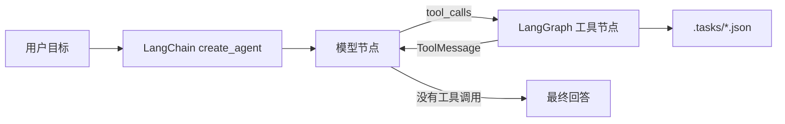

# s10：Task System — 目标太大，拆成小任务

>
> **Harness 层**：把大目标拆成可持久化、可认领、带依赖关系的小任务。

[s09](../s09_memory/) → **s10** → [s11](../s11_background_tasks/)

---

## 问题

假设 Agent 接到一个完整项目：建立数据库、实现 API、编写测试和补充文档。如果它只有一张当前会话内的待办清单，很容易先实现 API，随后才发现数据库结构尚未建立；开始写测试后，又发现接口签名还在变化。

这些工作不是互相独立的列表项，而是存在明确的先后依赖：

```text
建立数据库结构
├──→ 实现 API ──→ 编写测试
└──→ 编写文档
```

s05 的 TodoWrite 适合记录当前任务内部的执行步骤，但它没有跨会话磁盘持久化、任务依赖和负责人字段。本章实现的是更高一层的 **Task System**。

| 对比项 | TodoWrite（s05） | Task System（s10） |
|---|---|---|
| 定位 | 当前工作的执行清单 | 可恢复的业务任务图 |
| 存储 | LangGraph 当前会话状态 | `.tasks/{task_id}.json` |
| 依赖 | 无 | `blockedBy` |
| 生命周期 | 当前进程或当前线程 | 跨进程、跨会话保留 |
| 分工 | 不认领任务 | `owner` + `claim_task` |
| 状态 | pending / in_progress / completed | pending / in_progress / completed |

---

## 解决方案

每个任务单独保存为一个 JSON 文件。任务通过 `blockedBy` 指向必须先完成的上游任务，形成一个有向依赖图。



LangChain 版本不再维护上游 Anthropic SDK 代码中的 `TOOLS` JSON Schema、`TOOL_HANDLERS` 和手写工具循环：

```python
@tool("create_task")
def run_create_task(
    subject: str,
    description: str = "",
    blockedBy: list[str] | None = None,
) -> str:
    """创建持久化的 pending 任务，可选填依赖任务 ID。"""
    task = create_task(subject, description, blockedBy)
    return f"已创建 {task.id}：{task.subject}"

agent = create_agent(
    model=model,
    tools=TOOLS,
    middleware=[runtime_system_prompt],
    name="task_system",
)
```

`@tool` 根据函数签名和文档字符串生成工具 Schema。`create_agent` 编译 LangGraph，自动完成：

```text
模型 → tool_calls → 执行工具 → ToolMessage → 再次调用模型
```

模型不再产生工具调用时，本轮图执行结束。

---

## 两类状态放在哪里

本章最重要的边界，是区分 **Agent 运行状态** 和 **业务任务状态**。

```text
LangGraph 运行状态
└── session_state["messages"]
    ├── HumanMessage
    ├── AIMessage（可能包含 tool_calls）
    └── ToolMessage

业务任务状态
└── .tasks/{task_id}.json
    ├── subject / description
    ├── status / owner
    └── blockedBy

长期记忆
└── .memory/MEMORY.md
```

当前教学代码没有配置 LangGraph checkpointer，所以 `messages` 只保存在当前 Python 进程的 `session_state` 中，退出程序后会丢失。任务 JSON 在磁盘上，退出程序后仍然存在。

如果以后为 `create_agent` 配置 SQLite 或 PostgreSQL checkpointer，对话和图执行状态也可以持久化；但 checkpointer 仍不能替代 `.tasks` 业务任务系统。两者解决的问题不同。

---

## 任务数据结构

```python
@dataclass
class Task:
    id: str
    subject: str
    description: str
    status: Literal["pending", "in_progress", "completed"]
    owner: str | None
    blockedBy: list[str]
```

磁盘中的任务示例：

```json
{
  "id": "task_1785290400_a1b2c3d4",
  "subject": "实现 API",
  "description": "实现用户增删改查接口",
  "status": "pending",
  "owner": null,
  "blockedBy": [
    "task_1785290300_11223344"
  ]
}
```

ID 使用“秒级时间戳 + 随机十六进制后缀”。这比教学参考代码的四位随机数更不容易在同一秒碰撞，但它仍不是数据库级全局序列。

---

## 创建、依赖、认领与完成

### 创建任务

`create_task` 创建 `pending` 任务并立即写入 `.tasks`：

```python
schema = create_task("建立数据库结构")
api = create_task("实现 API", blockedBy=[schema.id])
tests = create_task("编写测试", blockedBy=[api.id])
docs = create_task("编写文档", blockedBy=[schema.id])
```

依赖 ID 可以在创建时尚不存在。缺失依赖会被视为阻塞，而不是让任务错误地开始。

### 判断能否开始

```python
def can_start(task_id: str) -> bool:
    return not incomplete_dependencies(load_task(task_id))
```

只要 `blockedBy` 中有一个任务缺失或状态不是 `completed`，结果就是 `False`。

### 认领任务

```text
pending ──claim_task──→ in_progress
```

`claim_task` 会依次检查：

1. 当前状态必须是 `pending`；
2. 所有依赖必须已经完成；
3. 设置 `owner`；
4. 把状态更新为 `in_progress`；
5. 保存 JSON。

### 完成任务

```text
in_progress ──complete_task──→ completed
```

完成后会扫描直接依赖当前任务的下游任务。只有下游任务的全部依赖都完成时，才会报告为“已解锁”。

---

## 本章的八个工具

| 工具 | 用途 |
|---|---|
| `bash` | 在工作区执行 shell 命令 |
| `read_file` | 读取 UTF-8 文本文件 |
| `write_file` | 写入 UTF-8 文本文件 |
| `create_task` | 创建带可选依赖的任务 |
| `list_tasks` | 查看状态、负责人、依赖和可开始状态 |
| `get_task` | 查看一个任务的完整 JSON |
| `claim_task` | 认领未阻塞的 pending 任务 |
| `complete_task` | 完成任务并报告新解锁的下游任务 |

任务函数和 LangChain 工具包装层是分开的：`create_task()` 等函数负责业务规则，`run_create_task()` 等 `@tool` 函数负责生成 Schema、打印进度和把异常转换成模型可以理解的文本。

---

## 相对已归档的 s11 Error Recovery 的变化

| 组件 | s11 Error Recovery（归档） | s10 |
|---|---|---|
| 重点 | API 错误恢复 | 持久化任务图 |
| 任务模型 | 无 | `Task` dataclass |
| 磁盘任务存储 | 无 | `.tasks/*.json` |
| 依赖检查 | 无 | `blockedBy` + `can_start` |
| 任务状态机 | 无 | pending → in_progress → completed |
| Agent 循环 | `create_agent` / LangGraph | 仍由 `create_agent` / LangGraph 负责 |

为了突出本章机制，代码没有复制已归档的 s11 Error Recovery 的完整 `ErrorRecoveryMiddleware`。任务持久化和模型错误恢复是独立层：实际项目中可以把本章五个任务工具加入 legacy/s11_error_recovery 的 `TOOLS`，两层可以直接组合。

---

## 已修复的原代码问题

本章实现修复了原占位代码和初稿中的以下问题：

- 任务目录从错误的 `.task` 统一为参考章节使用的 `.tasks`；
- `json.load(raw)` 改为读取字符串所需的 `json.loads(raw)`；
- `time.timr()` 改为 `time.time()`；
- 空标题分支补上真正的 `raise ValueError(...)`；
- 缺失依赖改为捕获 `FileNotFoundError`；
- `complete_task` 的返回消息移出遍历循环，避免没有下游任务时变量未赋值；
- 只报告由当前任务直接解锁的下游任务；
- 增加任务 ID 和工作区路径边界检查；
- 使用进程内 `RLock` 防止 LangGraph 并行工具调用竞争同一任务；
- 环境变量、工具说明、错误结果和代码注释统一整理。

---

## 本章文件

- `code.py`：带注释教学版（可直接运行）；
- `code_uncommented.py`：保留必要中文文档字符串、不含教学行注释的完整版本；

---

## 运行

在仓库根目录准备环境：

```powershell
python -m venv venv
.\venv\Scripts\Activate.ps1
pip install -r requirements.txt
Copy-Item .env.example .env
```

`.env` 至少需要：

```dotenv
MODEL_ID=your-model-id
OPENAI_API_KEY=your-api-key
BASE_URL=https://your-openai-compatible-endpoint/v1
```

运行任一版本：

```powershell
python -m s10_task_system.code
python -m s10_task_system.code_uncommented
```

可以依次尝试：

1. `创建四个任务：建立数据库结构；实现 API（依赖数据库）；编写测试（依赖 API）；编写文档（依赖数据库）。`
2. `列出全部任务以及它们的状态。`
3. `认领第一个没有阻塞的任务。`
4. `完成刚才认领的任务，然后告诉我解锁了哪些任务。`

观察仓库根目录的 `.tasks`：每次创建、认领和完成都会更新对应 JSON 文件。

> `bash` 和 `write_file` 可以执行命令或修改工作区文件。请在测试工作区中运行，并确认模型准备执行的操作符合预期。

---

## 教学版边界

当前实现有意保持简洁：

- 没有 DAG 环检测；
- 没有任务删除、释放认领或 `in_progress → pending` 恢复路径；
- `RLock` 只保护当前 Python 进程，不提供多进程文件锁；
- 没有高水位 ID 文件；
- 没有配置 LangGraph checkpointer，对话消息不会跨进程恢复；
- 没有合并已归档的 s11 Error Recovery 的完整错误恢复中间件。

真实 Claude Code 的任务系统还包含递增 ID、高水位标、双向 `blocks` / `blockedBy`、任务更新、跨进程锁、agent ownership 竞争检查和任务列表监听等机制。

---

<details>
<summary>深入 Claude Code 源码</summary>

以下内容根据参考仓库对 Claude Code `utils/tasks.ts`、TaskCreate、TaskGet、TaskUpdate、TaskList 和任务列表监听逻辑的分析整理。教学代码用于说明核心机制，不宣称与产品源码逐行等价。

### 一、真实 TaskRecord 字段更多

| 字段 | 用途 |
|---|---|
| `id` | 任务 ID |
| `subject` | 简短标题 |
| `description` | 完整任务描述 |
| `activeForm` | 进行中时显示的进行时文本 |
| `owner` | 被分配的 agent ID |
| `status` | pending / in_progress / completed |
| `blocks` | 当前任务阻塞的下游任务 |
| `blockedBy` | 阻塞当前任务的上游任务 |
| `metadata` | 可扩展元数据 |

真实存储按任务列表隔离，形式类似：

```text
~/.claude/tasks/{taskListId}/{taskId}.json
```

教学版只有一个工作区级 `.tasks` 目录，也只保存理解任务依赖所需的六个字段。

### 二、Task System 与 TodoWrite 是两套机制

真实实现并不是简单地把 TodoWrite 改名为 Task。交互式会话可以使用任务系统，部分非交互式或 SDK 场景仍可以使用 TodoWrite。Task System 额外提供文件持久化、依赖、ownership、并发保护和任务列表监听。

### 三、真实认领需要跨进程锁

多个 agent 可能同时尝试认领同一个任务。真实实现会在锁内重新读取任务，再检查：

1. 是否已经被其他 agent 认领；
2. 是否已经完成；
3. 是否仍被上游任务阻塞；
4. 当前 agent 是否已有其他未完成任务；
5. 条件满足后才写入 owner。

“先读取、再写入”如果不在同一把锁内，会产生检查时与使用时不一致的问题。本章的 `RLock` 只演示当前进程内保护；多 agent、多进程场景需要真正的文件锁或数据库事务。

### 四、高水位标防止 ID 重用

真实任务目录还会记录已经分配过的最高任务 ID。即使旧任务文件被删除，新的任务也不会重新使用旧 ID。教学版使用时间戳和随机后缀，因此没有实现高水位文件。

### 五、真实工具把创建与更新分开

真实系统通常暴露四类任务工具：TaskCreate、TaskGet、TaskUpdate、TaskList。TaskCreate 负责基础字段；状态、负责人和 `blocks` / `blockedBy` 关系主要由 TaskUpdate 维护。

本章为了便于观察，把依赖直接放进 `create_task(blockedBy=...)`，并把两个常用状态动作拆成 `claim_task` 和 `complete_task`。另外，本章的 claim 同时设置 owner 并把状态改为 `in_progress`；真实实现中，认领与状态更新可以是分开的步骤。

### 六、任务列表可以被响应式监听

真实 Harness 可以监听任务目录变化。当另一个 agent 完成任务或更新 owner 时，界面和协作 agent 能够及时看到最新列表。本章每次调用 `list_tasks` 都从磁盘重新读取，保证显式查询得到真实状态，但没有实现文件系统 watcher。

</details>

---

## 接下来

s11 将在任务系统之上增加 Background Tasks：耗时命令不再阻塞 Agent 的模型循环，Agent 可以继续处理其他工作，后台任务完成后再返回结果。

