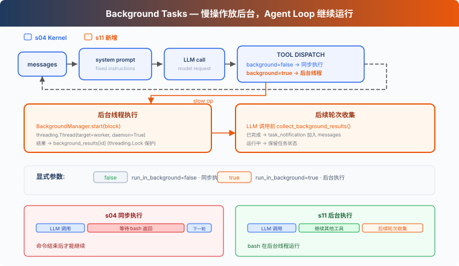

# s11: Background Tasks — 慢操作放后台

> **对齐状态**：本章 `code.py` 对齐上游 `s11_background_tasks` 的结构；模型适配与本章机制在 `code.py` 中直接实现，使用 LangChain OpenAI-compatible 调用。
[English](README.md) · [中文](README.zh.md) · [日本語](README.ja.md)

s01 → ... → s09 → s10 → `s11` → [s12](../s12_cron_scheduler/) → s13 → ... → s16 → s17

> *"慢操作放后台，Agent Loop 继续运行"* — 后台线程执行命令，后续轮次收集完成结果。
>
> **Harness 层**: 后台 — 异步执行, 不阻塞主循环。

---

## 问题

读取文件或运行 `git status` 通常很快，同步执行时等待并不明显。但安装依赖、执行完整测试或构建项目可能持续几分钟。在命令返回前，Harness 无法处理当前响应中的下一个工具调用，也不能进入下一轮。

如果后续工作并不依赖这个命令，继续等待就没有必要。例如，Agent 启动完整测试后，本来还可以检查文档或整理其他文件，但同步执行会让整个 Agent Loop 停在这次 Bash 调用上。

S11 要解决的问题是：让耗时的 Bash 命令在后台执行，使 Agent Loop 可以继续处理其他工作，并在后续轮次收集完成结果。

---

## 解决方案



本章把慢操作放入后台线程。当前工具调用先返回一个占位 `tool_result`，Agent Loop 可以继续运行；后续轮次开始时再收集已经完成的结果，以通知形式加入对话。

同步 vs 后台：

| | 同步 (s04) | 后台 (s11) |
|---|---|---|
| 慢操作 | 当前工具调用被阻塞 | 后台线程执行 |
| Agent Loop | 等待命令返回 | 收到占位结果后继续运行 |
| 结果 | 命令结束后返回 | 先返回 `bg_id`，后续轮次收集结果 |
| 判断标准 | — | bash 的 `run_in_background` 参数 |

---

## 工作原理

### should_run_background: 显式请求

模型通过 bash 工具的 `run_in_background` 参数请求后台执行。只有参数明确为 `true`，并且工具是 bash 时，才会进入后台执行路径。其他调用仍然同步执行。

```python
def should_run_background(tool_name: str, tool_input: dict) -> bool:
    return (
        tool_name == "bash"
        and tool_input.get("run_in_background") is True
    )
```

不再根据 `install`、`build` 或 `test` 等关键词猜测。是否进入后台由工具调用明确决定。

### BackgroundManager: 后台执行与生命周期

`BackgroundManager` 保存任务状态和完成队列。`start()` 先登记任务，再启动 daemon 线程，并立即返回 `bg_id`：

```python
class BackgroundManager:
    def __init__(self):
        self.tasks = {}
        self.results = {}
        self._ready = []
        self._lock = threading.Lock()

    def start(self, block) -> str:
        # Register task, then run _run() in a daemon thread.
        ...

    def _run(self, task_id: str, command: str):
        output, exit_code = _run_bash_process(command)
        status = "completed" if exit_code == 0 else "failed"
        with self._lock:
            self.tasks[task_id]["status"] = status
            self.results[task_id] = _format_bash_result(output, exit_code)
            self._ready.append(task_id)
```

命令以非零状态退出或 worker 抛出异常时，任务会进入 `failed`。Shell 会在独立的进程组中启动；命令完成、超时，或 Agent 经正常路径、`SIGTERM` 退出时，运行时会停止原进程组。这只是生命周期清理，并不是沙箱；另建 session 的进程仍可能离开该进程组。

### collect_background_results: 通知收集

后续轮次开始时，`collect()` 从完成队列中取出结果，并格式化为 `<task_notification>` 通知：

```python
def collect_background_results() -> list[str]:
    return BACKGROUND.collect()
```

通知不复用原始 `tool_use_id`。原始 tool call 已经用占位 `tool_result` 回复了；后续收集完成结果时，会用 `task_notification` 格式把它作为独立事件加入对话。一个 `tool_use` 仍然只对应一个 `tool_result`。

### 循环中的集成

每次调用 LLM 前，Agent Loop 先收集已经完成的后台结果。`execute_tool()` 仍然在主线程执行 `PreToolUse`，然后再选择同步或后台执行：

```python
while True:
    inject_background_results(messages)
    response = client.messages.create(...)

def execute_tool(block) -> str:
    blocked = trigger_hooks("PreToolUse", block)
    if blocked is not None:
        return str(blocked)
    if should_run_background(block.name, block.input):
        task_id = start_background_task(block)
        output = f"[Background task {task_id} started]"
    else:
        output = call_tool(block)
    trigger_hooks("PostToolUse", block, output)
    return output
```

慢操作先返回一个带 `bg_id` 的占位 tool_result。后台结果不会主动唤醒 Agent；下一次进入 Agent Loop 时，`inject_background_results()` 才会收集已经完成的结果。

### 合起来跑

```
Turn 1:
  LLM → bash "npm install" (run_in_background=true)
  → start_background_task → bg_0001
  → tool_result: "[Background task bg_0001 started]..."
  → LLM: "OK, I'll check later. Let me also read the config."

Turn 2:
  LLM → read_file "package.json" (fast, sync)
  → tool_result: file content

Turn 3:
  → collect bg_0001 as <task_notification>
  → LLM sees: config file + install notification in one message
```

npm install 在后台运行时，Agent Loop 继续执行了 read_file。

---

## 本章新增了什么

| 组件 | S04 Kernel | S11 |
|------|-----------|-----------|
| 执行模型 | 全部同步 | 慢操作后台线程 + 通知注入 |
| bash schema | `command` | `command` + `run_in_background` |
| 新函数 | — | `should_run_background`, `start_background_task`, `collect_background_results`, `inject_background_results` |
| 新类型 | — | `BackgroundManager` |
| 通知格式 | — | `<task_notification>`（不复用 tool_use_id） |
| 循环行为 | 工具同步执行 | 显式后台执行，后续轮次收集完成结果 |
| 工具 | 5 | 5（bash schema 增加一个参数） |

---

## 试一下

```sh
cd learn-claude-code
python s11_background_tasks/code.py
```

试试这些 prompt：

1. `Run pip list in the background and find all Python files in this directory`
2. `Run npm install (use run_in_background) and while waiting, read package.json`
3. `Run a short sleep in the background, then list all Markdown files`

观察重点：显式设置 `run_in_background` 后，命令有没有被送到后台？`bg_id` 是否返回？后续轮次有没有以 `<task_notification>` 格式收集完成结果？

---

## 接下来

后台任务解决了"慢操作不阻塞"。但如果想定时做某件事呢？比如"每天早上 9 点跑测试"、"每 5 分钟检查一次服务器状态"。

s12 Cron Scheduler → 给 Agent 装一个闹钟。
---

## 本项目保留的 LangChain / LangGraph 教学补充

> 以下内容来自本仓库对齐前的 README，作为上游课程之外的本地教学补充完整保留。

<!-- local-langchain-additions:start -->
<details>
<summary>展开本仓库原有的 LangChain / LangGraph 教学说明</summary>

# s11: Background Tasks — 慢操作放后台

[s10](../s10_task_system/) → `s11` → [s12](../s12_cron_scheduler/)

> *"慢操作丢后台, agent 继续处理"* — 后台线程跑命令, 完成后注入通知。
>
> **Harness 层**: 后台 — 异步执行, 不阻塞主循环。

---

## 问题

你用过洗衣机吗？把衣服扔进去，按下启动，然后去干别的——做饭、回消息、看论文。30 分钟后洗衣机"滴滴滴"提醒你：好了。你不会站在洗衣机前面干等 30 分钟。

Agent 的 bash 工具也一样。`pip install torch` 要 10 分钟，`npm run build` 要 3 分钟。这些命令一跑，Agent 就在等 bash 工具返回，没法利用这段时间处理别的任务。

读文件是毫秒级，不等。`git status` 一秒内返回，不等。但 `npm install`？分钟级。Agent 等 10 分钟什么都不做，而 LLM 按 token 计费，空转就是浪费。

---

## 解决方案


教学代码沿用 s10 的持久化任务系统和动态 system prompt；为了聚焦后台任务，仍然省略已归档的 s11 的完整错误恢复、技能加载和上下文压缩。唯一的核心变化是：耗时 shell 命令被送入后台线程，`bash` 工具立即返回后台任务 ID，命令完成后再把通知注入 LangGraph 消息状态。

同步 vs 后台：

| | 同步 (s10) | 后台 (s11) |
|---|---|---|
| 慢操作 | Agent 干等 | 后台线程执行 |
| Agent 空闲 | 是 | 否，可以继续处理其他工作 |
| 工具结果 | 命令结束后返回 | 立即返回 `bg_id` 占位结果 |
| 最终结果 | 当前工具消息 | 后续模型调用前注入通知 |
| 判断标准 | — | `run_in_background` 显式参数，启发式兜底 |

LangChain 的 `create_agent` 已经编译了标准 LangGraph 工具循环：

```text
model → tools → model → ... → final answer
```

所以本章不再手写 `tool_use` 分发循环。后台行为放在 `bash` 工具内部，完成通知通过 `BackgroundNotificationMiddleware.before_model` 写入 Agent 的 `messages` 状态。

---

## 工作原理

### should_run_background：显式请求优先，启发式兜底

模型通过 `bash` 工具的 `run_in_background` 参数决定执行方式：

- `true`：强制后台执行；
- `false`：强制前台执行；
- 不传：根据命令关键词进行启发式判断。

```python
SLOW_COMMAND_KEYWORDS = (
    "pip install",
    "npm install",
    "npm run build",
    "docker build",
    "cargo build",
    "pytest",
    "gradle build",
    "mvn test",
    "compile",
    "deploy",
)


def is_slow_operation(command: str) -> bool:
    """判断命令是否可能是耗时操作。"""
    normalized = command.lower().strip()
    return any(
        keyword in normalized
        for keyword in SLOW_COMMAND_KEYWORDS
    )


def should_run_background(
    command: str,
    run_in_background: bool | None,
) -> bool:
    """显式参数优先；未提供参数时使用启发式判断。"""
    if run_in_background is not None:
        return run_in_background

    return is_slow_operation(command)
```

CC 的 bash 工具 schema 也有 `run_in_background: boolean` 参数。模型自己决定哪些命令放入后台，不依赖关键词猜测。本章保留启发式兜底，但显式参数优先。

### execute_shell_command：可终止的进程树

后台线程最终仍然需要启动一个系统进程。代码使用 `subprocess.Popen` 执行命令，并捕获 stdout、stderr 和退出码。

在 Windows 上，`subprocess.run(..., shell=True, timeout=...)` 可能只终止外层 shell，子进程仍然占用输出管道。为保证超时真正生效，本章为每条命令创建独立进程组；超时时，Windows 使用 `taskkill /T /F`，POSIX 使用 `killpg` 终止整棵进程树。

```python
process = subprocess.Popen(
    command,
    shell=True,
    cwd=WORKDIR,
    stdout=subprocess.PIPE,
    stderr=subprocess.PIPE,
    text=True,
    errors="replace",
    **process_options,
)

try:
    stdout, stderr = process.communicate(timeout=timeout)
except subprocess.TimeoutExpired:
    _terminate_process_tree(process)
```

命令执行函数统一返回 `(output, exit_code)`。退出码 `0` 表示完成，`124` 表示超时，其他非零退出码表示失败。

### start_background_task：后台执行与生命周期

每个后台任务使用递增 ID，并在内存注册表中保存状态：

```python
BackgroundStatus = Literal[
    "running",
    "completed",
    "failed",
    "timeout",
]


@dataclass
class BackgroundTask:
    id: str
    command: str
    status: BackgroundStatus
    started_at: float
    finished_at: float | None = None
    exit_code: int | None = None


background_tasks: dict[str, BackgroundTask] = {}
background_results: dict[str, str] = {}
BACKGROUND_LOCK = RLock()
```

`start_background_task` 先在锁内分配 ID 并登记 `running` 状态，然后启动 daemon 线程：

```python
def start_background_task(command: str) -> str:
    global _background_counter

    with BACKGROUND_LOCK:
        _background_counter += 1
        background_id = f"bg_{_background_counter:04d}"
        background_tasks[background_id] = BackgroundTask(
            id=background_id,
            command=command,
            status="running",
            started_at=time.time(),
        )

    def worker() -> None:
        output, exit_code = execute_shell_command(
            command,
            BACKGROUND_TIMEOUT,
        )

        if exit_code == 0:
            status = "completed"
        elif exit_code == 124:
            status = "timeout"
        else:
            status = "failed"

        with BACKGROUND_LOCK:
            task = background_tasks[background_id]
            task.status = status
            task.finished_at = time.time()
            task.exit_code = exit_code
            background_results[background_id] = output

    Thread(target=worker, daemon=True).start()
    return background_id
```

状态转换为：

```text
running ──→ completed
       ├──→ failed
       └──→ timeout
```

注册表只存在于当前 Python 进程内。程序退出后不会继续管理这些任务；生产实现应使用持久化任务队列、独立 worker 或操作系统进程管理器。

### bash 工具：立即返回占位 ToolMessage

LangChain 根据 `@tool` 函数签名生成工具 schema。`run_in_background` 是可选参数：

```python
@tool("bash")
def run_bash(
    command: str,
    run_in_background: bool | None = None,
) -> str:
    """在工作区运行 shell 命令。"""
    if should_run_background(command, run_in_background):
        background_id = start_background_task(command)
        return (
            f"[Background task {background_id} started]\n"
            "The command is still running. Its result will arrive "
            "later in a <task_notification> message."
        )

    output, exit_code = execute_shell_command(
        command,
        FOREGROUND_TIMEOUT,
    )
    return output
```

工具会立刻返回带 `bg_id` 的占位结果。LangGraph 将它转换成与原始 tool call 配对的 `ToolMessage`，因此模型知道命令正在运行，可以继续调用 `read_file`、任务系统工具或处理其他工作。

### collect_background_results：通知收集

后台任务结束后，`collect_background_results` 原子地取出终态任务和输出，并生成 XML 风格通知：

```python
def collect_background_results() -> list[str]:
    with BACKGROUND_LOCK:
        ready_ids = [
            background_id
            for background_id, task in background_tasks.items()
            if task.status in {
                "completed",
                "failed",
                "timeout",
            }
        ]

        ready = [
            (
                background_tasks.pop(background_id),
                background_results.pop(background_id, "（没有输出）"),
            )
            for background_id in ready_ids
        ]

    return [
        (
            "<task_notification>\n"
            f"  <task_id>{task.id}</task_id>\n"
            f"  <status>{task.status}</status>\n"
            f"  <exit_code>{task.exit_code}</exit_code>\n"
            f"  <command>{task.command}</command>\n"
            f"  <summary>{output[:2000]}</summary>\n"
            "</task_notification>"
        )
        for task, output in ready
    ]
```

收集后任务从注册表删除，因此每个完成通知只注入一次。

通知不复用原始 tool call ID。原始工具调用已经收到“后台任务已启动”的 `ToolMessage`；后台完成是稍后发生的独立事件。如果再次伪造相同 tool call ID，会破坏模型要求的工具消息配对关系。

### BackgroundNotificationMiddleware：注入 LangGraph 状态

原参考实现在手写 agent loop 中轮询通知。LangChain 版本使用 middleware：

```python
class BackgroundNotificationMiddleware(AgentMiddleware):
    def before_model(
        self,
        state: dict[str, Any],
        runtime: Any,
    ) -> dict[str, Any] | None:
        notifications = collect_background_results()

        if not notifications:
            return None

        return {
            "messages": [
                HumanMessage(
                    content="\n\n".join(notifications)
                )
            ]
        }
```

`before_model` 在每次模型调用之前运行。它返回的 `messages` 会通过 LangGraph 的消息 reducer 追加到现有状态，而不是覆盖历史消息。

Agent 装配保持很小：

```python
agent = create_agent(
    model=model,
    tools=TOOLS,
    middleware=[
        BackgroundNotificationMiddleware(),
        runtime_system_prompt,
    ],
    name="background_tasks",
)
```

### 合起来跑

```text
Turn 1:
  LLM → bash "npm install" (run_in_background=true)
  → start_background_task → bg_0001
  → ToolMessage: "[Background task bg_0001 started]..."
  → LLM: 后台安装中，继续读取 package.json

Turn 2:
  LLM → read_file "package.json"
  → ToolMessage: 文件内容
  → 后台线程完成 bg_0001
  → before_model 注入 <task_notification>
  → LLM 同时看到文件内容和安装完成通知
```

如果后台命令在当前 Agent 回合结束后才完成，通知会在下一次用户输入触发模型调用时注入。这是当前命令行教学版的边界。

---

## 相对 s10 的变更

| 组件 | 之前 (s10) | 之后 (s11) |
|---|---|---|
| 执行模型 | 全部同步 | 慢操作后台线程 + 通知注入 |
| bash schema | `command` | `command` + `run_in_background` |
| 子进程执行 | `subprocess.run` | `Popen` + 超时终止进程树 |
| 新函数 | — | `should_run_background`、`start_background_task`、`collect_background_results` |
| 新类型 | — | `BackgroundTask`、`BackgroundStatus` |
| 通知格式 | — | `<task_notification>`，不复用 tool call ID |
| LangGraph 集成 | 默认工具循环 | `before_model` middleware 追加消息 |
| 工具数量 | 8 | 8，执行策略发生变化 |

---

## 本章文件

- `code.py`：带注释教学版（可直接运行）；
- `code_uncommented.py`：保留必要中文文档字符串、不含教学行注释的完整版本；

两个文件的可执行逻辑一致，只在教学注释密度上有所区别。

---

## 试一下

在仓库根目录运行任一版本：

```powershell
python -m s11_background_tasks.code
python -m s11_background_tasks.code_uncommented
```

试试这些 prompt：

1. `Run pip list in the background and find all Python files in this directory`
2. `Run npm install (use run_in_background) and while waiting, read package.json`
3. `Create a task to setup the project, then run pip list in the background`
4. `在后台执行 python -c "import time; time.sleep(5); print('done')"，等待期间读取 requirements.txt`

观察重点：

- 慢操作有没有被送到后台；
- `bash` 是否立即返回 `bg_id`；
- Agent 是否能在后台任务运行时继续调用其他工具；
- 后台通知是否以 `<task_notification>` 格式注入；
- 失败和超时命令是否分别报告 `failed`、`timeout`。

---

## 教学版边界

- 后台任务和结果只保存在内存中，不能跨进程恢复；
- daemon 线程不会提供独立服务级生命周期；
- 没有暂停、取消、重启和读取增量输出的工具；
- 没有后台任务并发数量限制；
- 没有交互式命令停滞看门狗；
- 当前回合结束后完成的通知，要等下一次模型调用才会注入；
- 已归档的 s11 Error Recovery 的完整模型错误恢复没有合并进本章。

---

## 接下来

后台任务解决了"慢操作不阻塞"。但如果想定时做某件事呢？比如"每天早上 9 点跑测试"、"每 5 分钟检查一次服务器状态"。

s12 Cron Scheduler → 给 Agent 装一个闹钟。

</details>
<!-- local-langchain-additions:end -->

<!-- upstream-cc-source:start -->
## 深入 CC 源码

> 原文：[s13_background_tasks](https://github.com/shareAI-lab/learn-claude-code/blob/67a9126c6435a8654ba7a6f68c0fd2130f00a462/s13_background_tasks/README.md)。以下折叠块保持原文，文中的章号与源码行号沿用该版本。

<details>
<summary>深入 CC 源码</summary>

> 以下基于 CC 源码 `query.ts`（211, 1054-1060, 1411-1482 行）、`services/toolUseSummary/toolUseSummaryGenerator.ts`（L15 prompt 文本）、`LocalShellTask.tsx`（L24-25 常量, L59-98 看门狗逻辑）、`messageQueueManager.ts`（通知队列）、`utils/task/framework.ts`（L267 `enqueueTaskNotification`）的完整分析。

### 一、pendingToolUseSummary：Haiku 后台生成

CC 在每批工具执行完后，启动一个 Haiku side-query 生成工具使用摘要。发起代码在 `query.ts:1411-1482`，prompt 文本定义在 `services/toolUseSummary/toolUseSummaryGenerator.ts:15`（变量名 `TOOL_USE_SUMMARY_SYSTEM_PROMPT`）。提示是 "Write a short summary label... think git-commit-subject, not sentence"，过去时态，约 30 字符。

Haiku 摘要（~1s）在主模型流式生成（5-30s）期间完成。下一轮开始前，把摘要 yield 出去。SDK 消费这些摘要做移动端进度展示。

### 二、线程模型：没有真正的线程

CC 运行在 Node.js/Bun 单线程事件循环中。"后台"只是 "不 await"。`ShellCommand.background(taskId)` 把 stdout/stderr 重定向到文件，让进程独立运行。

### 三、七种后台任务类型

CC 定义了 7 种后台任务（`Task.ts:7-13`）：`local_bash`、`local_agent`、`remote_agent`、`in_process_teammate`、`local_workflow`、`monitor_mcp`、`dream`。每种有自己的注册、生命周期和通知机制。

### 四、通知注入：命令队列

后台任务完成后通过 `enqueueTaskNotification`（`utils/task/framework.ts:267`）或 `enqueuePendingNotification`（`messageQueueManager.ts`）入队到共享命令队列。通知格式是结构化的 XML：

```xml
<task_notification>
  <status>completed</status>
  <summary>Background command "npm test" completed (exit code 0)</summary>
</task_notification>
```

优先级分 `next` > `later`（`messageQueueManager.ts`）。后台任务默认 `later`（不阻塞用户输入）。消费点在 `query.ts:1566-1593`。

### 五、停滞看门狗

后台 bash 任务有一个看门狗（`LocalShellTask.tsx` L24-25 常量, L59-98 逻辑），定期检查输出是否停滞，45 秒无增长后检测交互式提示（`(y/n)` 等），防止后台任务卡在无人响应的交互式对话框。

### 六、并发限制

前台工具调用：`CLAUDE_CODE_MAX_TOOL_USE_CONCURRENCY`（默认 10 个并发安全工具）。后台 bash 任务：没有硬性限制，它们是独立的子进程。

</details>

<!-- upstream-cc-source:end -->
