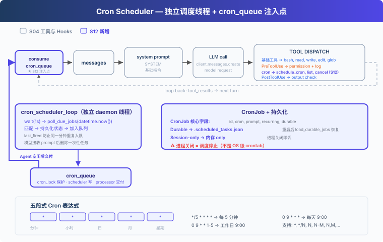

# s12: Cron Scheduler — 按时间启动任务

> **对齐状态**：本章 `code.py` 对齐上游 `s12_cron_scheduler`；模型请求由 `harness/langchain_messages.py` 转换为 LangChain OpenAI-compatible 调用，循环和 Harness 机制保持上游结构。
[English](README.md) · [中文](README.zh.md) · [日本語](README.ja.md)

s01 → ... → s10 → s11 → `s12` → [s13](../s13_agent_teams/) → ... → s17

---

## 问题

S11 解决的是命令开始后的执行方式：耗时的 Bash 命令可以在后台运行。但它不会记录某项工作应该在什么时间开始，也没有组件持续检查当前时间。

对于“每天早上 9 点跑测试”或“每 30 分钟检查 CI 状态”这样的请求，如果只依靠当前的 Agent Loop，用户仍要在每次到点后重新发送 prompt。Harness 需要保存执行时间，到点后把对应的 prompt 加入待执行队列，再在 Agent 空闲时交给 Agent Loop。

---

## 解决方案



假设 Agent 注册了下面这项任务：

```text
cron:   0 9 * * *
prompt: run tests
```

调度线程在本地时间 09:00 匹配到这项任务，把 `[Scheduled] run tests` 放进 `cron_queue`。队列处理线程等到 Agent 空闲后启动一轮 Agent Loop，模型随后可以调用 Bash 执行测试。

S12 的代码保留 S04 的五个基础工具和 Hooks，再增加 `schedule_cron`、`list_crons`、`cancel_cron`。它不包含 S11 的后台命令，因为这里传递的是一条待执行的 prompt，而不是某个后台命令的执行结果。

---

## 工作原理

### CronJob 保存什么

```python
@dataclass
class CronJob:
    id: str
    cron: str
    prompt: str
    recurring: bool
    durable: bool
    pending_delivery: bool = False
    last_fired: str | None = None
```

`cron` 决定何时触发，`prompt` 是触发后交给 Agent 的任务。`pending_delivery` 表示任务已经到期但尚未被模型接收，`last_fired` 防止同一分钟重复入队。

### 五段式 Cron 表达式

```text
分钟  小时  日  月  星期
  *    *   *   *   *      每分钟
  0    9   *   *   *      每天 09:00
 */5   *   *   *   *      每 5 分钟
  0    9   *   *  1-5     工作日 09:00
```

本章支持 `*`、`*/N`、`N`、`N-M` 和 `N,M,...`。`schedule_job()` 会在保存任务前调用 `validate_cron()`，拒绝字段数量或取值范围不正确的表达式。

### 到期后先入队

调度线程每秒读取一次本地时间。表达式匹配且任务在当前分钟尚未触发时，`_enqueue_due_job()` 先保存 `pending_delivery` 和 `last_fired`，再把任务放进内存队列：

```python
def poll_due_jobs(moment: datetime):
    minute_marker = moment.strftime("%Y-%m-%d %H:%M")
    with cron_lock:
        for job in list(scheduled_jobs.values()):
            if job.pending_delivery or job.last_fired == minute_marker:
                continue
            if cron_matches(job.cron, moment):
                _enqueue_due_job(job, minute_marker)
```

持久化失败时，`_enqueue_due_job()` 会恢复原来的状态，不会把只存在于内存中的任务暴露给队列处理线程。

### Agent 空闲后再交付

`queue_processor_loop()` 不负责判断时间。它只检查队列，并用 `agent_lock` 避免定时任务与用户正在进行的回合同时修改会话：

```python
def queue_processor_loop(stop_event=RUNTIME_STOP):
    while not stop_event.wait(0.2):
        if not has_cron_queue() or not agent_lock.acquire(blocking=False):
            continue
        try:
            if has_cron_queue():
                run_agent_turn_locked()
        finally:
            agent_lock.release()
```

Agent Loop 从队列取出到期任务，并把它们作为新的用户消息追加：

```python
fired = consume_cron_queue()
for job in fired:
    messages.append({"role": "user", "content": f"[Scheduled] {job.prompt}"})
```

模型调用失败时，这些消息会从当前会话中移除，任务重新放回队列。模型成功接收后，一次性任务会被删除，周期任务则清除 `pending_delivery`，等待下一次匹配。

### 持久化边界

| 模式 | 保存位置 | 进程重启后 |
|---|---|---|
| `durable=True` | `.scheduled_tasks.json` | 重新加载 |
| `durable=False` | 内存 | 消失 |

`.scheduled_tasks.json` 使用临时文件和 `os.replace()` 更新。文件损坏时，启动日志会报告错误，不会静默忽略。

这里采用至少一次交付：进程若在模型接收 prompt 后、确认状态写回前退出，同一任务可能在重启后再次交付。

### 运行边界

- 调度器使用 Agent 进程的本地时间。
- Agent 进程关闭后，调度线程也会停止；`durable` 只保留任务定义。
- 重启时只恢复任务，不补跑停机期间错过的时间点。
- 定时回合运行在队列处理线程中。需要交互确认的工具调用会被拒绝，不会与主终端同时读取输入。
- 调度线程和队列处理线程只在运行 CLI 时启动，导入 `code.py` 不会启动后台线程。

需要在 Agent 关闭时仍按时执行任务，应使用系统的 crontab、systemd timer 或其他外部调度服务。

---

## 试一下

```sh
cd learn-claude-code
python s12_cron_scheduler/code.py
```

可以依次输入：

1. `Schedule "run date" every 2 minutes and keep it after restart.`
2. `List all cron jobs.`
3. `Cancel the cron job you just created.`

运行时可以查看 `.scheduled_tasks.json`，并观察到期后出现的 `[Scheduled] run date` 消息。测试一分钟级任务时，Agent 进程需要保持运行。

---

## 接下来

调度器可以在指定时间启动一轮 Agent Loop，但这一轮仍由一个 Agent 处理。面对需要同时调查多个模块、并行修改并汇总结果的任务，Harness 还需要把工作分给多个 Agent，并收集各自的执行结果。

s13 Agent Teams → Lead 分配任务，队友独立执行，再通过收件箱返回结果。
---

## 本项目保留的 LangChain / LangGraph 教学补充

> 以下内容来自本仓库对齐前的 README，作为上游课程之外的本地教学补充完整保留。

<!-- local-langchain-additions:start -->
<details>
<summary>展开本仓库原有的 LangChain / LangGraph 教学说明</summary>

# s12: Cron Scheduler — 按时间表生产工作

[s11](../s11_background_tasks/) → **s12** → [s13](../s13_agent_teams/)

> 按时间表生产工作，让调度与执行解耦。

本章参考 [`shareAI-lab/learn-claude-code/s12_cron_scheduler`](https://github.com/shareAI-lab/learn-claude-code/tree/main/s12_cron_scheduler)，使用 **LangChain 1.x + LangGraph** 重新实现同一组 Cron Scheduler 概念。参考仓库直接维护 Anthropic 消息和工具循环；本项目复用 s11 的 `create_agent`、后台任务 middleware 与工具集合，把重点放在定时调度、队列交付和持久化边界上。

## 问题

s11 已经能把慢命令送到后台，但所有工作仍需用户主动触发。类似下面的任务不应该要求人反复发送同一个 prompt：

- 每天 09:00 运行测试；
- 每 10 分钟检查一次 CI；
- 下一个整点提醒检查部署状态。

定时任务还带来新的并发问题：Agent 可能正在回答用户，调度器不能打断当前回合；模型执行较慢时，时间检查也不能停下来等待。

## 解决方案


本章把定时工作拆成四层：

```text
Scheduler（每秒检查时间）
    ↓ append
cron_queue（保存已到期任务）
    ↓ Agent 空闲时取出
Queue Processor（自动拉起 Agent 回合）
    ↓ HumanMessage
Consumer / LangGraph Agent（执行 prompt）
```

Scheduler 只负责“什么时候到期”，不直接调用模型；Queue Processor 只负责“Agent 是否空闲”；真正的工具选择和执行仍由 LangGraph Agent 完成。

## 核心数据结构

每个定时任务由 `CronJob` 表示：

```python
@dataclass
class CronJob:
    id: str
    cron: str
    prompt: str
    recurring: bool
    durable: bool
```

- `cron`：5 段式表达式；
- `prompt`：触发后注入 Agent 的消息；
- `recurring=True`：周期任务，触发后继续保留；
- `recurring=False`：一次性任务，首次触发前从注册表删除；
- `durable=True`：写入 `.scheduled_tasks.json`，重启后恢复定义；
- `durable=False`：仅在当前 Python 进程中存在。

进程内还维护三份共享状态：

```python
scheduled_jobs: dict[str, CronJob]   # 任务定义
cron_queue: deque[CronJob]           # 已到期、待交付任务
last_fired: dict[str, str]           # 同一分钟去重标记
```

它们统一由 `cron_lock` 保护。用户回合和自动定时回合则通过 `agent_lock` 串行执行，避免同时修改 LangGraph 会话状态。

## Cron 表达式

格式为：

```text
分钟 小时 日 月 星期
```

本教学版支持 `*`、`*/N`、单个数字、`N-M` 和逗号列表：

| 表达式 | 含义 |
|---|---|
| `* * * * *` | 每分钟 |
| `*/5 * * * *` | 每 5 分钟 |
| `0 9 * * *` | 每天 09:00 |
| `0 9 * * 1-5` | 周一至周五 09:00 |
| `0 9 1,15 * *` | 每月 1 日和 15 日 09:00 |

星期使用 `0=周日`、`1=周一`、……、`6=周六`。当“日”和“星期”同时被具体值约束时，采用标准 cron 的 **OR** 语义：任一字段匹配即可。

时间按运行 Python 进程的本机时区解释。

## 调度与交付

### 1. Scheduler

`cron_scheduler_loop()` 每秒轮询一次。匹配后用包含日期的 `YYYY-MM-DD HH:MM` 标记去重，所以一个任务在同一分钟最多触发一次，第二天相同时间仍能再次触发。

单个任务的异常在循环内部捕获，不会杀掉整个调度线程。一次性 durable 任务会先从内存和持久化文件删除，成功后才进入队列，降低重启后重复执行的风险。

### 2. Queue Processor

`queue_processor_loop()` 每 0.2 秒观察队列，并非阻塞地尝试获取 `agent_lock`：

- Agent 忙：保留队列，稍后再试；
- Agent 空闲：消费当前队列并启动一个 LangGraph 回合；
- 没有到期任务：不调用模型。

### 3. Consumer

到期任务被转成新的 `HumanMessage`：

```xml
<scheduled_task>
  <id>cron_ab12cd34</id>
  <cron>*/5 * * * *</cron>
  <prompt>check CI status</prompt>
</scheduled_task>
```

动态 system prompt 会告诉模型三个新工具及其边界：

- `schedule_cron`：创建任务；
- `list_crons`：列出任务；
- `cancel_cron`：按 ID 取消任务。

## 持久化

durable 任务原子写入仓库启动目录下的 `.scheduled_tasks.json`：先写 `.scheduled_tasks.json.tmp`，再替换正式文件，避免留下半截 JSON。

启动时会逐条校验记录。单条记录损坏、cron 无效或 ID 重复时只跳过该条，不影响其他任务恢复。任务总数最多为 50。

需要特别区分：

- **跨重启保留定义**：是；
- **进程关闭后继续计时和执行**：否。

两个调度线程都是 daemon。若要求应用关闭后仍然准时执行，应使用系统 crontab、systemd timer、Windows Task Scheduler 或外部工作流平台。

## 相对 s11 的变化

| 组件 | s11 | s12 |
|---|---|---|
| 触发来源 | 用户输入 | 用户输入 + Cron Scheduler |
| 新类型 | — | `CronJob` |
| 新队列 | 后台命令完成通知 | `cron_queue` 到期任务队列 |
| 新线程 | 后台命令线程 | Scheduler + Queue Processor |
| 新存储 | 后台状态仅在内存 | `.scheduled_tasks.json` |
| 工具数量 | 8 | 11（新增 3 个 cron 工具） |

## 本章文件

- `code.py`：带注释教学版（可直接运行）；
- `code_uncommented.py`：无教学行注释的完整版本，适合快速通读；

两个文件的可执行逻辑一致，教学版与无注释版内容相同。

## 运行

先在仓库根目录准备环境：

```powershell
python -m venv venv
.\venv\Scripts\Activate.ps1
pip install -r requirements.txt
Copy-Item .env.example .env
# 编辑 .env，至少填写 MODEL_ID 和 OPENAI_API_KEY
```

运行任一版本：

```powershell
python -m s12_cron_scheduler.code
python -m s12_cron_scheduler.code_uncommented
```

可以依次尝试：

1. `Schedule a task to print the current date every 2 minutes.`
2. `List all cron jobs.`
3. `Create a session-only one-shot reminder for the next matching minute.`
4. `Cancel the recurring job and list jobs again.`

观察以下现象：

- 不输入新 prompt 时，到期任务是否仍出现 `[queue processor]`；
- durable 任务是否写入 `.scheduled_tasks.json`；
- 重启程序后 durable 任务是否恢复；
- 一次性任务触发后是否从任务列表消失；
- Agent 正忙时，到期任务是否保留在队列等待交付。

## 教学版边界

为了聚焦核心机制，本章没有实现参考仓库/真实 Claude Code 中更复杂的能力：

- 多进程文件锁与文件变更监听；
- 任务抖动、自动过期和 QoS；
- 错过触发时间后的补偿执行；
- `N-M/S`、`L`、`W`、`?` 等扩展 cron 语法；
- 完整的 UI 阻塞状态、优先级队列和跨会话协调。

## 接下来

s12 让一个 Agent 能自动按时间工作。但重构大型系统时，一个 Agent 的注意力和上下文仍然有限。

[s13: Agent Teams](../s13_agent_teams/) 将进入多 Agent 协作：持久队友、异步收件箱和团队生命周期。

</details>
<!-- local-langchain-additions:end -->
---

## 本项目保留的 Claude Code 源码补充

> 以下内容来自本仓库原有 README，作为上游课程之外的源码研读补充。

<details>
<summary>深入 CC 源码</summary>

> 以下基于 CC 源码 `CronCreateTool.ts`、`cronScheduler.ts`、`cron.ts`、`cronTasks.ts`、`cronTasksLock.ts`、`useScheduledTasks.ts`（139 行）的完整分析。

### 一、三个 Cron 工具

CC 暴露了三个 cron 工具给模型：`CronCreate`、`CronDelete`、`CronList`。全部由编译时门控 `feature('AGENT_TRIGGERS')` 和运行时 GrowthBook 标志 `tengu_kairos_cron` 控制。还有一个 `CLAUDE_CODE_DISABLE_CRON` 环境变量做本地覆盖。

### 二、存储：`.claude/scheduled_tasks.json`

```json
{ "tasks": [{ "id": "abc12345", "cron": "0 9 * * *", "prompt": "...", "recurring": true, "durable": true, "createdAt": 1714567890000 }] }
```

Durable 任务写磁盘；session-only 任务存于 `STATE.sessionCronTasks` 内存数组（进程重启丢失）。还有一个 `.scheduled_tasks.lock` 文件防止同项目的多个 session 重复触发。

### 三、调度器：1 秒轮询

`cronScheduler.ts` 每秒检查一次（`CHECK_INTERVAL_MS = 1000`）。谁持有锁谁触发文件任务；所有 session 都触发仅 session 任务。还有一个 `chokidar` 文件观察者监视 `scheduled_tasks.json` 变更。

### 四、Cron 表达式：标准 5 字段

分钟 小时 日 月 星期。支持 `*`、`*/N`、`N`、`N-M`、`N-M/S`、`N,M,...`。不支持 `L`、`W`、`?`。所有时间以本地时区解释。Day-of-month 和 day-of-week 同时约束时用 OR 语义。

### 五、抖动（防惊群效应）

- 重复性任务：触发延迟最多可达期间的 10%（上限 15 分钟），基于任务 ID 的确定性哈希
- 一次性任务：当触发时间落在 `:00` 或 `:30` 时，最多提前 90 秒触发
- 抖动配置可通过 GrowthBook 实时调整，60 秒刷新一次

### 六、自动过期

重复性任务 7 天后自动过期（可配置，上限 30 天）。过期前最后一次触发，触发后自动删除。

### 七、作业数上限

`MAX_JOBS = 50`（`CronCreateTool.ts:25`）。超限时返回错误："Too many scheduled jobs (max 50). Cancel one first."

### 八、触发注入

触发后通过 `enqueuePendingNotification()` 以 `priority: 'later'` 入队命令队列。标记 `workload: WORKLOAD_CRON`，API 在容量紧张时以更低的 QoS 为 cron 发起的请求服务。

### 九、Queue Processor：自动交付

真实 CC 通过 `useQueueProcessor.ts:48-60` 在无 query、无阻塞 UI、队列非空时自动触发处理。`queueProcessor.ts:52-87` 按队列优先级把命令交给 `handlePromptSubmit()`。教学版用 `queue_processor_loop` 保留核心行为：队列有任务且 Agent 空闲时，自动启动一轮 agent_loop。

</details>
