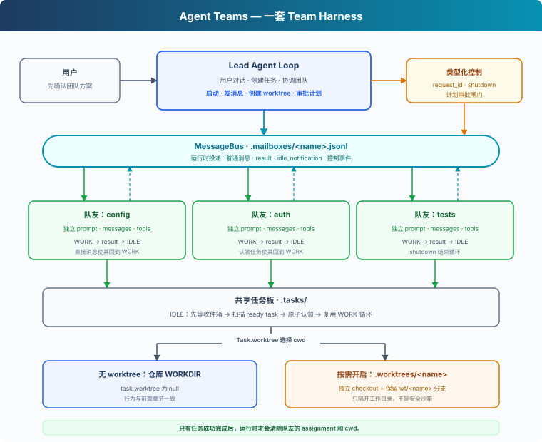
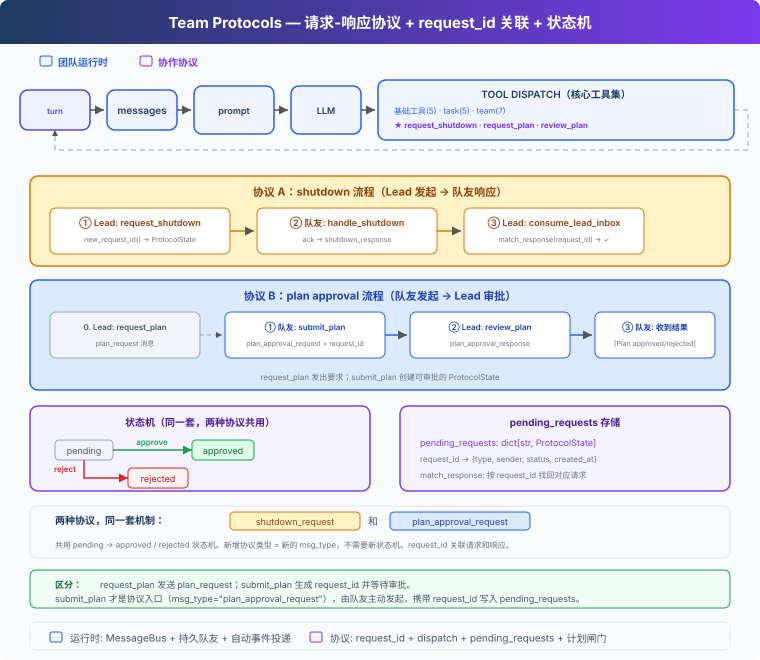

# s13: Agent Teams — 团队运行时与协作协议

> **对齐状态**：本章 `code.py` 对齐上游 `s13_agent_teams`；模型请求由 `harness/langchain_messages.py` 转换为 LangChain OpenAI-compatible 调用，循环和 Harness 机制保持上游结构。
[English](README.md) · [中文](README.zh.md) · [日本語](README.ja.md)

s01 → ... → [s10](../s10_task_system/) → `s13` → [s14](../s14_mcp_plugin/) → s15 → s16 → s17

> *“一个 Agent 装不下整项工作时，就让队友分头完成。”* — 持久队友、共享任务认领、可选 worktree 与协作协议。
>
> **Harness 层**：Team（团队）— 多个 Agent 如何分工、共享状态，同时接受 Lead 控制。

---

## 问题

假设我们让 Agent 重构整个后端，工作涉及配置加载、认证和测试。一个 Agent 可以依次处理，但总耗时更长，早期细节也会逐渐离开上下文。

这类工作适合并行，可用户通常只描述目标，不会替运行时设计团队：

```text
重构这个示例后端。清理配置加载、认证和测试，
保持现有接口，并确保测试通过。
```

Harness 需要回答一组相互关联的问题：

1. 谁判断并行是否有用，新增 Agent 又由谁确认？
2. 每个队友如何跨任务保留身份和上下文？
3. 结果如何自动返回 Lead，而不是让模型轮询收件箱？
4. 空闲队友能否直接接手 ready task，不再等待 Lead 逐项派发？
5. 并行修改可能冲突时，任务应该使用哪个工作目录？
6. 关机和计划审批如何成为可追踪、可执行的协议？

---

## 解决方案



s13 复用 s10 的基础工具、Hooks、Permission 和 Task System，并增加一套由 Lead 管理的团队运行时：

- **Lead** 负责用户对话，提出分工方案并等待确认。
- **队友** 运行独立 Agent Loop，在 WORK 和 IDLE 之间切换。
- **MessageBus** 通过文件收件箱传递普通消息、结果和控制事件。
- **运行时投递** 消费 Lead 的收件箱，把团队事件注入下一轮对话。
- **共享任务板** 让空闲队友发现 ready task，并在锁内完成认领。
- **可选 worktree** 在需要时把任务绑定到另一个工作目录；未绑定任务仍使用仓库目录。
- **类型化协议和计划闸门** 显式记录关机与审批状态，并在计划获批前阻止修改型工具。

任务图继续采用 s10 的两阶段契约。Lead 先为所有节点调用 `create_task`，再使用返回的运行时 ID 调用 `update_task(addBlockedBy=...)`，最后才分配 ready task。只有 Lead 能使用 `update_task`；队友只能列举、认领和完成任务，团队运行期间不能改写任务图结构。

s11 的后台任务和 s12 的定时任务没有被带入本章。它们不参与队友通信、任务认领或计划审批。

这些机制都属于 Team 这一层。任务发现不需要另一套 Agent Loop，worktree 也不会产生另一种 Agent。

---

## 工作原理

### 1. Lead 先提出团队，再等待用户确认

启动队友会改变成本、并发度和可以修改工作区的角色集合。Lead 的系统提示词会把这条边界明确写出来：

```python
"When parallel work would help, first propose a small team with clear "
"responsibilities and wait for the user's confirmation. Do not call "
"spawn_teammate before the user confirms."
```

收到第一条需求后，Lead 只提出分工：

```text
我建议并行处理三个方向：
- config：清理配置加载
- auth：重构认证
- tests：补充回归测试

你确认后我再启动队友。
```

用户回复“开始吧”后，Lead 才能调用 `spawn_teammate`。Lead 会先创建任务，再把初始 `task_id` 传给队友。用户给出目标，Lead 设计团队，用户确认执行边界。

### 2. 每个队友拥有独立循环

s06 的 subagent 是一次性调用，队友则是持久执行单元：

| | s06 Subagent | s13 队友 |
|---|---|---|
| 生命周期 | 一次调用后结束 | `WORK → IDLE → WORK`，直到关机 |
| 上下文 | 只服务一个任务 | 跨任务保留 |
| 通信 | 返回一次结果 | 接收消息并发出事件 |
| 协作 | 单向委派 | 与 Lead 双向协作 |

`TeammateRuntime` 为每个队友保存独立的系统提示词、messages、工具和当前任务，再在线程中运行 WORK / IDLE 循环。队友工作时，Lead 可以继续协调其他任务。`lead` 和 `agent` 保留给运行时身份，但 `MessageBus` 仍允许把 `lead` 作为协调者收件箱。

`spawn_teammate` 在线程启动前认领初始任务。认领失败时不会启动队友。队友没有任务时，文件和 Shell 工具会要求它先认领任务，而不是回退到仓库目录。

### 3. MessageBus 把通信放在模型上下文之外

Lead 和队友不能共享同一个 messages 数组，否则一个队友的工具结果会进入另一个队友的推理上下文。`MessageBus` 为每个 Agent 提供 `.mailboxes/<name>.jsonl` 收件箱：

```python
class MessageBus:
    def send(self, from_agent, to_agent, content,
             msg_type="message", metadata=None):
        msg = {
            "from": from_agent,
            "to": to_agent,
            "content": content,
            "type": msg_type,
            "metadata": metadata or {},
        }
        with self._changed:
            MAILBOX_DIR.mkdir(parents=True, exist_ok=True)
            with self._path(to_agent).open("a", encoding="utf-8") as handle:
                handle.write(json.dumps(msg, ensure_ascii=True) + "\n")
            self._changed.notify_all()

    def wait_for_messages(self, agent, timeout=None):
        deadline = None if timeout is None else time.monotonic() + timeout
        with self._changed:
            while not self.peek(agent):
                remaining = (None if deadline is None
                             else deadline - time.monotonic())
                if remaining is not None and remaining <= 0:
                    return []
                self._changed.wait(remaining)
            return self._read_unlocked(agent)
```

锁会保护收件箱文件，避免队友并发读写。`Condition` 既能在消息到达时唤醒队友，也能支持 IDLE 状态下的短时等待。

### 4. 收件箱事件由运行时投递

`read_inbox()` 会读取并删除收件箱文件，因此 Lead 只保留一个消费者 `consume_lead_inbox()`：

```python
def consume_lead_inbox():
    messages = BUS.read_inbox("lead")
    for message in messages:
        if message["type"].endswith("_response"):
            match_response(...)
    return messages
```

CLI 主循环同时等待终端输入和 Lead 收件箱。新消息到达时，它会先消费收件箱，再发起一轮 Lead 调用：

```text
MessageBus → consume_lead_inbox
           → 更新协议状态
           → 把 [Team events] 注入 history
           → 启动新一轮 Lead 调用
```

Lead 启动队友后会结束当前轮次，不用反复调用 `list_teammates` 或 `get_task` 等待结果。队友事件到达时，运行时会自动唤醒下一轮。

`check_inbox` 不是模型工具。消息到达和消费属于运行时，模型只处理已经投递到上下文里的事件。

### 5. 结果与 IDLE 是两个事件

队友完成一项任务后，运行时按顺序发送两个事件：

```text
result:            "认证已重构，相关测试通过。"
idle_notification: "Waiting for more work."
```

`result` 回答“这项任务产出了什么”，`idle_notification` 回答“这个队友能否继续接任务”。一个含糊的“完成了”无法同时表达这两种状态。

空闲队友不会退出。直接消息或 ready task 会让它回到 WORK，`shutdown_request` 则会启动平滑关机握手。

### 6. IDLE 先看收件箱，再找 ready task

队友进入 IDLE 后优先处理消息，然后检查共享任务板：

```python
while True:
    inbox = BUS.wait_for_messages(name, IDLE_SCAN_INTERVAL)
    if inbox:
        should_stop = handle_messages(inbox)
        if should_stop or messages[-1]["role"] == "user":
            break
        continue

    task = claim_next_task(name)
    if task:
        messages.append({
            "role": "user",
            "content": f"[Auto-claimed task {task.id}] {task.subject}",
        })
        break
```

关机、计划审批和 Lead 的直接指令应该先于临时发现的工作。如果没有消息，也没有 ready task，队友会保持 IDLE。前置任务完成后，当前受阻的任务可能变为 ready。

### 7. 发现和认领分成两步，认领必须原子执行

扫描只负责找候选任务：

```python
def scan_unclaimed_tasks() -> list[Task]:
    return [
        task for task in list_tasks()
        if task.status == "pending"
        and task.owner is None
        and can_start(task.id)
    ]
```

候选列表只是某一时刻的快照。其他队友，甚至另一个使用同一任务目录的 Harness 进程，也可能看到同一任务。因此所有权变更必须放进 `claim_task()`，并由 `task_store_lock()` 同时取得进程内锁和文件锁：

```python
def claim_task(task_id: str, owner: str) -> str:
    with task_store_lock():
        task = load_task(task_id)
        if task.status != "pending" or task.owner is not None:
            return "Task is no longer available"
        if _owner_in_progress(owner):
            return "Owner must complete its current task first"
        if not can_start(task_id):
            return "Task is blocked"
        cwd, error = task_worktree_cwd(task)
        if error:
            return f"Cannot claim {task_id}: {error}"
        task.owner = owner
        task.status = "in_progress"
        save_task(task)
        teammate_assignments[owner] = {"task_id": task.id, "cwd": cwd}
        return f"Claimed {task.id}"
```

多个队友可以同时发现同一候选，但只有一个 claim 能把它推进到 `in_progress`。持有同一存储锁时，任务内容会先写入临时文件，再原子替换正式文件。队友完成当前任务后才能再认领下一项；worktree 绑定损坏时，认领会直接失败，不会回退到仓库目录。

### 8. 认领后的工作复用同一个 WORK 循环

认领成功后，运行时把任务 ID、标题和描述放进队友的 messages：

```text
任务板出现 ready task
  → IDLE 队友发现候选
  → claim_task 写入 owner 和 in_progress
  → 任务进入队友 messages
  → WORK
  → complete_task
  → result + idle_notification
  → IDLE
```

队友继续使用直接派发任务时的模型调用、文件工具、Shell、计划闸门、结果上报和关机协议。任务发现只是现有 WORK 循环的另一个入口。

### 9. 由任务选择工具的工作目录

`Task.worktree` 是可选字段：

```python
@dataclass
class Task:
    id: str
    subject: str
    description: str
    status: str
    owner: str | None
    blockedBy: list[str]
    worktree: str | None = None
```

并行修改需要分开目录时，Lead 可以创建并绑定 worktree：

```python
create_worktree(name="auth-refactor", task_id="task_1a2b3c4d")
```

`create_worktree` 只提供给 Lead。它要求任务处于 pending、无人认领且尚未绑定，随后检查名称、路径、分支和 Git 注册信息，创建 checkout，最后才写入任务绑定。如果 Git 报告失败却已经留下分支或已注册的 checkout，运行时会报告 partial operation，让任务保持未绑定，并保留这些内容供人工恢复。队友只使用任务工具和文件工具。

认领任务时，运行时会把解析后的目录写入 `teammate_assignments`。该队友的 `bash`、`read_file`、`write_file`、`edit_file` 和 `glob` 都从 assignment 读取目录。没有绑定 worktree 的任务解析到 `WORKDIR`；没有认领任务的队友不能使用这些工作区工具：

```python
cwd, error = task_worktree_cwd(task)
if not error:
    teammate_assignments[owner] = {
        "task_id": task.id,
        "cwd": cwd,
    }
```

`complete_task(task_id, owner)` 会检查调用者是否拥有这个进行中的任务。成功完成只记录结果，不会马上清除 assignment；直到当前模型轮次结束，后续工具调用仍使用这个任务目录。队友回到 IDLE 时，运行时才释放 assignment。完成失败时也会保留目录，方便修正后重试。

进程重启后，`assignment_cwd()` 可以根据持久化任务中的 owner 和 worktree 绑定恢复进行中的 assignment。同一 owner 已转到新任务时，它也会替换本地的旧 lease。若绑定丢失或无效，它会直接失败，不会把操作悄悄切回仓库目录。

> Worktree 只分开 Git 工作目录和分支，不是安全沙箱。Shell 命令仍能访问父进程有权访问的路径和资源。

### 10. Worktree 移除由宿主负责

模型可以创建任务绑定的 worktree，但不能移除它。清理保留为宿主函数，让用户或宿主先检查任务所有权、assignment lease 和 Git 状态。这个函数会拒绝 pending 或 in-progress 绑定以及当前轮次仍在使用的 lease。未明确选择破坏性移除时，已跟踪、未跟踪和已忽略文件都会阻止清理。

`remove_worktree(name, discard_changes=True)` 只供已经另行取得用户明确确认的宿主调用。两种移除路径都会保留仓库里的 `wt/<name>` 分支，包括没有 upstream 的干净本地提交。移除成功后，任务绑定会被清空。

```text
干净 worktree   → 宿主可移除目录，保留 wt/<name> 分支
有改动 worktree → 由用户决定保留还是丢弃
待办/进行中任务 → 拒绝移除
```

任务完成与 worktree 清理也互相独立。`complete_task` 记录任务结果；队友回到 IDLE 后，用户或宿主才检查、合并、保留或移除 worktree。

### 11. 控制消息使用类型和 request_id

普通协作可以使用自由文本，关机和审批则不能依靠猜测消息意图。它们使用结构化消息：



```python
@dataclass
class ProtocolState:
    request_id: str
    type: str
    sender: str
    target: str
    status: str
    payload: str
    work_version: int | None = None
    task_id: str | None = None


pending_requests: dict[str, ProtocolState] = {}
```

关机路径如下：

```text
Lead 创建 pending 状态的关机请求
  → shutdown_request(request_id) 进入队友收件箱
  → 队友完成当前步骤
  → shutdown_response(request_id) 返回 Lead
  → request_id 找到原始请求
  → pending 变为 approved，队友循环退出
```

ID 把回复关联到请求，类型阻止不匹配的回复修改状态，状态则阻止同一回复重复生效。

### 12. 计划审批会约束执行

计划协议的方向相反：

```text
Lead → plan_request
队友 → plan_approval_request(request_id, plan)
Lead → plan_approval_response(request_id, approve, feedback)
```

如果 Lead 在启动队友前就知道必须先看计划，可以调用 `spawn_teammate(..., task_id=task.id, require_plan=True)`；运行时会先认领任务并打开闸门，再启动线程。对于已经运行的队友，也可以再用 `request_plan` 要求其提交计划。

工具分发层负责执行闸门：

```python
def _run_teammate_tool(name, block, handlers):
    gate = plan_gates.get(name, "not_required")
    if block.name in {"bash", "write_file", "edit_file"} and gate not in {
        "not_required", "approved"
    }:
        return f"Blocked: plan status is {gate}."
    try:
        return handlers[block.name](**block.input)
    except Exception as error:
        return f"Error: {type(error).__name__}: {error}"
```

状态是 `required`、`pending` 或 `rejected` 时，队友可以读取文件、提交或修改计划，但不能运行 Shell 命令、写文件或编辑文件。提交计划时会记录队友当前的 task 和 work version；审批返回时两者仍然一致才会生效。认领或释放任务会改变 work version，使旧审批失效；普通消息不会改变任务身份或审批状态。

队友不会直接从后台线程读取用户输入。遇到需要用户确认的危险命令或工作区外路径时，工具会返回 permission 错误，由 Lead 与用户处理。

---

## 一次完整运行

```text
s13 >> 把后端重构拆到共享任务板，尽量并行完成配置、认证和测试。
       认证任务使用 worktree，保持现有接口，并确保测试通过。

Lead：我建议按 config、auth 和 tests 三个方向分工。
      是否启动团队？

s13 >> 开始吧

[task] config created
[task] auth created → worktree auth-refactor
[task] tests created
[claim] alice → config (cwd: repository)
[claim] bob → auth (cwd: .worktrees/auth-refactor)
[teammate] alice spawned
[teammate] bob spawned
[complete] auth
[bus] bob → lead (result) ...
[bus] bob → lead (idle_notification) ...
[wake: 2 team events → new turn]
Lead：我已收到认证任务的结果，接下来继续协调其余工作。
```

终端会显示用户请求、Lead 的团队方案、任务状态、认领结果、所选目录、结果、IDLE 切换和控制事件。用户不需要指定谁是 Lead，也不必提醒它检查收件箱。

---

## 相对 s10 的变化

| 组件 | s10 | s13 |
|---|---|---|
| Agent | 单个 Agent | 一个 Lead 加持久队友 |
| 用户流程 | 直接执行请求 | 先提团队方案，再确认启动 |
| 通信 | 无 | 文件收件箱加运行时投递 |
| 生命周期 | 一个循环 | 队友 `WORK / IDLE / shutdown` |
| 共享工作 | 单 Agent 使用任务工具 | IDLE 扫描加队友原子认领 |
| 工作目录 | 仓库 `WORKDIR` | 必须认领任务；任务可选 worktree |
| 结果上报 | 当前 Agent 输出 | 分开的 `result` 与 `idle_notification` |
| 控制 | 无 | 类型化关机与计划审批协议 |
| 执行约束 | 无团队约束 | 必需计划会锁住修改型工具 |

---

## 试一下

```sh
cd learn-claude-code
python s13_agent_teams/code.py
```

输入一个自然需求：

```text
把后端重构拆到共享任务板，在依赖允许时并行完成配置、认证和测试。
认证任务使用 worktree，保持现有接口，并在最后汇总结果。
```

Lead 提出团队方案后回复：

```text
开始吧
```

观察 `.tasks/` 如何从 `pending` 进入 `in_progress` 和 `completed`，`.mailboxes/` 如何投递 `result` 与 `idle_notification`，以及 `.worktrees/` 是否只为绑定的任务创建。还可以检查直接消息是否先于任务板扫描，以及 `complete_task` 失败后队友的工作目录是否保持不变。

---

## 接下来

Lead 和队友目前只能调用直接写在 `code.py` 里的工具。接入 Jira、部署平台或知识库时，Harness 还要为每个外部系统分别编写工具定义和调用逻辑；外部系统增加或修改工具，也要跟着修改课程代码。

s14 MCP Tools → 通过统一的发现与调用协议，在运行时连接外部服务并把它们的工具加入工具池。
---

## 本项目保留的 LangChain / LangGraph 教学补充

> 以下内容来自本仓库对齐前的 README，作为上游课程之外的本地教学补充完整保留。

<!-- local-langchain-additions:start -->
<details>
<summary>展开本仓库原有的 LangChain / LangGraph 教学说明</summary>

# s13: Agent Teams — 用 LangGraph Handoff 组织多 Agent 协作

[s12](../s12_cron_scheduler/) → **s13** → [s14](../s14_mcp_plugin/)

> 一个 Agent 负责统筹，一个 Agent 负责执行；通过显式状态和工具调用完成控制权交接。

本章参考 [`shareAI-lab/learn-claude-code/s13_agent_teams`](https://github.com/shareAI-lab/learn-claude-code/tree/main/s13_agent_teams)，使用本项目锁定的 **LangChain 1.3.11 + LangGraph 1.2.7** 重新实现 Agent Teams 的核心概念。

参考仓库用“队友线程 + 文件收件箱”模拟真实 Claude Code 的异步团队；本章代码采用另一条更贴近 LangChain/LangGraph 的路线：用两个 `create_agent` 子图分别表示 Lead 和 Teammate，再由父级 `StateGraph` 和 `Command` 完成顺序 handoff。

这两种实现都在解决“一个 Agent 的上下文和专业能力有限”这个问题，但执行模型并不相同：

| 维度 | 参考仓库 | 本章实现 |
|---|---|---|
| 协作机制 | 文件收件箱传消息 | 共享图状态 + `Command` |
| 执行方式 | 多个线程可并行 | 同一图内顺序 handoff |
| 队友数量 | Lead + 多个命名队友 | Lead + 一个可动态改名/改角色的队友节点 |
| 上下文 | 每个线程独立消息历史 | 父图共享 `messages`，任务再显式交接 |
| 持久化 | JSON/JSONL 邮箱文件 | `InMemorySaver` checkpoint |
| 教学重点 | 收件箱、线程、异步通信 | 状态、子图、工具协议、路由与上下文工程 |

因此，本章更准确的定位是：**Agent Teams 的最小 handoff 内核**。它展示了团队协作最关键的控制面，但还不是一个真正并行、长期驻留的完整 Agent Team。

## 问题

复杂工作往往同时包含规划、编码、测试、审查和资料分析。把所有职责塞进单个 Agent 会出现几个问题：

- system prompt 和工具越来越多，模型每一步都要在大量无关能力中选择；
- 长任务持续累积消息和工具输出，重要信息被噪声淹没；
- 不同专业角色的工作方式互相干扰；
- 主 Agent 既要统筹又要执行，很容易失去对整体目标的关注；
- 简单的“调用一次子 Agent 工具”只能返回结果，无法清楚表达控制权正在谁手里。

本章把职责拆成两个角色：

- **Lead**：理解用户目标、使用基础工具、管理任务，并决定何时委派；
- **Teammate**：根据 Lead 给出的名字、角色和完整任务执行具体工作，完成后必须汇报。

Lead 与 Teammate 不是两个互相调用的普通 Python 函数。它们各自都是一个能循环调用模型和工具的 LangChain Agent，外层再由 LangGraph 管理状态和跳转。

## 总体架构


```text
                         Parent StateGraph(TeamState)

用户消息 ──START──> [ lead_agent 子图 ]
                          │
                          │ assign_teammate(...)
                          │ Command.PARENT + goto="teammate"
                          ▼
                    [ teammate_agent 子图 ]
                          │
                          │ report_to_lead(summary)
                          │ Command.PARENT + goto="lead"
                          ▼
                    [ lead_agent 子图 ] ──> 最终回答

共享内容：messages、active_agent、teammate_name/role/task
会话保存：InMemorySaver + thread_id
```

父图只声明一条固定边：

```python
builder.add_edge(START, "lead")
```

没有固定的 `lead -> teammate` 或 `teammate -> lead` 边。两个方向都由工具返回的 `Command` 在运行时决定：模型不调用 handoff 工具，当前 Agent 子图正常结束，父图也随之结束；模型调用工具，控制权才切换到另一个节点。

## LangChain 和 LangGraph 分别负责什么

LangChain 与 LangGraph 经常一起出现，但在本章中职责很清楚。

### LangChain：负责单个 Agent 内部的执行循环

`create_agent` 把模型、工具、system prompt 和 middleware 组合成一个已经编译的 Agent 图。每个 Agent 内部大致执行：

```text
动态 system prompt
       ↓
调用模型
       ↓
有 tool_calls？──否──> 返回 AIMessage，当前 Agent 结束
       │
       是
       ↓
执行工具 ─────────────> 把 ToolMessage 送回模型继续判断
```

本章通过 LangChain 完成：

- `create_agent`：分别构造 Lead 和 Teammate；
- `@tool`：声明 `assign_teammate` 与 `report_to_lead`；
- `@dynamic_prompt`：每次模型调用前生成角色 prompt；
- `@wrap_tool_call`：在不改变工具行为的前提下打印调用和结果；
- `AgentState`：提供 Agent 所需的标准消息状态；
- `AIMessage`、`HumanMessage`、`ToolMessage`：表达不同来源的会话事件。

### LangGraph：负责多个 Agent 之间的状态与控制流

外层 `StateGraph(TeamState)` 把两个 LangChain Agent 当作子图节点。LangGraph 负责：

- `START`：规定用户请求先进入 Lead；
- `TeamState`：定义多个节点共同读写的数据结构；
- `add_messages`：合并节点产生的新消息；
- `Command`：一次返回“更新什么状态”和“下一步去哪里”；
- `Command.PARENT`：从当前 Agent 子图跳回父团队图；
- `InMemorySaver`：按 `thread_id` 保存多轮 checkpoint；
- `stream(..., subgraphs=True)`：输出父图和两个子图的中间事件。

可以把二者理解为：**LangChain 管一个 Agent 怎么工作，LangGraph 管多个 Agent 何时交接、共享什么状态、下一步去哪里。**

## 共享状态：`TeamState`

```python
class TeamState(AgentState):
    messages: Annotated[list[AnyMessage], add_messages]
    active_agent: NotRequired[str]
    teammate_name: NotRequired[str]
    teammate_role: NotRequired[str]
    teammate_task: NotRequired[str]
```

### `messages` 与 reducer

`messages` 不是普通列表字段。`Annotated[..., add_messages]` 给它绑定消息 reducer：节点只需返回新增消息，LangGraph 会按消息 ID 追加或覆盖，而不是让后一次更新直接替换整个历史。

这对 handoff 很重要。Lead 工具返回三条消息时：

```python
"messages": [
    current_ai_message,
    transfer_message,
    assignment_message,
]
```

它表达的是“把这几条合并到父状态”，不是“丢弃原会话，只留下这三条”。

### `active_agent`

本实现会在交接时更新 `active_agent`，便于观察和未来扩展，但当前路由并不读取它。真正决定下一节点的是 `Command.goto`。

如果以后希望每个新用户回合自动回到上次活跃角色，可以把 `START -> lead` 改为基于 `active_agent` 的条件路由；当前教学版始终让新回合从 Lead 开始。

### 队友元数据

`teammate_name`、`teammate_role` 和 `teammate_task` 在第一次委派前可以不存在，所以使用 `NotRequired`。`teammate_system_prompt` 每次从状态读取这些值：同一个 Teammate 子图可以先扮演测试工程师，下一次再扮演数据库工程师，而不需要重新编译图。

要注意，这只是**动态角色复用**，不是多个命名队友实例同时驻留。新的委派会覆盖上一组队友元数据。

## Handoff 的核心：工具返回 `Command`

普通工具通常返回字符串或结构化数据，LangChain 再把结果包装为 `ToolMessage`。Handoff 工具还必须改变外层图的执行位置，因此返回 `Command`：

```python
return Command(
    graph=Command.PARENT,
    goto="teammate",
    update={
        "active_agent": "teammate",
        "teammate_name": clean_name,
        "teammate_role": clean_role,
        "teammate_task": clean_task,
        "messages": [...],
    },
)
```

三个参数各自回答一个问题：

- `graph=Command.PARENT`：在哪一层图中寻找目标节点；
- `goto="teammate"`：接下来执行哪个节点；
- `update={...}`：跳转前向共享状态合并哪些数据。

Lead 和 Teammate 本身都是 `create_agent` 生成的子图。若省略 `Command.PARENT`，运行时会尝试在当前 Agent 子图里寻找 `teammate` 或 `lead`，而这些节点只存在于父团队图中。

## 为什么必须传 `AIMessage + ToolMessage`

模型调用 `assign_teammate` 时，最近一条 `AIMessage` 中包含类似下面的工具调用：

```text
AIMessage(tool_calls=[{"id": "call_123", "name": "assign_teammate", ...}])
```

对大模型 API 来说，每个工具调用都必须有使用相同 `tool_call_id` 的工具结果。虽然 handoff 的真正效果是切换图节点，消息协议仍然需要闭合：

```python
transfer_message = ToolMessage(
    content="任务已交给 alice，等待队友汇报",
    tool_call_id=tool_call_id,
    name="assign_teammate",
)
```

所以 `assign_teammate` 会把以下内容一起写回父图：

1. 发起工具调用的完整 `AIMessage`；
2. 确认交接的 `ToolMessage`；
3. 发给 Teammate 的结构化 `HumanMessage`。

`report_to_lead` 使用相同原则：保留 Teammate 发起汇报工具调用的 `AIMessage`，补齐对应 `ToolMessage`，再用新的 `HumanMessage` 把总结交给 Lead。

如果只复制 AI 文本、丢掉 `tool_calls`，或者保留工具调用却没有对应 `ToolMessage`，历史就可能被模型服务判定为格式非法，也可能让下游 Agent 误以为工具仍未完成。

## 上下文工程：共享历史不等于任务清晰

本章的两个子图使用同一个 `TeamState.messages` 字段。因此 Teammate 会收到父图已有的共享消息历史，并非真正的空白上下文。

但 Lead 仍然必须通过 `task` 参数提供完整目标、路径、限制、预期输出和验证要求，原因有三点：

- 原始会话可能很长，队友不应自行猜测哪些内容与当前任务相关；
- 结构化交接能形成明确的工作契约，便于 Lead 检查汇报；
- 未来若改为严格隔离的 per-agent 消息通道，完整任务仍可直接复用。

任务使用 `<teammate-assignment>`，汇报使用 `<teammate-result>`。这些 XML 标签只是给模型看的语义边界，不参与 LangGraph 路由。真正路由仍由 `Command` 完成。

当前实现选择共享历史，优点是简单且连续；代价是上下文会继续增长，队友也可能看到无关内容。更强的隔离方案可以为每个 Agent 建立独立消息字段，或者在进入子图前显式筛选/摘要消息。

## 动态 Prompt 和能力隔离

Lead 的工具集：

```text
bash, read_file, write_file,
create_task, list_tasks, get_task, claim_task, complete_task,
assign_teammate
```

Teammate 的工具集：

```text
bash, read_file, write_file, report_to_lead
```

Teammate 没有 `assign_teammate`，因此不能递归创建队友；也没有共享任务管理工具，避免它擅自改变 Lead 的协调计划。这种**按角色裁剪工具**比只在 prompt 里说“不要调用某工具”更可靠，因为不可用工具根本不会进入模型看到的 schema。

`@dynamic_prompt` 则解决同一个图在不同状态下如何获得不同身份：

- Lead prompt 强调委派质量、结果核验和最终责任；
- Teammate prompt 注入动态名称、角色、工作目录和任务；
- Teammate 被要求结束前调用 `report_to_lead`，否则它直接输出普通 AIMessage 时父图会自然结束，Lead 无法继续接管。

## Middleware：横切逻辑不进入业务工具

两个 `@wrap_tool_call` middleware 会打印：

- 模型请求的工具名、参数和调用 ID；
- 普通工具返回的完整 `ToolMessage`；
- handoff 工具返回的 `Command`、目标节点和状态更新字段；
- 工具异常类型与消息。

Lead 还复用 s11 的 `BackgroundNotificationMiddleware`，在模型调用前收集已完成的后台命令结果。Teammate 没有这个 middleware，因为本章把后台结果的统筹责任留给 Lead。

Middleware 适合日志、重试、权限检查、动态 prompt、上下文压缩等横切逻辑；业务工具则应专注于实际动作。两者分离后，不需要在每个工具里重复写追踪代码。

## Checkpoint 与多轮会话

```python
checkpointer = InMemorySaver()
team_graph = builder.compile(checkpointer=checkpointer)
```

`run_turn` 每次只传入新的 `HumanMessage`，并固定使用 `thread_id="s13-main"`。`InMemorySaver` 根据这个 ID 找回先前 checkpoint，因此 Lead 能在下一轮继续看到前面的委派和汇报。

需要区分三种“状态保存”：

- 同一 Python 进程、同一 `thread_id`：保留；
- 同一进程、不同 `thread_id`：隔离；
- Python 进程重启：丢失。

生产环境若需要跨重启恢复，应换成 SQLite 或 Postgres checkpointer，并为不同用户/会话生成稳定且隔离的 thread ID。

## Streaming 与输出去重

```python
team_graph.stream(
    ...,
    stream_mode="values",
    subgraphs=True,
)
```

`subgraphs=True` 让流事件携带 Lead/Teammate 子图命名空间，终端才能标出当前消息来自哪个 Agent。`values` 模式返回每一步的累计状态，因此同一历史消息会反复出现；`print_new_messages` 使用 s11 的 `message_key` 去重，只打印首次观察到的 AI 文本。

工具调用与 `ToolMessage` 已由 middleware 完整打印，所以流处理函数只打印 AI 文本，避免重复输出。

## 一次完整交接

假设用户输入：

```text
请让 alice 作为测试工程师检查 schema.sql，并把发现汇报给你。
```

执行顺序如下：

1. 父图从 `START` 进入 Lead；
2. Lead 模型决定调用 `assign_teammate(name="alice", role="tester", task="...")`；
3. LangChain 注入当前 `state` 和 `tool_call_id`；
4. 工具返回 `Command.PARENT`，更新队友元数据和消息，并跳到 `teammate`；
5. Teammate 的动态 prompt 从状态读取 Alice 的身份和任务；
6. Teammate 可调用 `read_file`、`bash` 等工具完成检查；
7. Teammate 调用 `report_to_lead(summary="...")`；
8. 第二个 `Command.PARENT` 把总结写入状态并跳回 `lead`；
9. Lead 读取 `<teammate-result>`，必要时自行验证，然后向用户给出最终回答。

整个过程可能包含多次模型调用和工具调用，但控制权在任一时刻只属于一个 Agent。

## 相对 s12 的变化

本章复用的是 s11 的模型、文件工具、任务系统和后台通知 middleware，没有把 s12 的 Cron 工具带入团队图。这样可以把注意力集中在 handoff，而不是继续扩大工具集合。

| 组件 | s12 | s13 |
|---|---|---|
| Agent 数量 | 单个 Agent | Lead + Teammate 两个 Agent 子图 |
| 外层编排 | 单 Agent 回合 + 调度线程 | `StateGraph(TeamState)` |
| 控制权 | 始终属于同一 Agent | `Command.goto` 在节点间切换 |
| 新状态 | Cron 注册表和队列 | 当前角色与队友元数据 |
| 新工具 | Cron 创建、列出、取消 | `assign_teammate`、`report_to_lead` |
| Prompt | 一个动态 system prompt | Lead/Teammate 两套动态 prompt |
| 观测 | 消息输出 | 子图命名空间 + 工具/Command 追踪 |

## 本章文件

- `code.py`：带注释教学版（可直接运行）；
- `code_uncommented.py`：去掉教学行注释的完整版本，适合快速通读和自行练习；

两个文件的运行逻辑一致。

## 运行

先在仓库根目录准备环境：

```powershell
python -m venv venv
.\venv\Scripts\Activate.ps1
pip install -r requirements.txt
Copy-Item .env.example .env
# 编辑 .env，至少填写 MODEL_ID 和 OPENAI_API_KEY
```

运行任一版本：

```powershell
python -m s13_agent_teams.code
python -m s13_agent_teams.code_uncommented
```

也支持直接运行文件：

```powershell
python s13_agent_teams/code.py
```

可以尝试以下 prompt：

1. `请把当前目录下的 Python 文件清单交给 alice，她是代码审查员，让她总结每章的文件命名规律。`
2. `让 bob 作为测试工程师检查 schema.sql 的 SQL 语法和约束设计，完成后你再复核他的结论。`
3. `先自己读取 README.md，再把 s13_agent_teams/code.py 的架构分析交给一名 LangGraph 专家。收到汇报后比较两者。`

观察终端中的四类信号：

- `[Lead tool_call]`：Lead 发起委派；
- `[handoff] lead -> alice`：父图控制权切到 Teammate；
- `[Teammate tool_call]`：队友独立使用工具；
- `[handoff] alice -> lead`：队友汇报后 Lead 恢复控制权。

## 验证代码结构

不调用模型也可以先做静态验证：

```powershell
python -m py_compile s13_agent_teams/code.py
python -m py_compile s13_agent_teams/code_uncommented.py

python -c "import s13_agent_teams.code as c; print(type(c.team_graph).__name__)"
```

预期最后输出 `CompiledStateGraph`。

## 教学版边界

为了让 handoff 机制保持可读，本章有意省略或简化以下能力：

- **不并行**：一次只有一个 Teammate 节点运行，不支持多个队友 fan-out/fan-in；
- **不驻留多个身份**：名字和角色只是状态字段，下一次委派会覆盖；
- **共享消息历史**：没有 per-agent 私有上下文，长任务可能继续膨胀；
- **内存 checkpoint**：进程重启后会话消失；
- **固定 thread ID**：示例 CLI 只维护一个主会话，不适合多用户服务；
- **没有权限冒泡**：队友工具不会向 Lead 发起审批请求；
- **没有取消/关机协议**：顺序 handoff 不需要终止后台队友，但也没有优雅停止语义；
- **没有业务级循环保护**：`recursion_limit=128` 只是运行时保险，不等于明确的最大委派次数；
- **共享工作目录缺少隔离**：若扩展为并行队友，需要文件锁、worktree 或任务所有权约束。

## 从本章扩展到真正的 Agent Team

如果要从顺序 handoff 升级为并行团队，可以按下面的顺序演进：

1. 把单个 `teammate_*` 字段改成按 agent ID 索引的成员注册表；
2. 为每个队友维护独立消息通道或独立子图 checkpoint；
3. 用 `Send` 或任务队列进行并行 fan-out，再由 Lead 汇总 fan-in；
4. 引入结构化邮箱消息，区分任务、结果、权限、空闲和关机事件；
5. 给共享文件写入增加锁、worktree 隔离或冲突检测；
6. 把 `InMemorySaver` 换成持久化 checkpointer；
7. 增加最大队友数、超时、取消、重试、权限审批和可观测性。

如果主要需求是“主 Agent 调用临时专家并收集结果”，LangChain 的 subagents/supervisor 模式通常更直接；如果需要角色轮流直接接管对话，本章的 handoff 模式更合适；如果需要多个专家同时工作后统一综合，则应使用 router 或自定义 LangGraph fan-out/fan-in 工作流。

## 参考资料

- [参考仓库 s13：Agent Teams](https://github.com/shareAI-lab/learn-claude-code/tree/main/s13_agent_teams)
- [LangChain 官方文档：Multi-agent patterns](https://docs.langchain.com/oss/python/langchain/multi-agent)
- [LangChain 官方文档：Handoffs](https://docs.langchain.com/oss/python/langchain/multi-agent/handoffs)
- [LangChain 官方文档：Agents](https://docs.langchain.com/oss/python/langchain/agents)
- [LangChain 官方文档：Middleware](https://docs.langchain.com/oss/python/langchain/middleware/overview)
- [LangGraph API：Command](https://reference.langchain.com/python/langgraph/types/Command)

## 接下来

s13 已经能在 Lead 和 Teammate 之间交接控制权。新版 17 章编排中，旧版的 s16 Team Protocols、s17 Autonomous Agents、s18 Worktree Isolation 已并入本章，对应材料见 [legacy](../legacy/)。

[s14: MCP & Plugin](../s14_mcp_plugin/) 将把外部工具接入同一个工具池。

</details>
<!-- local-langchain-additions:end -->
---

## 本项目保留的 Claude Code 源码补充

> 以下内容来自本仓库原有 README，作为上游课程之外的源码研读补充。

<details>
<summary>深入 CC 源码</summary>

> 本章为机制级对照：Claude Code 真实实现里并没有“命名队友 + 文件收件箱”这套东西，参考仓库和本 LangChain 版本都是为教学把“多 Agent 协作”拆成可读的抽象。以下不逐行对应 CC 源码，只讲清真实 CC 怎么做、教学版各自简化和改写了什么。

### 一、CC 的委派本质是“一次性 subagent”，不是“持久队友”

Claude Code 里最接近“委派”的是 Task/subagent 工具（本仓库 s06 的对应物）：主 agent 每次调用都新建一个隔离的上下文，跑完只回传最终结果，然后销毁；没有跨任务保留身份的“队友线程”，也没有 WORK/IDLE 生命周期。参考仓库引入“持久队友”，是为了给“结果与空闲分开表达”“空闲队友自动认领 ready task”“队友与 Lead 之间有显式关机 / 审批协议”这些概念一个落点；它们都是教学抽象，不是 CC 源码里的某个组件。

### 二、“MessageBus 文件邮箱”是教学版的异步通道模拟

CC 的 subagent 结果作为工具结果同步回传主循环，不存在演员之间通过 JSONL 邮箱互发消息的机制。参考仓库用文件收件箱演示“通信放在模型上下文之外”；本 LangChain 版改用一张父级 `StateGraph` 里的两个子图，通过 `Command` 在父子图之间切换控制权。三者目标一致（不让一个队友的工具结果污染另一个的推理），实现分别是文件收件箱、类型化邮箱消息、图状态 + `Command`。

### 三、任务认领与依赖图，对应 CC 的 TodoWrite 与任务系统

“空闲队友原子认领 ready task”是团队版的教学简化。CC 有 TodoWrite（会话内清单）和持久化任务系统（s10）；多 agent 竞争同一任务时的跨进程锁、高水位 ID，都属于 s10 任务系统的课题，而不是“队友抢任务”这个教学场景本身。

### 四、worktree 隔离才是 CC 真实存在的并行机制

CC 确实用 git worktree 给并行任务分隔工作目录（本仓库 legacy 里 s18 Worktree Isolation 的来源）。参考仓库把它并入 s13 作为“任务绑定的 worktree”；本 LangChain 版为聚焦 handoff 没有实现 worktree，只保留“共享工作目录”这一最小假设。

### 五、本 LangChain 版的取舍

本仓库最终做的是“Agent Teams 的最小 handoff 内核”：Lead / Teammate 是同一张 `StateGraph` 里顺序切换的两个 `create_agent` 子图，共享 `messages`，用 `Command.PARENT` + `goto` 交接控制权。它刻意省略了并行队友、驻留多身份、每-agent 私有上下文、持久化 checkpointer 与 worktree——这些在参考仓库 / 真实 CC 里分别对应线程、命名队友、线程收件箱、会话状态与 git worktree。
</details>
