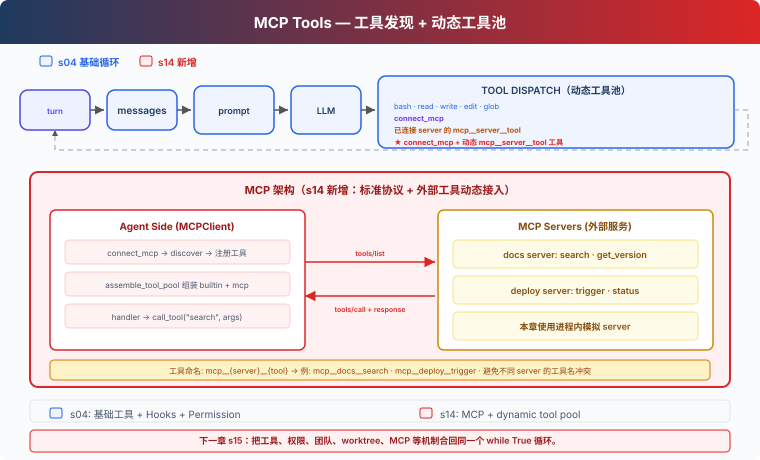

# s14: MCP Tools — 发现并调用外部工具

[s04](../s04_hooks/) → `s14` → [s15](../s15_integrated_harness/) → s16 → s17

> **Harness 层**：MCP Tools — 连接服务、发现工具，并把它们加入 Agent 的工具循环。

---

## 问题

前面的基础工具都直接写在 `code.py` 里。接入文档系统和部署平台时，我们还可以继续手写 `search_docs`、`deploy_status` 和 `trigger_deploy`，但每增加一个服务，都要重新维护工具定义、参数格式和调用代码。

MCP 把这部分拆成两个角色：server 提供工具列表和调用入口，Harness 负责连接、命名、权限检查，并把发现的工具交给模型。

---

## 解决方案



本章从 s04 的五个基础工具和 Hooks 出发，增加三个部分：

- `MCPClient` 保存 server 返回的工具定义和调用入口。
- `connect_mcp` 连接一个 server，并取得它的工具列表。
- `assemble_tool_pool` 把基础工具与已经连接的 MCP 工具组装到同一个工具池。

课程里的 `docs` 和 `deploy` 是进程内模拟 server，用来展示 `tools/list`、`tools/call` 和动态工具池。真实 MCP transport 不在本章实现。

---

## 工作原理

### 1. 基础 Agent Loop 不需要改变

每轮调用模型前，Harness 组装当前工具池：

```python
def agent_loop(messages: list):
    while True:
        tools, handlers = assemble_tool_pool()
        response = client.messages.create(
            model=MODEL,
            system=assemble_system_prompt(),
            messages=messages,
            tools=tools,
            max_tokens=8000,
        )
        ...
```

连接新 server 后，下一轮 `assemble_tool_pool()` 会把新工具加入模型输入。工具执行后，结果仍作为 `tool_result` 追加到 messages。

### 2. MCPClient 保存发现结果和调用入口

```python
class MCPClient:
    def register(self, tool_defs, handlers):
        self.tools = list(tool_defs)
        self._handlers = dict(handlers)

    def call_tool(self, tool_name, args):
        handler = self._handlers.get(tool_name)
        if not handler:
            return f"MCP error: unknown tool '{tool_name}'"
        try:
            return str(handler(**args))
        except Exception as error:
            return f"MCP error: {type(error).__name__}: {error}"
```

`register()` 对应课程里的工具发现结果，`call_tool()` 对应调用入口。错误会返回给模型，不会直接结束 Agent Loop。

### 3. connect_mcp 只负责连接和发现

```python
def connect_mcp(name: str) -> str:
    if name in mcp_clients:
        return f"MCP server '{name}' already connected"
    factory = MOCK_SERVERS.get(name)
    if not factory:
        return f"Unknown server '{name}'"
    server = factory()
    mcp_clients[name] = server
    ...
```

开始时，模型只看到五个基础工具和 `connect_mcp`。调用 `connect_mcp(name="docs")` 后，Harness 保存 docs client。下一轮模型调用会看到：

```text
mcp__docs__search
mcp__docs__get_version
```

### 4. 前缀区分不同 server 的同名工具

多个 server 都可能提供 `search` 或 `status`。Harness 使用：

```text
mcp__{server}__{tool}
```

`normalize_mcp_name()` 把不适合模型工具名的字符替换为下划线。组装工具池时还会检查规范化后的名称冲突和 64 字符长度限制：

```python
prefixed = f"mcp__{safe_server}__{safe_tool}"
if prefixed in origins:
    raise ValueError("MCP tool name collision after normalization")
```

因此 `docs.one/get.version` 和 `docs_one/get_version` 不会悄悄映射到同一个名字。

### 5. 工具定义和 handler 一起加入工具池

```python
tools.append({
    "name": prefixed,
    "description": tool_def.get("description", ""),
    "input_schema": schema,
})
handlers[prefixed] = (
    lambda *, client=server, tool=raw_name, **kwargs:
    client.call_tool(tool, kwargs)
)
```

模型看到带前缀的名字；handler 仍使用 server 原始工具名调用 `MCPClient`。默认参数保存当前 client 和 tool，避免循环里的 lambda 全部指向最后一个工具。

### 6. 权限由宿主配置决定

MCP server 可以提供 `readOnlyHint` 或 `destructiveHint`，但这些信息来自 server，不能直接作为授权依据。本章使用宿主侧策略：

```python
MCP_HOST_POLICY = {
    ("docs", "search"): "allow",
    ("docs", "get_version"): "allow",
    ("deploy", "status"): "allow",
    ("deploy", "trigger"): "confirm",
}
```

`permission_hook()` 根据规范化后的工具名查询这份策略。未配置的外部工具默认需要用户确认；即使 description 写着 `readOnly`，也不会自动放行。

### 7. 工具输入错误留在工具边界内

模型可能漏传参数，也可能传入 server 不接受的字段。`execute_tool()` 和 `MCPClient.call_tool()` 都会捕获异常，并返回错误 `tool_result`：

```text
MCP error: TypeError: <lambda>() missing 1 required argument: 'query'
```

模型可以在下一轮修正参数，而不是让课程脚本直接退出。

---

## 相对 s04 的变化

| 组件 | s04 | s14 |
|---|---|---|
| 基础工具 | 五个固定工具 | 保持不变 |
| 工具来源 | `code.py` 中的定义 | 基础工具加动态发现的 MCP 工具 |
| 工具池 | 固定 `TOOLS` | 每轮由 `assemble_tool_pool()` 组装 |
| 外部工具名 | 无 | `mcp__{server}__{tool}` |
| 权限 | Shell 和路径检查 | 增加宿主侧 MCP 策略 |
| MCP transport | 无 | 使用进程内模拟 server 展示协议边界 |

本章不带入 Task、Background、Cron、Team 或 Worktree。它们会在 s15 的 Integrated Harness 中与 MCP 合并。

---

## 试一下

```sh
cd learn-claude-code
python s14_mcp_plugin/code.py
```

输入：

```text
连接 docs server，搜索 agent hooks，并告诉我当前文档 API 版本。
```

一次典型工具轨迹是：

```text
connect_mcp(name="docs")
mcp__docs__search(query="agent hooks")
mcp__docs__get_version()
```

再输入：

```text
连接 deploy server，查看 web 服务状态，不要触发部署。
```

`status` 会按宿主策略直接执行；`trigger` 需要用户确认。

---

## 接下来

目前，MCP 还是一条独立的课程分支。s15 Integrated Harness 会把基础工具、Hooks、Skills、Context、Memory、Task、Background、Cron、Teams 和 MCP 放进同一个运行时。
---

## 本项目保留的 LangChain / LangGraph 教学补充

> 以下内容来自本仓库对齐前的 README，作为上游课程之外的本地教学补充完整保留。

<!-- local-langchain-additions:start -->
<details>
<summary>展开本仓库原有的 LangChain / LangGraph 教学说明</summary>

# s14: MCP & Plugin — 把外部工具接进同一个工具池

> LangChain / LangGraph 教学改编版。章节结构参考
> [shareAI-lab/learn-claude-code 的 s14](https://github.com/shareAI-lab/learn-claude-code/blob/main/s14_mcp_plugin/README.md)。
>
> **Harness 层**：MCP Tools — 连接服务、发现工具，并把它们加进 agent 循环。

[s13](../s13_agent_teams/) → **s14** → [s15](../s15_integrated_harness/)

---

## 问题

前几章的工具都直接写在 `code.py` 里。要接入一个文档系统和部署平台，可以再加 `search_docs`、`deploy_status`、`trigger_deploy`，但每接一个服务就要再写一组工具定义、参数 schema 和调用处理函数。

MCP 把这份职责拆开：server 提供「工具列表 + 调用接口」，harness 负责连接它、给模型可见的工具起名字、套上权限检查，再把发现到的工具交给模型。

---

## 解决方案


本章从 s04 的五个基础工具和 Hook 出发，新增三块：

- `MCPClient`：保存某个 server 返回的工具定义和调用处理器。
- `connect_mcp`：连接一个 server，拿到它的工具列表。
- `assemble_tool_pool`：把基础工具和所有已连接 server 的工具合并成当前工具池。

`docs` 和 `deploy` 是进程内的 mock server，用来模拟 `tools/list`、`tools/call` 和动态工具池。本章不实现真正的 MCP transport（JSON-RPC / OAuth / 资源订阅 / 轮询）。

---

## LangChain 里的关键差异：工具池是“动态”的

s01–s13 里 `create_agent()` 在创建时就把工具编译进了静态 LangGraph。但 MCP 的工具要在**运行时**才会出现：

```
connect_mcp(name="docs")  →  下一轮模型调用就多了 mcp__docs__search
```

所以本章不调用 `create_agent`，而是自己铺开那张 LangGraph：

```python
class AgentState(TypedDict):
    messages: Annotated[list, add_messages]

def model_node(state):
    tools = assemble_tool_pool()                      # 每轮都取“当前”工具
    return {"messages": [MODEL.bind_tools(tools).invoke(state["messages"])]}

def tools_node(state):
    ...   # PreToolUse / 权限 / 执行 / PostToolUse

graph_builder.add_edge(START, "model")
graph_builder.add_conditional_edges("model", route, {"tools": "tools", "end": END})
graph_builder.add_edge("tools", "model")
```

`route` 判断最后一条消息是否还有 `tool_calls`：有就回到 tools 节点，没有就结束。这正是 `create_agent` 帮我们编译掉的那条循环，现在因为需要运行时改工具集合，就显式写出来。

---

## 工作原理

### 1. MCPClient 保存发现结果和调用处理器

```python
class MCPClient:
    def register(self, tool_defs, handlers):
        self.tools = list(tool_defs)
        self._handlers = dict(handlers)

    def call_tool(self, tool_name, args):
        handler = self._handlers.get(tool_name)
        if not handler:
            return f"MCP error: unknown tool '{tool_name}'"
        try:
            return str(handler(**args))
        except Exception as error:
            return f"MCP error: {type(error).__name__}: {error}"
```

错误被转成字符串返回给模型，而不是把异常抛回 agent 循环。

### 2. connect_mcp 只负责连接和发现

未知 server 名、重复连接都返回普通字符串，不抛异常。连接成功后把 client 写进 `mcp_clients`，下一轮 `assemble_tool_pool()` 就会带上它。

### 3. 前缀把不同 server 的工具区分开

```
mcp__{server}__{tool}
```

`normalize_mcp_name()` 把模型工具名字母表之外的字符替换成下划线；组装时还会检查规范化后的重名和 64 字符上限。

### 4. 动态工具如何保留参数 schema

这是 LangChain 版最讲究的一步：每个 mock 工具是带类型注解的函数，`functools.wraps` 把它的签名复制到转发的 `**kwargs` 包装器上，再交给 `StructuredTool.from_function`。这样 Pydantic 能推断出 `search(query, limit)` 的 schema，同时真正的调用仍然走 `client.call_tool` 的错误边界：

```python
@functools.wraps(handler)
def _runner(**kwargs):
    return client.call_tool(raw_name, kwargs)

StructuredTool.from_function(func=_runner, name=prefixed, description=description)
```

### 5. 权限由 host 决定，不由 server 声称决定

server 可能标注 `readOnlyHint` 或 `destructiveHint`，但那不是授权。本章用 host 侧策略：

```python
MCP_HOST_POLICY = {
    "mcp__docs__search":      "allow",
    "mcp__docs__get_version": "allow",
    "mcp__deploy__status":    "allow",
    "mcp__deploy__trigger":   "confirm",
}
```

未配置的外部工具默认 `confirm`（要用户确认）。描述里含 `readOnly` 不等于可信。

---

## 与 s04 的对比

| 组件 | s04 | s14 |
|---|---|---|
| 基础工具 | 五个固定工具 | 不变 |
| 工具来源 | 定义在 code.py | 基础工具 + 发现的 MCP 工具 |
| 工具池 | 固定 TOOLS | 每轮由 assemble_tool_pool() 组装 |
| 外部工具名 | 无 | mcp__{server}__{tool} |
| 权限 | 命令与路径检查 | 增加 host 侧 MCP 策略 |
| 循环 | create_agent 静态图 | 手写 LangGraph（动态工具） |

本章不携带 Task / Background / Cron / Team / Worktree，它们和 MCP 一起在 s15 汇合。

---

## 运行

```sh
cd learn-claude-code
python -m s14_mcp_plugin.code
```

输入：

```
Connect to the docs server, search for agent hooks, and tell me the current documentation API version.
```

典型工具调用序列：

```
connect_mcp(name="docs")
mcp__docs__search(query="agent hooks")
mcp__docs__get_version()
```

再试：

```
Connect to the deploy server and check the web service status. Do not trigger a deployment.
```

`status` 走 host 策略直接放行；`trigger` 会触发用户确认。

---

## 下一步

MCP 在这里仍是独立分支。s15 Integrated Harness 会把基础工具、Hook、skills、上下文、记忆、任务、后台工作、cron、团队和 MCP 合并进一个 runtime。

</details>
<!-- local-langchain-additions:end -->

<!-- upstream-cc-source:start -->
## 深入 CC 源码

> 原文：[s19_mcp_plugin](https://github.com/shareAI-lab/learn-claude-code/blob/67a9126c6435a8654ba7a6f68c0fd2130f00a462/s19_mcp_plugin/README.md)。以下折叠块保持原文，文中的章号与源码行号沿用该版本。

<details>
<summary>深入 CC 源码</summary>

> 以下基于 CC 源码 `services/mcp/client.ts`、`auth.ts`、`config.ts`、`channelNotification.ts` 的分析。

### 一、6 种 Transport 类型

教学版只展示了 stdio mock。CC 支持 6 种传输（`types.ts:23-25`）：

| Transport | 通信方式 |
|-----------|---------|
| `stdio` | 子进程 stdin/stdout（跨平台默认） |
| `sse` | HTTP Server-Sent Events |
| `http` | Streamable HTTP（POST/SSE 双向） |
| `ws` | WebSocket |
| `sse-ide` | IDE 内嵌 SSE 传输 |
| `sdk` | 进程内 SDK 传输 |

连接时本地（stdio）和远程（http/sse/ws）服务器分批并发：本地批量 3 个，远程批量 20 个。

### 二、工具池组装算法

`assembleToolPool()`（`tools.ts:345-364`）：

```typescript
// 去重时优先保留内置工具（name 相同时内置在前）
return uniqBy(
  [...builtInTools.sort(byName), ...filteredMcpTools.sort(byName)],
  'name',
)
```

内置工具和 MCP 工具分开排序，不是合起来排。原因是 CC 的 `claude_code_system_cache_policy` 在最后一个内置工具之后的某个位置放全局缓存断点——混排会破坏这个设计。

### 三、命名规则：`mcp__server__tool`

`buildMcpToolName()`（`mcpStringUtils.ts:50-52`）：

```
mcp__<normalizedServerName>__<normalizedToolName>
```

所有非 `[a-zA-Z0-9_-]` 字符替换为 `_`（`normalization.ts:17-23`）。教学版的 `normalize_mcp_name` 用同样的规则。

### 四、权限检查

CC 对 MCP 工具有独立的权限系统。`checkPermissions()` 对 MCP 工具的检查逻辑不同于内置工具——MCP 工具可以声明自己的权限需求（readOnly、destructive 等），CC 根据声明决定是否需要用户确认。教学版只在 description 中用文本标注 `(readOnly)` / `(destructive)`，不做权限拦截。

### 五、配置来源与优先级

MCP 服务器配置来自多个来源。CC 的配置优先级从低到高：

```
claude.ai 连接器 < plugin < user settings.json < approved project .mcp.json < local settings.local.json
```

`claude.ai` 连接器单独拉取、按内容签名去重，以最低优先级合并（`config.ts:1267-1289`）。企业 `managed-mcp.json` 存在时完全排除其他配置。

教学版直接传 server name 给 `MOCK_SERVERS` 字典，不做配置合并。

### 六、Channel 通知：服务器反向推消息

教学版只讲了 Agent → MCP Server 的单向调用。CC 还支持反向通知（`channelNotification.ts`）：

1. Server 声明 `capabilities.experimental['claude/channel']`
2. Server 通过 MCP 通知 `notifications/claude/channel` 给 Agent 发消息
3. 消息包装在 `<channel source="serverName">...</channel>` XML 标签中
4. Agent 被 SleepTool 唤醒（1 秒内）

Server 还可以请求权限：`notifications/claude/channel/permission_request` → Agent 回复 `notifications/claude/channel/permission`。用户通过 5 字母短 ID 确认/拒绝。

### 七、OAuth 认证流程

CC 的 MCP 认证（`auth.ts`）支持完整的 OAuth 2.0 + PKCE 流程：
- 通过公钥客户端 + PKCE 发现 OAuth 元数据（RFC 8414 / RFC 9728）
- 本地回调服务器接收授权码
- 令牌通过 `getSecureStorage()` 持久化（macOS Keychain / Linux 加密文件 / Windows 凭据管理器）
- 过期前 5 分钟自动刷新
- 支持跨应用访问（XAA）：浏览器获取 id_token → RFC 8693 + RFC 7523 交换 → 无需反复弹浏览器

### 八、连接生命周期的错误处理

CC 对 MCP 连接有精细的错误分类和重试（`client.ts:1266-1402`）：
- 终局性错误（ECONNRESET、ETIMEDOUT、EPIPE 等）：连续 3 次 → 关闭 + 重连
- 工具调用 401：令牌过期 → 抛出 `McpAuthError` → 触发重认证
- 工具调用超时：`Promise.race` 超时（可配置，默认约 28 小时）
- Stdio 断连：按 SIGINT → SIGTERM → SIGKILL 顺序杀进程

### 教学版的简化

- 6 种 transport → 1 种（mock stdio）：概念量可控
- Channel 反向通知 → 省略：教学版 Agent 是主动方
- OAuth 流程 → 省略：教学版假设 server 不需要认证
- 多层配置优先级 → 省略：教学版直接传 server name
- 复杂的错误分类 → 省略：教学版用 try/except 兜底
- MCP 工具只给 Lead → 省略子 agent 继承：简化代码结构

</details>

<!-- upstream-cc-source:end -->
