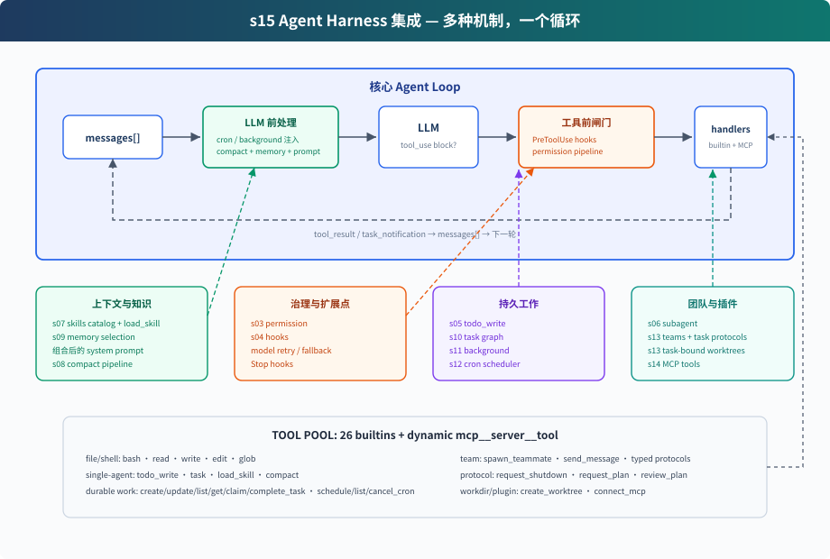

# s15: Agent Harness 集成 — 多种机制，一个循环

> **对齐状态**：本章 `code.py` 对齐上游 `s15_integrated_harness`；模型请求由 `harness/langchain_messages.py` 转换为 LangChain OpenAI-compatible 调用，循环和 Harness 机制保持上游结构。
[English](README.md) · [中文](README.zh.md) · [日本語](README.ja.md)

s01 → ... → s13 → [s14](../s14_mcp_plugin/) → `s15` → [s16](../s16_workflow_runtime/) → s17

> *"多种机制，一个循环"* — 工具、权限、记忆、任务、团队、插件都挂在同一个 while True 上。
>
> **Harness 层**: 集成 — 把本章示例实际使用的机制放进同一个可运行系统。

---

## 问题

前面的章节把不同机制放在各自独立的示例中。本章把集成运行时需要的机制接到一起。

一个能长期工作的 coding agent 需要同时拥有：

- 工具分发和权限边界
- hooks 扩展点
- todo 计划和任务图
- 技能、记忆、系统 prompt 组装
- 压缩和错误恢复
- 后台任务和 cron 调度
- 团队、协议和 idle 任务认领
- 任务绑定的 worktree
- MCP 外部工具接入

S15 不再引入一个独立机制，而是展示现有机制从哪里进入模型循环，以及它们产生的事件如何回到同一段对话。

---

## 解决方案



S15 不再引入新机制，而是把前面各章的组件集成到同一个 harness：

```text
用户输入
  → UserPromptSubmit hooks
  → cron/background 通知注入
  → context compact
  → memory + skills + MCP 状态组装 system prompt
  → LLM
  → has tool_use block?
      否 → Stop hooks → 返回
      是 → PreToolUse hooks + permission
          → TOOL_HANDLERS / MCP handlers / background dispatch
          → PostToolUse hooks
          → tool_result / task_notification 回 messages
          → 下一轮
```

循环仍是同一个结构：调用模型，检查响应里是否出现 `tool_use` block，执行工具，再把结果追加回 `messages`。是否继续工具轮，由响应中有没有实际的 `tool_use` block 决定。

---

## 组件在循环中的位置

| 位置 | 组件 | 作用 |
|------|------|------|
| 用户输入前后 | `UserPromptSubmit` hooks | 记录、注入、审计用户输入 |
| LLM 前 | cron queue | 把定时触发的 prompt 注入 `messages` |
| LLM 前 | background notifications | 后台任务完成后以 `<task_notification>` 注入 |
| LLM 前 | compaction pipeline | 先压大输出，再裁历史，再压旧 tool_result，必要时摘要 |
| LLM 前 | memory / skills / MCP state | 组装 system prompt，让模型看到当前能力和长期上下文 |
| LLM 调用 | error recovery | 429/529 重试，`max_tokens` 升级，prompt too long 触发 reactive compact |
| 工具执行前 | `PreToolUse` hooks + permission | 拦截危险命令、写越界、破坏性 MCP 工具 |
| 工具分发 | `assemble_tool_pool` | 组装内置工具和 MCP 动态工具 |
| 工具执行时 | background dispatch | 显式标记的 bash 操作放入 daemon thread，主循环先返回占位结果 |
| 工具执行后 | `PostToolUse` hooks | 大输出告警、日志等后处理 |
| 返回循环 | tool_result | 每个 `tool_use` 对应一个 `tool_result`，再回到下一轮 |
| 本轮没有 tool_use / 停止时 | `Stop` hooks | 统计、清理、审计 |

---

## code.py 包含什么

### 工具与分发

内置工具池包含 26 个工具：

```text
bash, read_file, write_file, edit_file, glob
todo_write, task, load_skill, compact
create_task, update_task, list_tasks, get_task, claim_task, complete_task
schedule_cron, list_crons, cancel_cron
spawn_teammate, list_teammates, send_message
request_shutdown, request_plan, review_plan
create_worktree
connect_mcp
```

`assemble_tool_pool()` 每轮组装：

```text
BUILTIN_TOOLS + connected MCP tools
BUILTIN_HANDLERS + mcp__server__tool handlers
```

所以 `connect_mcp("docs")` 后，下一轮工具池里会出现 `mcp__docs__search`。

### 权限和 hooks

权限不写死在工具执行行里，而是作为 `PreToolUse` hook：

```python
blocked = trigger_hooks("PreToolUse", block)
if blocked:
    results.append(tool_result(block.id, blocked))
    continue
```

这样 permission、log、审计都可以挂在同一个 hook 点上。Lead、一次性 subagent 和队友的工具都会先经过 `PreToolUse`；允许执行的调用会在 handler 返回后触发 `PostToolUse`。

权限判断不会把 MCP server 自己写的 description 当成授权依据。宿主维护一组精确的已知只读工具名单，其他 MCP 工具都要询问用户。文件工具越过 `WORKDIR` 会直接拒绝，每条 bash 命令执行前都会询问。只有前台用户轮次可以弹出交互确认；异步轮次直接拒绝需要确认的操作，不和主 CLI 争抢输入。

### 计划与任务

S15 同时保留两层计划：

- `todo_write`：当前会话内的轻量计划，保存在内存中
- task graph：跨会话、可依赖、可认领的任务文件，写入 `.tasks/task_*.json`

前者帮助单个 Agent 不漂移；后者支撑团队协作。

两者目标相近，但实现不同：`todo_write` 整表替换当前会话清单，task record 则有稳定 ID 和单条生命周期更新。下面单独出现的 `task` 工具表示“一次性派发隔离 subagent”，不是 Task System。

集成宿主中的任务图仍采用两阶段构建：Lead 先创建所有任务节点，再使用 `create_task` 返回的运行时 ID 调用 `update_task`。队友只能列举、认领和完成任务，因此依赖结构由 Lead 在分发工作前确定。

### 子 agent 与团队

S15 有两种 delegation：

- `task`：一次性 subagent。独立 `messages[]`，中间过程丢弃，只返回最终摘要。
- `spawn_teammate`：持久队友线程。传入 ready `task_id` 时，运行时会在线程启动前完成认领；不传时，队友可以在 IDLE 中等待后续任务。没有 assignment 的队友不能使用文件或 Shell 工具。它按 `WORK → result → IDLE` 运行，不设固定的工具轮数上限；模型或分发失败会发出 `error`，线程清理会把未完成 assignment 释放回任务板。每次调用模型前都会先读取收件箱，因此直接消息和关机请求不会被连续的 tool-use 轮次饿死。idle 时先等待 `MessageBus` 消息，只在超时后扫描就绪 task，并以原子操作最多认领一个。

Lead 启动队友后结束当前轮次，不在模型循环里反复查询状态。队友事件进入 Lead 收件箱后，运行时会自动唤醒下一轮。

一次性 subagent 解决“上下文隔离”；持久队友解决“长期并行协作”。

### 记忆、技能和 prompt

S15 直接复用 s09 的 Memory runtime。每轮调用模型前，它读取 `.memory/MEMORY.md` 目录，根据当前请求选择相关记录，再把选中的正文交给 `assemble_system_prompt(context)`。本轮结束后，`extract_memories()` 提取可跨会话使用的信息；有新增记录时再运行 `consolidate_memories()`。

同一份 system prompt 还会加入身份、工具说明、workspace、skills catalog 和已连接的 MCP server。技能只放目录，完整内容通过 `load_skill(name)` 按需加载。

### 压缩和恢复

LLM 前先跑压缩管线：

```text
tool_result_budget → snip_compact → micro_compact → compact_history
```

`snip_compact` 会先归档完整历史，再裁掉中段消息。`micro_compact` 只在上下文超限时运行：它先保存较早且已读取的结果，再用恢复路径替换；最近 3 条保持完整，并在接近阈值 80% 时停止。如果未读取的新结果本身过大，S15 会先保留预览和完整输出路径，再考虑总结历史。

调用模型时再包一层恢复：

- 429：指数退避重试
- 529：指数退避，连续失败可切 fallback model
- `max_tokens`：先提高 max_tokens，再要求 continuation
- prompt too long：reactive compact 后重试

### 后台和 cron

bash 调用设置 `run_in_background=true` 后，主循环不再等待命令结束，而是先返回占位结果：

```text
should_run_background → start_background_task → placeholder tool_result
后台完成 → task_notification → 下一轮注入 messages
```

只有显式标记的 bash 调用会进入后台路径。命令非零退出或 worker 抛出异常时会发出 `failed` 通知。每条 Shell 命令都在独立进程组中运行；命令结束，或 Agent 经正常路径、`SIGTERM` 退出时，运行时会停止原进程组。另建 session 的进程可以离开这个进程组。

cron 调度器独立 daemon thread 每秒检查一次。durable 的一次性任务会先持久化为 `pending_delivery`，再进入队列，并保留到包含该 prompt 的模型调用成功；调用失败会放回队列，重启后也会再次入队，因此交付语义是至少一次。CLI 同时监听 `cron_queue`、Lead 收件箱和已经结束的后台任务，任一事件都能自动唤醒一轮 Agent。

### worktree 与 MCP

从 s13 继承的任务级 worktree 机制负责管理任务工作目录：

- pending 且未被认领的 task 可以留在主工作区，也可以通过 `create_worktree(name, task_id)` 绑定独立分支和目录
- 创建前会校验 task、名称、路径、分支和 Git registry；Git 命令失败后还会核对 registry 和分支状态，任何部分创建的 checkout 都保持未绑定并保留供人工恢复
- idle 队友以原子操作认领一个就绪 task，assignment 同时记录 `task_id` 和有效 `cwd`
- Lead 也可以把 ready `task_id` 直接传给 `spawn_teammate`，认领成功后才启动线程
- 队友所有文件工具都使用该 `cwd`；只有 task owner 能完成任务，assignment 会保留到当前模型轮次结束
- 移除保留在宿主侧的 `remove_worktree()` 函数中，模型不能调用。用户或宿主先检查任务所有权、assignment lease、后台工作和 Git 状态；破坏性移除需要另行取得用户确认

worktree 只改变工具的默认工作目录，用于分离 working copy，并不是安全沙箱。进程组清理也无法约束另建 session 的进程，因此删除保留为宿主操作。

认领或释放 task 会改变 assignment version，使旧的 plan approval 失效；普通 `send_message` 只传递消息，不会改变 task identity 或 plan 状态。

MCP 负责外部能力：

- `connect_mcp(name)` 连接 mock server
- `assemble_tool_pool()` 把 MCP 工具组装进工具池，并拒绝规范化后的名称冲突
- 工具名统一为 `mcp__server__tool`

---

## 相对 s14 的变化

| 范围 | s14 MCP | s15 Integrated Harness |
|------|---------|-------------------------|
| 内置工具 | 6 个 | 25 个 |
| 外部工具 | 已连接的 MCP 工具 | 沿用同一套动态 MCP 路径和宿主策略 |
| 本地机制 | S04 工具、hooks、权限和 MCP | todo、subagent、skills、compaction、memory、task graph、后台 bash、cron、teams 和 worktrees |
| 事件来源 | 用户输入和工具结果 | 用户输入、工具结果、cron prompt、后台通知和 team events |

---

## 试一下

```sh
cd learn-claude-code
python s15_integrated_harness/code.py
```

可以试：

1. `检查这个仓库，告诉我哪些 Python 文件最重要。`
2. `从已连接的文档中查一下 agent loop 的相关说明。`
3. `请在独立的 worktree 中并行重构认证模块和登录页，修改前先把各自的计划给我看。`
4. `3 分钟后提醒我开会。`
5. `在后台安装依赖，同时继续阅读 README.md。`

观察重点：

- 工具调用前是否经过 hooks/permission
- `connect_mcp` 后下一轮是否出现 MCP 工具
- 设置 `run_in_background=true` 的 bash 调用是否返回 background placeholder
- 到点是不是自动提醒开会
- 队友是否提交 plan，并在 approval 前暂停
- idle 队友是否只原子认领一个就绪 task
- 队友所有文件工具是否都切换到已认领 task 的 `cwd`
- 完成任务后是否在本轮剩余工具调用中保持 task `cwd`，并在 IDLE 时释放

---

## 接下来

[s16 Workflow Runtime](../s16_workflow_runtime/) 会在这个 host 中加入 `Workflow` 工具。Workflow 把固定的编排路径写在代码中，并记录运行进度，使同一次运行可以继续执行。
---

## 本项目保留的 LangChain / LangGraph 教学补充

> 以下内容来自本仓库对齐前的 README，作为上游课程之外的本地教学补充完整保留。

<!-- local-langchain-additions:start -->
<details>
<summary>展开本仓库原有的 LangChain / LangGraph 教学说明</summary>

# s15: Integrated Harness — 很多机制，一个循环

> LangChain / LangGraph 教学改编版。章节结构参考
> [shareAI-lab/learn-claude-code 的 s15](https://github.com/shareAI-lab/learn-claude-code/blob/main/s15_integrated_harness/README.md)。
>
> *"Many mechanisms, one loop"* — 工具、权限、记忆、任务、团队、插件全部挂在同一条循环上。
>
> **Harness 层**：集成 — 把前面章节的机制放进一个可运行的系统。

[s14](../s14_mcp_plugin/) → **s15** → [s16](../s16_workflow_runtime/)

---

## 问题

前几章把机制都放在各自独立的脚本里。这一章把它们接成一个集成 runtime。一个长期运行的 coding agent 需要同时具备：工具分发与权限边界、Hook 扩展点、规划与任务图、skills / 记忆 / system prompt 组装、压缩与错误恢复、后台任务与 cron、团队与 worktree、MCP 外部工具。

s15 不引入新机制，而是展示这些机制**在模型循环里的接入位置**，以及它们的事件如何回到同一条对话。

---

## 解决方案


```text
用户输入
  → UserPromptSubmit hook
  → 后台/cron 通知注入
  → system prompt 组装（记忆 + skills + MCP 状态）
  → LLM（bind_tools(assemble_tool_pool())，带恢复重试）
  → 是否还有 tool_calls？
      否 → Stop hook → 返回
      是 → PreToolUse hook + 权限
           → 内置工具 / MCP 工具 / 后台分发
           → PostToolUse hook
           → tool_result / task_notification 回到 messages
           → 下一轮
```

循环本身和 s01 一样：调模型、看有没有工具调用、执行工具、把结果追加回 messages。有没有 `tool_calls` 决定工具执行是否继续。

---

## 各机制在 LangChain 版本里的位置

| 位置 | 组件 | 作用 |
|---|---|---|
| 用户输入前后 | UserPromptSubmit hook | 打印/审计 |
| 模型调用前 | 后台/定时通知 | 把 `<task_notification>` / `<cron reminder>` 注入 messages |
| 模型调用前 | 记忆 / skills / MCP 状态 | 组装 system prompt |
| 模型调用 | 错误恢复 | 指数退避重试，上下文过长则裁剪重试 |
| 工具执行前 | PreToolUse + 权限 | 拦截危险命令、越界写入、破坏性 MCP 工具 |
| 工具分发 | assemble_tool_pool | 内置工具 + 动态 MCP 工具 |
| 工具执行中 | 后台分发 | `run_in_background=true` 的命令进守护线程，返回占位结果 |
| 工具执行后 | PostToolUse | 日志 |
| 回到循环 | tool_result | 每个 tool_use 一个 ToolMessage，进入下一轮 |

> 说明：本章把团队（s13）与 worktree 的完整协议保留在 s13，未在此重复；后台 bash 与 cron 用简化版演示"注入式唤醒"。完整 5 字段 cron 解析、任务绑定 worktree 的多 agent 协作请回到 s12 / s13。

---

## 本章包含的工具

```
run_bash (run_in_background 可选)   run_read   run_write   run_edit   run_glob
todo_write                          load_skill
task (一次性子 agent)                connect_mcp (+ 动态 mcp__server__tool)
schedule_cron   list_crons   cancel_cron
```

### 关键机制

- **动态工具池**：与 s14 相同，`assemble_tool_pool()` 每轮组装内置 + MCP 工具；因为要注入通知并且工具在运行时变化，主循环用 `MODEL.bind_tools(tools)` 手写（同 s14 的手写 LangGraph 思路）。
- **一次性子 agent**：`task(prompt)` 用 `create_agent`（只读 run_read/run_glob）在隔离上下文里调查，只把最终摘要带回。
- **后台命令**：`run_bash(command, run_in_background=True)` 在守护线程里执行，完成后把通知放进队列，由 `inject_pending()` 注入消息流。
- **cron**：`schedule_cron(delay_seconds, prompt)` 是一次性相对延迟；守护线程每秒扫描到期任务放进队列。
- **记忆**：`.memory/MEMORY.md` 作为长期记忆目录，`memory_section()` 做关键词相关性选择后注入 system prompt。
- **skills**：`skills_catalog()` 只给目录摘要，`load_skill(name)` 按需加载全文。
- **压缩**：`compact_messages()` 截断过长工具结果，并给累计工具结果设总预算。
- **恢复**：`call_model_with_recovery()` 对临时错误指数退避，对上下文超长裁剪重试。

---

## 运行

```sh
cd learn-claude-code
python -m s15_integrated_harness.code
```

可试：

1. `Inspect this repository and tell me which Python files matter most.`
2. `Search the connected documentation for agent loop guidance.`（先让它 connect_mcp("docs")）
3. `Install the dependencies in the background while you read README.md.`
4. `Remind me to stand up in 30 seconds.`（schedule_cron）

观察：

- 每个工具调用是否经过 Hook / 权限；
- connect_mcp 后下一轮是否出现 `mcp__docs__search`；
- `run_in_background=true` 是否返回占位、稍后注入通知；
- cron 到点是否把 reminder 注入消息流；
- 记忆/skills/MCP 状态是否进入 system prompt。

---

## 与 s14 的对比

| 范围 | s14 MCP | s15 Integrated Harness |
|---|---|---|
| 内置工具 | 6 | 12（含 MCP 时动态增加） |
| 外部工具 | 连接后的 MCP 工具 | 同 s14 的动态 MCP + 主机策略 |
| 本地机制 | s04 工具、Hook、权限、MCP | 加 todo、skills、记忆、子 agent、后台、cron |
| 事件来源 | 用户输入 + 工具结果 | 用户输入、工具结果、后台通知、cron 提示 |

---

## 下一步

[s16 Workflow Runtime](../s16_workflow_runtime/) 给这个 host 加一个 `Workflow` 工具：把固定编排路径写进代码，用 journal 记录进度，中断后能续跑。

</details>
<!-- local-langchain-additions:end -->
---

## 本项目保留的 Claude Code 源码补充

> 以下内容来自本仓库原有 README，作为上游课程之外的源码研读补充。

<details>
<summary>深入 CC 源码</summary>

> 以下为机制级对照：s15 不引入新机制，只把前面各章挂回一个循环——这正是 Claude Code 那条 1700+ 行 query loop 的集成形态（见 s01 的“深入 CC 源码”）。本仓库 s01–s14 拆开的每块机制，在真实 CC 里是“一个 loop + 挂在循环各位置的 hook / 权限 / 压缩 / 恢复”。

### 一、CC 的“集成”是回到一个 query loop

CC 没有为每个机制单起一个运行时；权限、PreToolUse / PostToolUse、上下文压缩、错误恢复、后台与 cron 通知，全部挂在同一个 agent loop 的各个 hook 点上（s01 的 State 对象 10 个字段就是这些机制的状态）。s15 的教学价值在于让你看清：前面每一章，究竟是这条循环上哪个位置的一块拼图。

### 二、LangChain 版如何把这些位置落到代码

- hook / 权限 → middleware（`wrap_tool_call` / 权限检查）
- 动态系统提示（记忆 + skills + MCP 状态）→ 动态 prompt / `assemble_system_prompt`
- 动态工具池 → 手写 LangGraph 工具节点（与 s14 相同）
- 后台 / cron 通知注入 → `before_model` middleware 在模型调用前把通知追加进 `messages`
- 错误恢复 → 模型调用处指数退避 + 上下文超长裁剪重试

也就是说：`create_agent` 提供标准模型-工具循环，其余机制用 middleware / 图节点挂在循环外面，而不是写进循环里——这正是 s04“挂在循环上，不写进循环里”的集成版。

### 三、教学版走捷径的代价

本章对 s13 的团队 / 协议与 worktree、s12 的完整 5 字段 cron 都做了简化，并在 README 明确指回对应章节。真实 CC 的集成是全部能力在线；教学版有权选择“哪些机制本章演示、哪些回原章节看”，但要清楚这只是一个教学 runtime，不是 CC 的逐行复刻。
</details>
