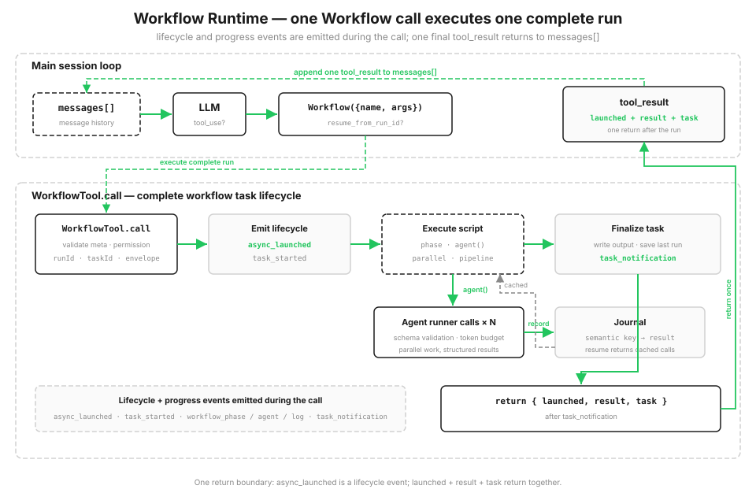

# s16: Workflow Runtime — 编排固定时写进代码

> LangChain / LangGraph 教学改编版。章节结构参考
> [shareAI-lab/learn-claude-code 的 s16](https://github.com/shareAI-lab/learn-claude-code/blob/main/s16_workflow_runtime/README.md)。
>
> *"One tool_use runs an entire orchestration"* — `Workflow` 工具启动一个可恢复的脚本 runtime，协调多次 agent 调用。
>
> **Harness 层**：编排 — 在单 agent 循环之上运行保存好的多 agent 脚本。

[s15](../s15_integrated_harness/) → **s16** → [s17](../s17_goal_loop/)

---

## 问题

s01–s15 每一步都由模型决定调用哪个工具。当路径依赖上一步的发现时，这很好；但对"固定序列"任务（例如对多个维度并行审查、逐条核验、去重合并）来说，顺序和依赖在运行前就已知道。此时宿主需要三样：

- **并行**，而不是一个一个等地；
- **稳定的结果结构**，即使单个 agent 回答有波动；
- **可恢复**，中断后不重跑已完成的部分。

如果编排只存在于对话历史里，它的顺序和 checkpointer 也只存在于那段历史里。保存好的 workflow 把固定序列写进代码，用 journal 记录已完成的调用。

---

## 把计划写进代码，而不是写成一串对话回合



给工具池加一个 `Workflow` 工具。host 注册可信脚本，脚本由 `agent()` / `parallel()` / `pipeline()` / `phase()` 构建。模型只提供已保存的 workflow 名字、参数、可选的续跑 runId；**不发送任何可执行代码**。

workflow 作为一次 `tool_use` 进入主循环。脚本运行时发布生命周期与进度事件，并把每步按行写进磁盘 journal。脚本结束后，调用返回启动信封、结果和任务状态。中间结果存在变量里，不占用对话历史。用 `resume_from_run_id` 重启时，未变化的 `agent()` 命中 journal 缓存、直接复用旧结果。

```python
DIMENSIONS = ["security", "performance", "maintainability"]

async def sample_workflow(ctx, args):
    # 每个维度独立走 audit -> verify（pipeline 没有阶段间屏障）
    results = await ctx.pipeline(DIMENSIONS, audit, verify)
    confirmed = [f for r in results if r for f in r["confirmed"]]
    return {"confirmed": confirmed}
```

---

## LangChain 版本的关键点

| 原语 | 作用 |
|---|---|
| `agent(prompt, {schema, label, phase})` | 派发一个 workflow 子 agent，结果经过 JSON 解析 + schema 校验 |
| `parallel(thunks)` | 屏障式并行：全部并发跑完才返回 |
| `pipeline(items, *stages)` | 无屏障流水线：每个 item 独立走完整段阶段，互不等待 |
| `phase(title)` / `log(message)` | 进度事件 |
| `workflow(name, args)` | 一层嵌套子 workflow |

### 结构化输出：校验在编排边界做

`agent({schema})` 要求子 agent 只返回符合 schema 的 JSON。`SimpleJsonSchema` 解析并校验，失败追加提醒**重试一次**，仍失败则抛 `WorkflowInputError`。下游拿到的对象而不是从散文里抠字段。

### journal 与 resume

- 每次运行在 `.runtime/` 下产生：`<runId>.json`（快照）、`<runId>.output.json`、`<runId>.journal.jsonl`、`<runId>.lock`。
- 新 runId 用独占创建 lock 文件预留；续跑复用已存在 runId 的 journal。
- journal 每行记录一个 `agent()` 结果的 `key -> value`。

### 稳定调用键：缓存不依赖并发完成顺序

并行/流水线的完成顺序不确定，所以键不能是"第 n 个完成"。键用调用内容的稳定哈希：

```python
def make_key(kind, label, prompt, schema):
    basis = f"{kind}|{label}|{prompt}|{json.dumps(schema, sort_keys=True)}"
    return f"{kind}-{_stable_hash(basis):010d}"
```

未变的调用在续跑时命中缓存；只有变化的部分及其下游才真正重跑。

---

## 运行

```bash
python -m s16_workflow_runtime.code          # 交互：真实 API，读 change 后调 review-changes
python -m s16_workflow_runtime.code demo     # 确定性 fixture + 事件流 + 续跑演示（无需 API）
python -m s16_workflow_runtime.code resume   # 续跑最近一个 runId；全部命中缓存
```

demo 模式的关键观察：第一次 run 后 `agents=9`；续跑同一个 runId 后 `agents=0 tokens=0`，说明每个 `agent()` 都命中了 journal 缓存。

---

## 与 s15 的对比

| | s15 Integrated Harness | s16 Workflow Runtime |
|---|---|---|
| 循环 | 一条模型驱动的循环 | 主循环不变；一个工具运行脚本化编排 |
| 下一步由谁决定 | 模型每轮决定 | 脚本事先声明编排 |
| 多 agent | s06 一次性子 agent | 脚本化、可续跑，经 agent-runner 边界 |
| 新机制 | — | 编排原语、host 注册表、任务生命周期、journal/resume、结构化输出 |

s16 不替换主循环，而是在工具层暴露 `Workflow`，背后启动一个本地 workflow runtime：一个保存好的脚本经 runner 边界协调 N 次调用。

---

## 下一步

[s17 Goal Loop](../s17_goal_loop/) 用一个更小、独立的循环判断目标是否达成，以及是否还需要再来一轮。

<details>
<summary>深入 CC 源码</summary>

> 以下为概念级对照：Claude Code 的 stock 工具集里没有一个“把编排脚本保存为可恢复 workflow 的 Workflow 工具”——那是为讲“固定编排 / 可恢复”而引入的教学抽象（真正的 agent 编排库，如 LangGraph、Prefect、Temporal，才有类似的编排原语与续跑能力）。以下只讲概念对应关系，不逐行对应 CC 源码。

### 一、“固定编排”在 CC 里的真实形态

CC 让模型逐轮决定工具调用，真正的“固定流程”落在用户侧：slash command、规则 / 配置文件、MCP server 提供的动作。把编排显式写进代码并带 journal 续跑，是把“用户预先决定流程”提升成“宿主保存的可恢复脚本”——这是本仓库（与参考仓库）的教学抽象，对应 agents SDK 或工作流引擎的 workflow 概念。

### 二、结构化输出 + 校验重试是宿主层通用做法

`agent({schema})` 要求子 agent 只返回匹配 schema 的 JSON，解析失败给一次重试机会；这是业界“别让 agent 回来写散文”做法的教学实现。CC 的 subagent 返回自由文本、不强制 schema，因此“校验 + 重试”这一层是 workflow 编排引入的稳定性边界。

### 三、journal 续跑对应“别重复已完成昂贵步骤”

CC 会话恢复（--resume / --continue）靠 checkpoint 消息历史；本仓库的 journal 按 `agent()` 调用内容算稳定 key 缓存结果。二者目的相同（中断后不重跑已完成的昂贵步骤），实现不同：一个回放会话，一个按“调用内容”幂等命中缓存。用稳定哈希 key（而非“第 n 个完成”计数器）是为了让并行 / 流水线的不确定完成顺序不破坏缓存对应关系——这是编排引擎的通用难点，不是 CC 特有。

### 四、教学版边界

demo 模式用固定 runner 数据、`SimpleJsonSchema` 是极简 JSON schema 校验、嵌套 workflow 只支持一层、run lock 只在单机有效。这些取舍让“编排原语 + 生命周期事件 + journal / resume”可观察，但离生产工作流引擎（分布式锁、持久任务队列、超时 / 取消 / 重试策略）还有距离。
</details>

